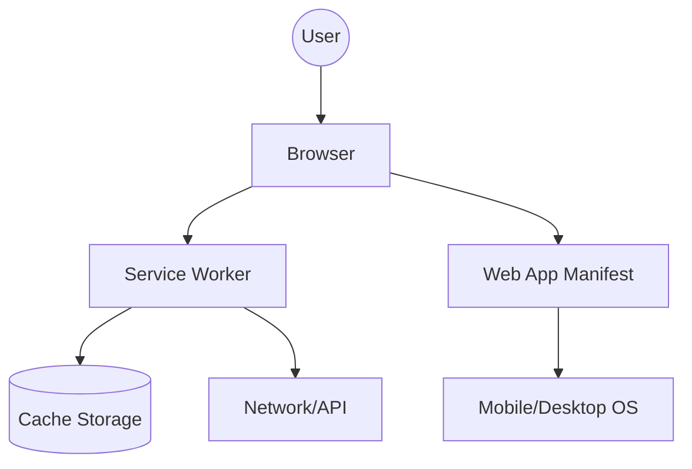

## Summary
The **W3C (World Wide Web Consortium)** and **WHATWG (Web Hypertext Application Technology Working Group)** are the primary bodies governing web standards. Following a 2019 agreement, the WHATWG maintains the **HTML and DOM Living Standards**, while the W3C publishes periodically updated snapshots. For a Software Architect, understanding these standards is crucial for building interoperable, future-proof web applications through technologies like **Progressive Web Apps (PWA)** and **Web Components**, while managing cross-browser compatibility using **Polyfills**.

## Role of Standards Bodies in Web Evolution

### W3C vs. WHATWG
*   **W3C (Founded 1994)**: Led by Tim Berners-Lee, it historically focused on semantic web and XHTML. It operates on a consensus-based model and publishes "Recommendations".
*   **WHATWG (Founded 2004)**: Formed by Apple, Mozilla, and Opera in response to the W3C's slow pace and focus on XHTML over HTML. They introduced the concept of the **Living Standard**, where features are continuously updated based on implementation.

### The 2019 Memorandum of Understanding (MoU)
In 2019, the two bodies ended years of competing standards (e.g., HTML5 vs. HTML Living Standard).
1.  **WHATWG** maintains the "Living Standard" for HTML and DOM.
2.  **W3C** focuses on specific features (accessibility, privacy, etc.) and publishes snapshots of the WHATWG standards as official W3C Recommendations.
3.  **Architectural Impact**: This unified approach reduces browser fragmentation and provides a single, authoritative source for web platform features.

---

## Progressive Web Apps (PWA) Standards

PWAs use modern web APIs to deliver an app-like experience. Key standards include:

### 1. Service Workers
A script that the browser runs in the background, separate from a web page.
*   **Purpose**: Enables offline capabilities, background sync, and push notifications.
*   **Standard**: W3C Service Workers Nightly/Living Standard.
*   **Architectural Pattern**: **Proxy Pattern**. It intercepts network requests to serve cached content or fetch from the network.

### 2. Web App Manifest
A JSON file (`manifest.json`) that provides metadata about the web application.
*   **Purpose**: Tells the browser how the app should be installed on a device (name, icons, start URL, display mode).
*   **Standard**: W3C Web Application Manifest.

### Go Implementation Example: Serving a PWA Manifest
```go
package main

import (
	"encoding/json"
	"net/http"
)

type Manifest struct {
	Name      string `json:"name"`
	ShortName string `json:"short_name"`
	StartURL  string `json:"start_url"`
	Display   string `json:"display"`
}

func manifestHandler(w http.ResponseWriter, r *http.Request) {
	m := Manifest{
		Name:      "Architecture Study App",
		ShortName: "ArchStudy",
		StartURL:  "/",
		Display:   "standalone",
	}
	w.Header().Set("Content-Type", "application/manifest+json")
	json.NewEncoder(w).Encode(m)
}

func main() {
	http.HandleFunc("/manifest.json", manifestHandler)
	http.ListenAndServe(":8080", nil)
}
```

---

## Web Components

Web Components provide a mechanism for encapsulation and reusability without relying on specific frameworks.

### Core Technologies
1.  **Custom Elements**: APIs to define new HTML tags (e.g., `<my-header>`).
2.  **Shadow DOM**: Provides DOM and CSS encapsulation. It allows a component to have its own isolated DOM tree that isn't accessible from the main document's JS or CSS.
3.  **HTML Templates (`<template>` and `<slot>`)**: Defines reusable fragments of markup that are not rendered until instantiated.

### Architectural Value
*   **Microfrontends**: Allows different teams to build components in different frameworks that interoperate via standard DOM APIs.
*   **Design Systems**: Building a core UI library in Web Components ensures it can be used across React, Vue, Angular, or vanilla JS projects.

---

## Browser Compatibility and Polyfills

### Strategies for Compatibility
1.  **Progressive Enhancement**: Start with a basic functional experience and add advanced features for capable browsers.
2.  **Graceful Degradation**: Build the full experience and ensure it "breaks gracefully" in older browsers.
3.  **Feature Detection**: Using `if ('serviceWorker' in navigator)` instead of User Agent sniffing.

### Polyfills vs. Shims
*   **Polyfill**: A piece of code (usually JS) that implements a feature on web browsers that do not support it natively (e.g., `core-js` for ES6+ features).
*   **Shim**: Intercepts an existing API and changes its behavior or provides a layer of abstraction.

### Modern Tooling
*   **Browserslist**: Shared config to target specific browser versions (`> 0.5%, last 2 versions`).
*   **Babel**: Transpiles modern JS (ES6+) into backward-compatible versions.
*   **PostCSS / Autoprefixer**: Automatically adds vendor prefixes to CSS based on the Browserslist.

---

## Interview Preparation

**Q: What is the difference between a W3C Recommendation and a WHATWG Living Standard?**
**A:** A Living Standard is continuously updated and reflects the current state of implementation in browsers. A W3C Recommendation is a "snapshot" of a standard at a specific point in time, often used for regulatory or formal procurement purposes.

**Q: Why is Shadow DOM important for large-scale application architecture?**
**A:** It provides true encapsulation. CSS styles defined inside a Shadow Root do not leak out, and global styles (mostly) do not leak in. This prevents "CSS collision" in large apps where multiple teams contribute to the same page.

**Q: How does a Service Worker improve performance even when the user is online?**
**A:** By implementing a **Cache-First** or **Stale-While-Revalidate** strategy, the Service Worker can serve assets from the local cache instantly, bypassing the network latency for static resources.

**Q: What is the risk of over-polyfilling?**
**A:** Over-polyfilling increases bundle size and can degrade performance on older devices that are already slow. Modern approaches use "differential loading" (serving different bundles based on browser capabilities).

---
## Mermaid Diagram: PWA Architecture

