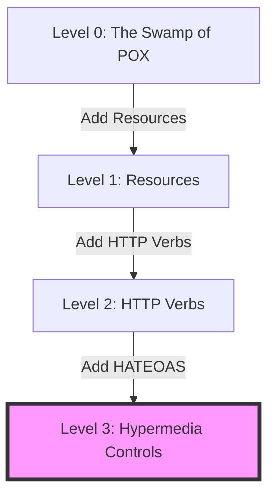

---
---

# REST (Representational State Transfer)

## Summary
REST is an architectural style for distributed hypermedia systems, first defined by Roy Fielding in 2000. It leverages the existing protocols of the web (primarily HTTP) to create scalable, decoupled, and cacheable web services. In a Software Architect's repertoire, REST serves as the de facto standard for building web APIs, emphasizing resource-oriented design over action-oriented protocols like SOAP or RPC.

## Detailed Explanation

### 1. Core Principles (The 6 Constraints)
To be considered "RESTful," a system must adhere to these six architectural constraints:

1.  **Uniform Interface**: The most critical constraint that simplifies and decouples the architecture.
    *   **Resource Identification**: URIs are used to identify resources (e.g., `/users/1`).
    *   **Manipulation through Representations**: Clients modify resources by sending a representation (e.g., JSON).
    *   **Self-descriptive Messages**: Each message includes metadata (Media Types) describing how to process it.
    *   **HATEOAS (Hypermedia as the Engine of Application State)**: The server provides links to discover available actions dynamically.
2.  **Client-Server**: Separates concerns between the user interface and data storage, allowing independent evolution.
3.  **Stateless**: Each request must contain all information necessary to process it. The server does not store client session state.
4.  **Cacheable**: Responses must define their cacheability to improve performance and reduce latency.
5.  **Layered System**: The client cannot determine if it's connected to the end server or an intermediary (proxy, load balancer).
6.  **Code on Demand (Optional)**: Servers can temporarily extend client functionality by transferring executable code (e.g., JavaScript).

### 2. Richardson Maturity Model
Developed by Leonard Richardson, this model grades an API's adherence to REST principles:

*   **Level 0 (The Swamp of POX)**: Uses HTTP purely as a transport for RPC. Single URI, usually POST only.
*   **Level 1 (Resources)**: Introduces multiple URIs for different resources but often sticks to a single method.
*   **Level 2 (HTTP Verbs)**: Uses HTTP methods (GET, POST, PUT, DELETE) and status codes correctly. This is the industry "standard."
*   **Level 3 (Hypermedia Controls)**: Implements HATEOAS. Responses contain links to related resources, allowing discovery.

### 3. Best Practices
*   **HTTP Methods & Idempotency**:
    *   `GET`: Retrieve resource (Safe, Idempotent).
    *   `POST`: Create resource (Not Safe, Not Idempotent).
    *   `PUT`: Replace resource (Idempotent).
    *   `PATCH`: Partial update (Not necessarily idempotent, but recommended).
    *   `DELETE`: Remove resource (Idempotent).
*   **Status Codes**:
    *   `201 Created`: Successfully created a resource via POST.
    *   `204 No Content`: Success but no body returned (common for DELETE/PUT).
    *   `401 Unauthorized`: Authentication required.
    *   `403 Forbidden`: Authenticated but lack permissions.
    *   `409 Conflict`: Resource state conflict (e.g., duplicate entry).

### 4. Go Implementation (Chi Router)
Go's `net/http` combined with `chi` provides a lightweight, idiomatic way to build RESTful services.

```go
package main

import (
	"encoding/json"
	"net/http"
	"github.com/go-chi/chi/v5"
	"github.com/go-chi/chi/v5/middleware"
)

type Product struct {
	ID    string  `json:"id"`
	Name  string  `json:"name"`
	Price float64 `json:"price"`
}

func main() {
	r := chi.NewRouter()
	r.Use(middleware.Logger)

	r.Route("/products", func(r chi.Router) {
		r.Get("/", listProducts)          // GET /products
		r.Post("/", createProduct)        // POST /products
		r.Route("/{id}", func(r chi.Router) {
			r.Get("/", getProduct)        // GET /products/123
			r.Put("/", updateProduct)     // PUT /products/123
			r.Delete("/", deleteProduct)  // DELETE /products/123
		})
	})

	http.ListenAndServe(":3000", r)
}

func getProduct(w http.ResponseWriter, r *http.Request) {
	id := chi.URLParam(r, "id")
	// In production, fetch from DB
	product := Product{ID: id, Name: "Architectural Guide", Price: 45.00}
	
	w.Header().Set("Content-Type", "application/json")
	json.NewEncoder(w).Encode(product)
}
```

## Interview Questions

**Q: What is the difference between PUT and PATCH?**
**A:** `PUT` is for full replacement; the client sends the entire entity. If fields are missing, they may be overwritten with defaults. `PATCH` is for partial updates; only changed fields are sent.

**Q: What does it mean for an operation to be "Idempotent"?**
**A:** An idempotent operation can be called multiple times without changing the result beyond the initial application. `GET`, `PUT`, and `DELETE` are idempotent; `POST` is not.

**Q: Why is statelessness important for scalability?**
**A:** Without session state on the server, any server instance can handle any request. This makes load balancing trivial and allows for horizontal scaling without session replication overhead.

**Q: How do you handle API versioning?**
**A:** URI versioning (`/v1/`) is the most common for its simplicity and cache-friendliness. Alternatively, Header versioning or Media Type versioning (Accept header) can be used for a cleaner URI space.

### Mermaid Diagram: Richardson Maturity Model

