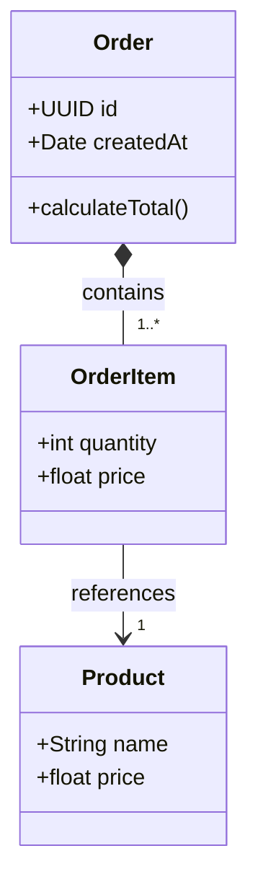
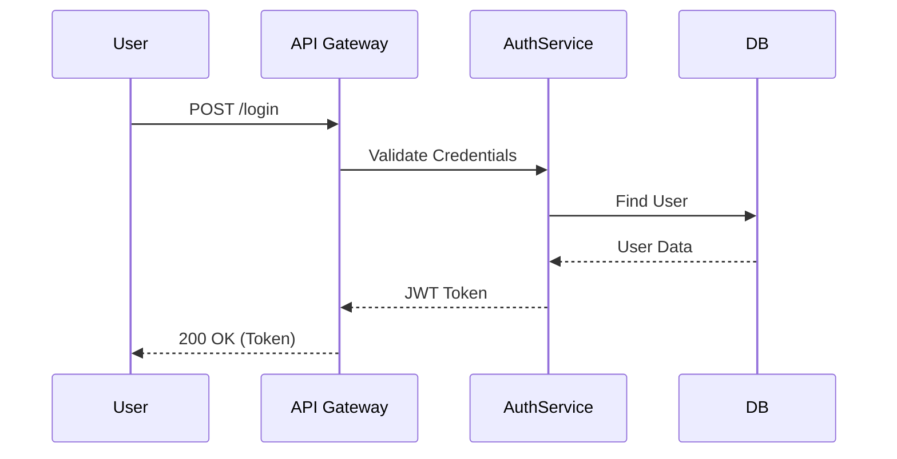

---
---

## Summary
The **Unified Modeling Language (UML)** is the standard modeling language for software engineering. It provides a set of standard diagrams to visualize the design of a system. For a Software Architect, UML is the primary tool for communicating structural and behavioral decisions to developers and stakeholders before a single line of code is written.

## Detailed Explanation

UML 2.5 defines 14 types of diagrams, divided into two main categories: **Structure** and **Behavior**. A Software Architect typically focuses on a core subset of these.

### 1. Structure Diagrams (Static View)
These diagrams depict the static structure of the system (the "things" and their relationships).

*   **Class Diagram**: The backbone of object-oriented modeling. It shows classes, attributes, methods, and relationships (inheritance, association, composition).
    *   *Architectural Use*: Designing the domain model and database schema.
*   **Component Diagram**: Shows how the system is wired together. It depicts high-level components (e.g., "Payment Service", "User Database") and their interfaces.
    *   *Architectural Use*: Defining microservices boundaries and dependencies.
*   **Deployment Diagram**: Shows the physical hardware (nodes) and the software artifacts deployed on them.
    *   *Architectural Use*: Modeling the infrastructure, cloud environment, and network topology.

### 2. Behavior Diagrams (Dynamic View)
These diagrams depict the dynamic behavior of the system (how "things" interact over time).

*   **Sequence Diagram**: Shows how objects interact in a particular time sequence.
    *   *Architectural Use*: Modeling API flows (Request/Response) and distributed transactions.
*   **Activity Diagram**: Shows the workflow or control flow of a system. Similar to a flowchart but supports concurrency.
    *   *Architectural Use*: Modeling business processes and complex algorithms.
*   **State Machine Diagram**: Shows the states of an object and the transitions between them.
    *   *Architectural Use*: Modeling the lifecycle of business entities (e.g., Order Status: Pending -> Paid -> Shipped).

## Mermaid Examples

Modern documentation prefers **Mermaid** over static images for "UML-like" diagrams because it is code-based and version-controllable.

### Class Diagram (Domain Model)


### Sequence Diagram (API Flow)


## Application in Go (Golang)

Go does not have classes in the traditional OOP sense, but UML Class Diagrams map directly to Go **Structs** and **Interfaces**.

*   **Class** -> `struct`
*   **Interface** -> `interface`
*   **Inheritance** -> Struct Embedding (Composition)
*   **Association** -> Fields (Pointers or Slices)

```go
package domain

// UML: Interface 'PaymentStrategy'
type PaymentStrategy interface {
	Pay(amount float64) error
}

// UML: Class 'CreditCard' implements 'PaymentStrategy'
type CreditCard struct {
	CardNumber string
}

func (c *CreditCard) Pay(amount float64) error {
	// Implementation
	return nil
}

// UML: Class 'Order' composes 'OrderItem' (Composition)
type Order struct {
	ID     string
	Items  []OrderItem // Association: Order has 0..* Items
}

type OrderItem struct {
	ProductID string
	Quantity  int
}
```

## Interview Questions

**Q: Which UML diagram would you use to describe a Microservices Architecture?**
**A:** A **Component Diagram** is best for showing the logical microservices and their dependencies (interfaces). A **Deployment Diagram** would then be used to show how these microservices are distributed across containers or servers (e.g., Kubernetes Pods).

**Q: What is the difference between Aggregation and Composition in a Class Diagram?**
**A:** Both are "has-a" relationships. **Composition** is a strong relationship where the child cannot exist without the parent (e.g., `Order` and `OrderItem` - if you delete the Order, the Items are gone). **Aggregation** is a weak relationship where the child can exist independently (e.g., `Classroom` and `Student` - if you delete the Classroom, the Student still exists).

**Q: Why might an architect choose Sequence Diagrams over Activity Diagrams?**
**A:** An architect chooses a **Sequence Diagram** when the focus is on the **interactions** and message exchange between systems (e.g., "What happens when API X calls Service Y?"). An **Activity Diagram** is chosen when the focus is on the **logic flow** and decision paths (e.g., "If condition A is met, do X, else do Y").
