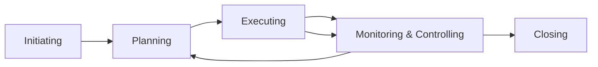
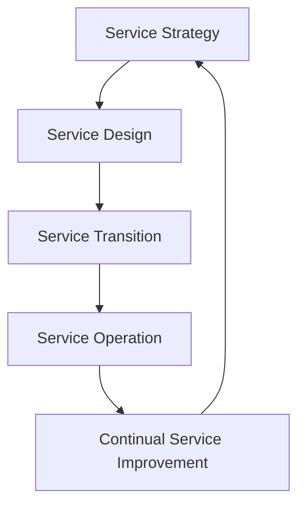
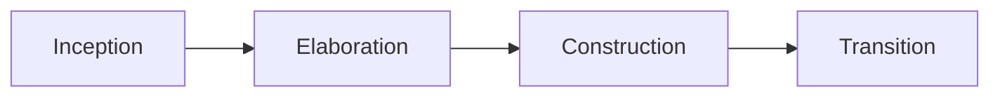

---
---

## Summary

In software architecture, technical decisions are rarely made in a vacuum. Understanding management and service frameworks ensures that architecture aligns with project goals, service delivery standards, and development lifecycles. This note covers three critical frameworks: **PMI (PMBOK)** for project management, **ITIL** for service management, and **RUP** for software development processes.

## PMI (Project Management Institute)

The Project Management Institute (PMI) provides the **PMBOK (Project Management Body of Knowledge)**, a standard for managing projects across industries. For a software architect, PMI concepts help in estimating effort, managing stakeholders, and aligning architectural milestones with the project schedule.

### **PMP Basics**
The Project Management Professional (PMP) certification is based on the PMBOK guide. It emphasizes that a project is a temporary endeavor with a defined beginning and end, aimed at creating a unique product or service.

### **The 5 Process Groups**
PMI organizes project management into five distinct phases:

1.  **Initiating**: Defining the project, identifying stakeholders, and obtaining authorization.
2.  **Planning**: Establishing the scope, schedule, budget, and risk management plan.
3.  **Executing**: Coordinating people and resources to carry out the plan.
4.  **Monitoring & Controlling**: Tracking progress and making necessary adjustments.
5.  **Closing**: Finalizing all activities and formally ending the project.

---

## ITIL (IT Infrastructure Library)

ITIL is the most widely adopted framework for **IT Service Management (ITSM)**. While PMI focuses on the *project* (building the software), ITIL focuses on the *service* (running the software and delivering value to the customer).

### **ITSM Context**
ITSM views software not just as code, but as a service that must be stable, reliable, and valuable to the end user.

### **The Service Lifecycle (ITIL v3)**
The ITIL v3 framework (still foundational for many organizations) organizes service management into five stages:

1.  **Service Strategy**: Defining the goals and customer requirements.
2.  **Service Design**: Designing the service, including architecture, processes, and policies.
3.  **Service Transition**: Building, testing, and deploying the service (where Architecture meets Operations).
4.  **Service Operation**: Managing the service in production (incident, problem, and change management).
5.  **Continual Service Improvement (CSI)**: Using feedback to improve the service over time.

---

## RUP (Rational Unified Process)

RUP is an **iterative software development process** framework. It is architecture-centric and use-case driven, making it highly relevant for architects.

### **Iterative Development**
Unlike traditional Waterfall, RUP promotes developing software in small, manageable iterations, reducing risk early in the lifecycle.

### **The 4 Phases**
RUP organizes the development lifecycle into four phases:

1.  **Inception**: Defining the scope and business case.
2.  **Elaboration**: Designing the architecture and mitigating high-risk items. *This is the most critical phase for a Software Architect.*
3.  **Construction**: Developing the components and features.
4.  **Transition**: Deploying the software to the users.

---

## Comparison: How They Complement Each Other

A successful software architect understands how to navigate these three frameworks simultaneously:

| Framework | Primary Focus | Architect's Role |
| :--- | :--- | :--- |
| **PMI** | **The Project**: Budget, Schedule, Scope. | Ensuring architectural tasks fit the project timeline and scope. |
| **RUP** | **The Development**: SDLC, Iterations, Artifacts. | Leading the Elaboration phase and defining the architectural baseline. |
| **ITIL** | **The Service**: Operations, Support, Value. | Designing for "Operability" (monitoring, scalability, disaster recovery). |

**Synthesized View**: 
- **PMI** manages the container (the project).
- **RUP** manages the creation (the development).
- **ITIL** manages the outcome (the service).

---

## Interview Questions

**Q: How does the "Elaboration" phase in RUP differ from "Planning" in PMI?**
**A:** PMI's Planning is broad, covering budget, HR, and risk at a project level. RUP's Elaboration is technical; it focuses on establishing the architectural baseline and proving the architecture can meet requirements, often through a "thin slice" or prototype.

**Q: Why should a Software Architect care about ITIL Service Operation?**
**A:** Service Operation includes incident and problem management. An architect must design systems that are easy to monitor and troubleshoot (observability) so that the Operations team can meet Service Level Agreements (SLAs).

**Q: Which PMI process group is most critical for defining non-functional requirements?**
**A:** The **Planning** group. This is where the scope is defined, and non-functional requirements (like performance, security, and scalability) must be identified to ensure the architecture is feasible within the project's constraints.

**Q: In which RUP phase is the "Architecture Baseline" typically established?**
**A:** In the **Elaboration** phase. By the end of this phase, the core architecture is validated, and the team is ready to scale up development in the Construction phase.
