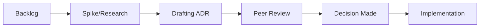

---
---

## Summary
**Kanban** is a Lean method to manage and improve work across systems by balancing demands with available capacity and improving the handling of system-level bottlenecks. For Software Architects, Kanban provides a visual framework to manage the flow of architectural work, ensuring that technical strategy is integrated into the delivery process.

## Detailed Explanation

### 1. Core Principles for Architects
*   **Visualize the Workflow**: Mapping out the steps from "Ideation" to "Production" for architectural enablers.
*   **Limit WIP (Work In Progress)**: Preventing "Architecture Overload" where too many decisions are being made but none are being implemented.
*   **Manage Flow**: Tracking the "Cycle Time" of an RFC—from initial proposal to final ADR approval.

### 2. Managing the Architectural Runway
Kanban allows architects to maintain a "buffer" of technical work that supports upcoming business requirements.
*   **Enabler Items**: Research, infrastructure, and refactoring tasks that "enable" future business value.
*   **Swimlanes**: Using horizontal lanes to separate "Business Features" from "Architectural Enablers."

### 3. Technical Debt Management
*   **Debt Visualization**: Categorizing cards by debt type (Maintenance, Bit Rot, Design Debt).
*   **Prioritization**: Using "Classes of Service" (e.g., Expedite for critical security patches, Standard for roadmap features).

### 4. Spikes and Spaced Learning
Architects use Kanban to manage **Spikes** (Research tasks).
*   **Outcome-Driven**: Every Spike card must result in a decision or a learning artifact.
*   **Lightweight PoCs**: Visualizing the progress of prototypes to reduce risk before full implementation.

## Mermaid Diagram: Architect-Led Kanban Board



## Go Application: Calculating Lead Time
Architects often measure the efficiency of the decision-making process.

```go
package main

import (
	"fmt"
	"time"
)

type KanbanCard struct {
	ID        int
	Title     string
	Created   time.Time
	Approved  time.Time
}

func (c KanbanCard) LeadTime() time.Duration {
	return c.Approved.Sub(c.Created)
}

func main() {
	card := KanbanCard{
		ID:       101,
		Title:    "RFC: Migration to Microservices",
		Created:  time.Now().AddDate(0, 0, -14), // 14 days ago
		Approved: time.Now(),
	}

	fmt.Printf("Card: %s\n", card.Title)
	fmt.Printf("Decision Lead Time: %.0f days\n", card.LeadTime().Hours()/24)
}
```

## Interview Questions

*   **Q: What is the difference between a Team Kanban and an Architecture Kanban?**
*   **A:** Team Kanban focuses on task execution and delivery velocity. Architecture Kanban focuses on **Decision Flow** and ensuring the "Architectural Runway" stays ahead of the development teams' needs.

*   **Q: How do you handle "Expedite" items in an Architecture Kanban?**
*   **A:** Expedite items (like critical security vulnerabilities or production-blocking architectural flaws) bypass WIP limits but require a "Retrospective" or "Post-Mortem" card to be created to address the root cause and prevent future occurrences.

*   **Q: How does Kanban help in reducing Technical Debt?**
*   **A:** By making debt visible. When technical debt is represented as cards on the same board as features, it forces a conversation about trade-offs during every planning or replenishment meeting.
