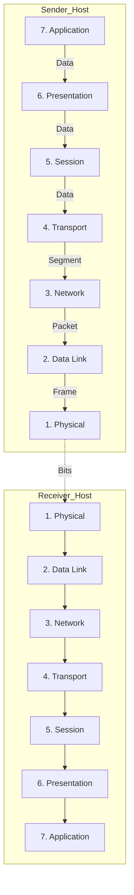

---
---

## Summary
The **OSI (Open Systems Interconnection) Model** is a conceptual framework that standardizes the functions of a telecommunication or computing system into seven distinct layers. Developed by the ISO in 1984, it provides a universal language for network engineers to describe how data moves across a network, facilitating interoperability between different vendors and technologies. While the modern Internet primarily uses the **TCP/IP model**, the OSI model remains the gold standard for teaching, troubleshooting, and architectural design.

## The 7 Layers
A common mnemonic to remember the layers (from Layer 7 down to Layer 1): 
**A**ll **P**eople **S**eem **T**o **N**eed **D**ata **P**rocessing.

| Layer | Name | PDU | Core Function | Typical Protocols/Hardware |
| :--- | :--- | :--- | :--- | :--- |
| **7** | **Application** | Data | Provides network services directly to user applications (APIs, UI). | HTTP, DNS, FTP, SMTP, SSH |
| **6** | **Presentation**| Data | Translates, encrypts, and compresses data for the application layer. | SSL/TLS, JPEG, GIF, ASCII |
| **5** | **Session** | Data | Manages sessions (connections) between applications; auth & checkpointing. | NetBIOS, RPC, Sockets |
| **4** | **Transport** | Segment | End-to-end communication, flow control, and error correction. | **TCP, UDP** |
| **3** | **Network** | Packet | Routing data between networks; logical addressing (IP). | **IP, ICMP**, Routers |
| **2** | **Data Link** | Frame | Physical addressing (MAC); error detection on the physical link. | Ethernet, Wi-Fi, Switches, Bridges |
| **1** | **Physical** | Bit | Transmission of raw bitstream over physical media. | Cables, Hubs, NICs, Fiber |

---

## Data Flow: Encapsulation & Decapsulation

Networking relies on the concept of **nesting** data, similar to Russian Matryoshka dolls.

### 1. Encapsulation (Sender Side)
As data travels from the Application layer down to the Physical layer:
- Each layer adds its own **Header** (control information) to the data received from the layer above.
- The Data Link layer (L2) also adds a **Trailer** (for error checking).
- **The Journey of a PDU**: 
  - **Data** (L7-L5) $\to$ **Segment** (L4) $\to$ **Packet** (L3) $\to$ **Frame** (L2) $\to$ **Bits** (L1).

### 2. Decapsulation (Receiver Side)
As bits arrive at the destination and move up the stack:
- Each layer strips its respective header, processes the instructions, and passes the remaining data to the layer above.
- If an error is detected at the Data Link layer via the trailer, the frame is usually dropped.

---

## Go Implementation: Conceptual Abstraction
In Go, we typically work at Layer 7 (`net/http`) or Layer 4 (`net`). However, as a Software Architect, you can model the OSI stack using a **Pipeline** or **Middleware** pattern to demonstrate how each layer adds its own logic.

```go
package main

import (
	"fmt"
	"strings"
)

// Layer defines the contract for an OSI layer implementation
type Layer interface {
	Wrap(data string) string
	SetNext(Layer)
}

// BaseLayer provides common functionality for all layers
type BaseLayer struct {
	next Layer
}

func (b *BaseLayer) SetNext(l Layer) { b.next = l }

// ApplicationLayer (Layer 7)
type ApplicationLayer struct{ BaseLayer }
func (l *ApplicationLayer) Wrap(data string) string {
	fmt.Println("[L7] Adding Application Data (JSON/HTML)")
	payload := fmt.Sprintf("{ \"payload\": \"%s\" }", data)
	if l.next != nil { return l.next.Wrap(payload) }
	return payload
}

// TransportLayer (Layer 4)
type TransportLayer struct{ BaseLayer }
func (l *TransportLayer) Wrap(data string) string {
	fmt.Println("[L4] Adding Transport Header (TCP Port: 8080)")
	payload := "TCP_HDR|" + data
	if l.next != nil { return l.next.Wrap(payload) }
	return payload
}

// NetworkLayer (Layer 3)
type NetworkLayer struct{ BaseLayer }
func (l *NetworkLayer) Wrap(data string) string {
	fmt.Println("[L3] Adding Network Header (IP: 192.168.1.1)")
	payload := "IP_HDR|" + data
	if l.next != nil { return l.next.Wrap(payload) }
	return payload
}

func main() {
	// Initialize Layers
	app := &ApplicationLayer{}
	transport := &TransportLayer{}
	network := &NetworkLayer{}

	// Construct the Stack (Application -> Transport -> Network)
	app.SetNext(transport)
	transport.SetNext(network)

	fmt.Println("--- Starting Encapsulation ---")
	finalPacket := app.Wrap("Hello, Network!")
	
	fmt.Println("\nFinal Wire Data:")
	fmt.Println(finalPacket)
}
```

---

## Interview Questions

**Q1: At which layer does a Router operate? What about a Layer 2 Switch?**
> **A:** A **Router** operates at **Layer 3 (Network)**, using IP addresses to route packets between different networks. A **Standard Switch** operates at **Layer 2 (Data Link)**, using MAC addresses to forward frames within a single network.

**Q2: What is the main difference between TCP and UDP at the Transport Layer?**
> **A:** **TCP** is connection-oriented and provides reliable, ordered delivery with error checking and flow control. **UDP** is connectionless and provides "best-effort" delivery, prioritizing speed over reliability (useful for streaming/gaming).

**Q3: Where does SSL/TLS (Encryption) fit in the OSI model?**
> **A:** It is traditionally assigned to **Layer 6 (Presentation)** because it handles data encryption and formatting. However, in modern implementations, it often functions as a shim between the Transport (L4) and Application (L7) layers.

**Q4: What is a PDU, and what are its names at Layers 2, 3, and 4?**
> **A:** PDU stands for **Protocol Data Unit**. 
> - Layer 4: **Segment** (TCP) or **Datagram** (UDP).
> - Layer 3: **Packet**.
> - Layer 2: **Frame**.

**Q5: What happens during "Decapsulation"?**
> **A:** Decapsulation is the process at the receiving end where each layer (starting from Physical) removes its header and trailer from the incoming data, processes the control info, and passes the result up to the next higher layer until it reaches the Application.

## Visual Representation

