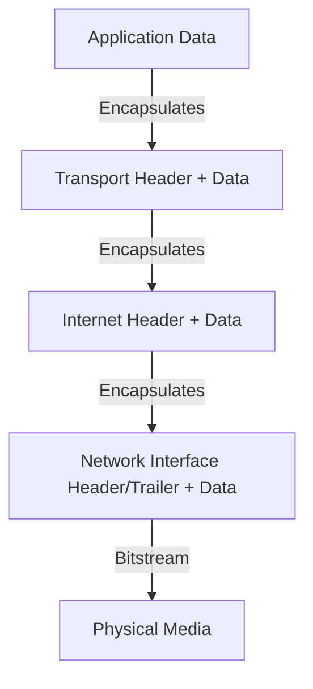

---
---

## Summary
The **TCP/IP Model**, also known as the **Internet Protocol Suite**, is the conceptual framework and set of communications protocols used for the modern internet. Unlike the theoretical OSI model, TCP/IP was designed for practical implementation and robustness. It condenses network communication into **4 functional layers**: Network Interface, Internet, Transport, and Application.

## Detailed Explanation

### The 4 Layers of TCP/IP
The model organizes protocols into a hierarchy where each layer provides services to the layer above it.

1.  **Application Layer**: The highest level where user applications (browsers, email clients) interact with the network. It handles data representation and encoding.
2.  **Transport Layer**: Responsible for host-to-host communication. It manages data integrity, flow control, and multiplexing using port numbers.
3.  **Internet Layer**: Handles logical addressing and routing. It ensures packets are delivered from the source host to the destination host across multiple networks.
4.  **Network Interface Layer**: (Also called the Link Layer) Defines how data is physically sent through the network hardware (e.g., Ethernet cables, Wi-Fi).

### Comparison: TCP/IP vs. OSI Model
The OSI model is a 7-layer theoretical reference, while TCP/IP is the 4-layer practical standard.

| TCP/IP Layer | OSI Equivalent | Function |
| :--- | :--- | :--- |
| **Application** | Application (7), Presentation (6), Session (5) | User-level data, encryption, session management. |
| **Transport** | Transport (4) | End-to-end reliability (TCP) or speed (UDP). |
| **Internet** | Network (3) | Logical addressing (IP) and routing. |
| **Network Interface** | Data Link (2), Physical (1) | Physical transmission and hardware addressing (MAC). |

### Key Protocols
*   **Internet Layer**:
    *   **IP (Internet Protocol)**: The core protocol for addressing and routing (IPv4/IPv6). It is "best-effort" and connectionless.
    *   **ICMP (Internet Control Message Protocol)**: Used for diagnostic and error reporting (e.g., `ping`).
*   **Transport Layer**:
    *   **TCP (Transmission Control Protocol)**: Connection-oriented, reliable, ensures data arrives in order.
    *   **UDP (User Datagram Protocol)**: Connectionless, fast, no guarantee of delivery (used for streaming/gaming).
*   **Application Layer**:
    *   **HTTP/HTTPS**: Web traffic.
    *   **DNS**: Domain name to IP resolution.
    *   **SSH**: Secure remote access.

### Visualizing Encapsulation


## Go Implementation

Go's `net` and `net/http` packages provide high-level abstractions for interacting with different layers of the TCP/IP stack.

### 1. Transport Layer (Raw TCP Connection)
Using the `net` package to establish a raw TCP connection. This demonstrates host-to-host communication without assuming the application-level protocol.

```go
package main

import (
	"bufio"
	"fmt"
	"net"
	"os"
)

func main() {
	// Dial establishes a connection at the Transport Layer (TCP)
	conn, err := net.Dial("tcp", "google.com:80")
	if err != nil {
		fmt.Println("Error connecting:", err)
		os.Exit(1)
	}
	defer conn.Close()

	// Sending raw bytes (forming an HTTP request manually)
	fmt.Fprintf(conn, "GET / HTTP/1.0\r\n\r\n")

	// Reading the raw response
	status, err := bufio.NewReader(conn).ReadString('\n')
	if err != nil {
		fmt.Println("Error reading:", err)
		return
	}
	fmt.Println("Transport Layer Response:", status)
}
```

### 2. Application Layer (HTTP Request)
Using the `net/http` package, which abstracts away the TCP handshake and raw byte management, focusing on the Application Layer semantics.

```go
package main

import (
	"fmt"
	"io"
	"net/http"
	"os"
)

func main() {
	// http.Get handles the Transport and Internet layers automatically
	resp, err := http.Get("http://google.com")
	if err != nil {
		fmt.Println("Error:", err)
		os.Exit(1)
	}
	defer resp.Body.Close()

	fmt.Println("Application Layer Status:", resp.Status)
	
	// Read a small part of the body
	body, _ := io.ReadAll(io.LimitReader(resp.Body, 50))
	fmt.Printf("Body preview: %s...\n", string(body))
}
```

## Interview Questions

**Q: What is the main difference between the TCP/IP and OSI models?**
**A:** The OSI model is a theoretical, protocol-independent framework with 7 layers used for education and standardization. The TCP/IP model is a practical, 4-layer suite of protocols that actually powers the internet.

**Q: Why is IP considered an "unreliable" protocol?**
**A:** IP (Internet Layer) is "best-effort." It does not guarantee that packets will arrive, that they will arrive in order, or that they won't be duplicated. Reliability is the responsibility of the Transport Layer (TCP).

**Q: Explain the concept of "Encapsulation" in TCP/IP.**
**A:** Encapsulation is the process where each layer adds its own header (and sometimes trailer) information to the data received from the layer above. For example, the Transport layer adds a TCP header to the Application data, then the Internet layer adds an IP header to that entire package.

**Q: What is the purpose of the Network Interface layer?**
**A:** It bridges the gap between the logical network (IP) and the physical hardware. It handles MAC addressing, hardware drivers, and the physical transmission of bits over media like fiber, copper, or air.

**Q: When would you use UDP over TCP?**
**A:** UDP is used when speed and low latency are more important than 100% reliability. Common examples include live video streaming, VOIP, and online gaming, where losing a single packet is better than waiting for a retransmission.
