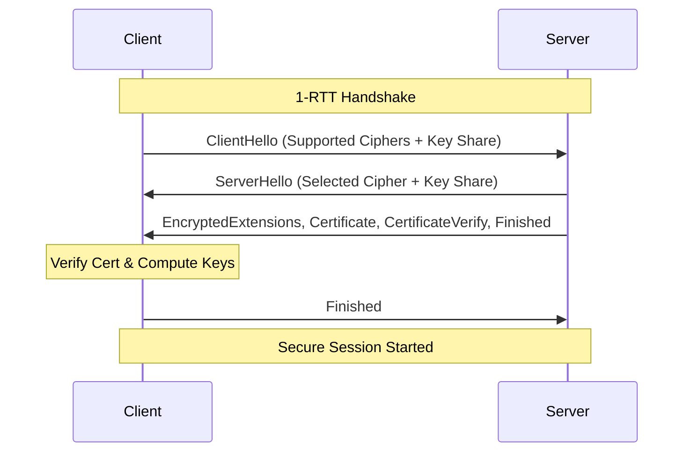

---
---
# HTTP and HTTPS

## Summary
The Hypertext Transfer Protocol (HTTP) is the foundation of data exchange on the Web. While HTTP/1.1 introduced persistence, HTTP/2 brought multiplexing, and HTTP/3 moved to UDP-based QUIC for even lower latency. HTTPS adds a security layer via TLS (Transport Layer Security), ensuring data integrity, confidentiality, and authentication through a cryptographic handshake.

## Detailed Explanation

### 1. Evolution of HTTP Versions

As a Software Architect, understanding the protocol evolution is critical for performance optimization and infrastructure planning.

#### HTTP/1.1 (1997)
- **Persistent Connections**: Kept TCP connections open for multiple requests (`Keep-Alive`).
- **Pipelining**: Allowed sending multiple requests without waiting for responses (rarely supported by servers/proxies).
- **Bottleneck**: **Head-of-Line (HOL) Blocking**. If a single request is slow, it blocks all subsequent requests on the same connection. Browsers mitigate this by opening up to 6 parallel TCP connections.

#### HTTP/2 (2015)
- **Binary Protocol**: Faster parsing and less error-prone than text-based HTTP/1.1.
- **Multiplexing**: Multiple requests/responses can be sent concurrently over a single TCP connection, eliminating HTTP-level HOL blocking.
- **Header Compression (HPACK)**: Reduces overhead by compressing redundant headers.
- **Server Push**: Allows the server to send assets to the client before they are requested.
- **Bottleneck**: **TCP HOL Blocking**. If a TCP packet is lost, all streams in the connection wait for retransmission, even if they aren't affected by the lost packet.

#### HTTP/3 (2020+)
- **QUIC Protocol**: Built on top of **UDP** instead of TCP.
- **No TCP HOL Blocking**: Streams are independent. Packet loss only affects the specific stream it belongs to.
- **Built-in Security**: TLS 1.3 is mandatory and integrated into the handshake.
- **Connection Migration**: Allows a client to switch from Wi-Fi to Cellular without dropping the connection (via Connection IDs).

### 2. Security: The TLS Handshake (TLS 1.3)

HTTPS is HTTP over TLS. The TLS handshake establishes a secure connection by negotiating cipher suites and keys.

#### TLS 1.3 Handshake Flow (1-RTT)
Compared to TLS 1.2 (2-RTT), TLS 1.3 simplifies the process and encrypts almost the entire handshake.



- **Public/Private Keys**: Used during the handshake to exchange a **Symmetric Session Key**. Data is then encrypted with the faster symmetric key.
- **Certificates**: A digital document (X.509) issued by a Certificate Authority (CA) that binds a public key to an identity (domain).

### 3. Core Components

#### Common HTTP Headers
- **Request**: `Host`, `User-Agent`, `Accept`, `Authorization`, `Cookie`.
- **Response**: `Content-Type`, `Cache-Control`, `Set-Cookie`, `Strict-Transport-Security` (HSTS).

#### HTTP Status Codes
- **2xx (Success)**: `200 OK`, `201 Created`, `204 No Content`.
- **3xx (Redirection)**: `301 Moved Permanently`, `302 Found`, `304 Not Modified`.
- **4xx (Client Error)**: `400 Bad Request`, `401 Unauthorized`, `403 Forbidden`, `404 Not Found`.
- **5xx (Server Error)**: `500 Internal Server Error`, `502 Bad Gateway`, `503 Service Unavailable`.

#### Cookies
Cookies are state management tools with security flags:
- `HttpOnly`: Prevents JavaScript access (mitigates XSS).
- `Secure`: Ensures the cookie is only sent over HTTPS.
- `SameSite`: Controls cross-site request behavior (`Strict`, `Lax`, `None`).

### 4. Go Implementation: Secure HTTPS Server

In Go, the `net/http` package provides native support for TLS. For modern standards, always enforce a minimum of TLS 1.2 or 1.3.

```go
package main

import (
	"crypto/tls"
	"fmt"
	"log"
	"net/http"
	"time"
)

func main() {
	mux := http.NewServeMux()
	mux.HandleFunc("/", func(w http.ResponseWriter, r *http.Request) {
		fmt.Fprintf(w, "Hello, secure world!")
	})

	server := &http.Server{
		Addr:         ":443",
		Handler:      mux,
		ReadTimeout:  5 * time.Second,
		WriteTimeout: 10 * time.Second,
		IdleTimeout:  120 * time.Second,
		TLSConfig: &tls.Config{
			// Enforce modern TLS versions
			MinVersion: tls.VersionTLS12,
			// Use modern cipher suites if not on TLS 1.3
			CipherSuites: []uint16{
				tls.TLS_ECDHE_ECDSA_WITH_AES_256_GCM_SHA384,
				tls.TLS_ECDHE_RSA_WITH_AES_256_GCM_SHA384,
			},
		},
	}

	log.Println("Starting HTTPS server on :443")
	// You need cert.pem and key.pem files
	err := server.ListenAndServeTLS("cert.pem", "key.pem")
	if err != nil {
		log.Fatalf("Server failed: %s", err)
	}
}
```

## Interview Questions

**Q: Explain the main difference between HTTP/2 and HTTP/3 from an architectural perspective.**
**A:** HTTP/2 uses TCP, which suffers from Head-of-Line blocking if a packet is lost. HTTP/3 uses QUIC (over UDP), where streams are independent; packet loss only affects one stream, improving performance on unreliable networks.

**Q: What is the TLS 1.3 handshake and why is it faster than TLS 1.2?**
**A:** TLS 1.3 reduces the handshake to 1 Round Trip (1-RTT) by sending key exchange data in the initial `ClientHello`. It also supports 0-RTT for resumed connections. In contrast, TLS 1.2 required 2-RTT before data could be sent.

**Q: What are the security benefits of the `HttpOnly` and `Secure` cookie flags?**
**A:** `HttpOnly` prevents client-side scripts (like JavaScript) from accessing the cookie, which helps mitigate Cross-Site Scripting (XSS) attacks. `Secure` ensures the cookie is only transmitted over an encrypted HTTPS connection, preventing it from being intercepted in plain text.

**Q: What is HSTS (HTTP Strict Transport Security)?**
**A:** HSTS is a security header that tells the browser to only interact with the server using HTTPS for a specified period. It prevents "SSL Stripping" attacks where an attacker downgrades a connection to plain HTTP.

**Q: How does a browser verify the validity of an SSL certificate?**
**A:** The browser checks the certificate's expiration date, ensures the domain name matches, and verifies the digital signature against a trusted root certificate in its built-in "trust store." It may also check the revocation status via OCSP (Online Certificate Status Protocol).

## Related Topics
- [[Work/Search/Roadmap/01-Computer Science/14-networking/04-http.md|HTTP Fundamentals]]
- [[Work/Search/Roadmap/01-Computer Science/14-networking/05-tls-and-https.md|TLS and HTTPS Deep Dive]]
- [[Work/Search/Roadmap/02-Software Development/05-API/API Design/01-learn-the-basics/03-http-versions.md|Detailed HTTP Versions]]
- [[Work/Search/Roadmap/04-System Design/01-System Design/11-communication/01-http-tcp-udp.md|Network Communication Protocols]]
