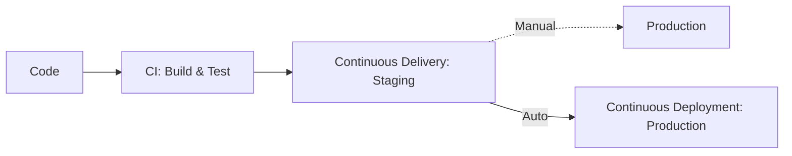

---
---

# Continuous Integration and Continuous Deployment (CI/CD)

## Summary
CI/CD is a cornerstone of modern software engineering that enables teams to deliver high-quality software at a rapid pace through automation. **Continuous Integration (CI)** focuses on frequent code merges and automated testing, while **Continuous Delivery** and **Continuous Deployment (CD)** automate the release process, ensuring that the software is always in a deployable state or automatically pushed to production. For a Software Architect, CI/CD is not just about tools, but about building a reliable system that reduces risk, ensures consistency, and provides fast feedback loops.

## Detailed Explanation

### 1. Definitions
The CI/CD "pipeline" is often divided into three distinct phases, depending on the level of automation and the final destination of the code:

*   **Continuous Integration (CI)**: The practice where developers merge their code changes into a central repository several times a day. Each merge triggers an automated build and test sequence.
    *   **Goal**: Find and fix bugs quicker, improve software quality, and reduce the time it takes to validate and release new software updates.
*   **Continuous Delivery (CDE)**: An extension of CI where the code is automatically built, tested, and prepared for a release to production. It ensures that the latest version is *ready* to be deployed at any time.
    *   **Goal**: The deployment to production is a manual "push-button" decision, but the artifacts are already validated.
*   **Continuous Deployment (CD)**: The most advanced stage where every change that passes all stages of the production pipeline is released to customers automatically, with no human intervention.
    *   **Goal**: Minimize lead time (the time from writing code to it being live).



### 2. Components of a CI/CD Pipeline
A robust pipeline consists of several stages and architectural principles:

*   **Pipeline Stages**:
    *   **Lint & Static Analysis**: Checking code for style, potential errors, and security vulnerabilities without executing it.
    *   **Build**: Compiling the code and resolving dependencies.
    *   **Unit Tests**: Verifying individual components in isolation.
    *   **Integration Tests**: Ensuring different modules or services work together.
    *   **Scan**: Checking for vulnerabilities in dependencies (SCA) and container images.
    *   **Deploy**: Moving the artifacts to a target environment.
*   **Artifacts**: The versioned, deployable packages (e.g., Docker images, binaries, JAR files) produced by the build stage. They should be built once and promoted through environments.
*   **Immutable Builds**: An architectural principle where once an artifact is created, it is never modified. If a change is needed, a new build is triggered. This prevents "configuration drift" between environments.

### 3. Deployment Strategies
Architects must choose the right strategy to minimize downtime and risk during releases:

*   **Blue/Green Deployment**: Two identical environments (Blue is live, Green is idle). The new version is deployed to Green. Once validated, traffic is switched via a load balancer. If issues occur, you switch back to Blue instantly.
*   **Canary Deployment**: The new version is deployed to a small subset of users (the "canaries"). Metrics are monitored; if successful, the rollout continues to the rest of the fleet.
*   **Rolling Updates**: Gradually replacing instances of the old version with the new version one by one or in small batches. This ensures zero downtime but may result in "version skew" (where both versions coexist for a short time).

## Go Implementation

In Go, CI/CD pipelines are efficient due to fast compilation and static linking. Below is a comprehensive **GitHub Actions** workflow for a Go application.

### GitHub Actions Workflow (`.github/workflows/ci.yml`)

```yaml
name: Go CI/CD Pipeline

on:
  push:
    branches: [ main ]
  pull_request:
    branches: [ main ]

jobs:
  build-and-test:
    runs-on: ubuntu-latest
    steps:
      - name: Checkout code
        uses: actions/checkout@v4

      - name: Set up Go
        uses: actions/setup-go@v5
        with:
          go-version: '1.23' # Use current stable version
          cache: true

      - name: Install dependencies
        run: go mod download

      - name: Run Vet
        run: go vet ./...

      - name: Lint with golangci-lint
        uses: golangci/golangci-lint-action@v6
        with:
          version: latest

      - name: Run Tests
        run: go test -v -race -coverprofile=coverage.txt -covermode=atomic ./...

      - name: Build Binary
        run: go build -v -o app ./main.go

      - name: Upload Artifact
        uses: actions/upload-artifact@v4
        with:
          name: go-binary
          path: app
```

### Explanation of the Workflow
1.  **Setup Go**: Uses `actions/setup-go` with caching enabled to speed up subsequent runs.
2.  **Go Vet**: Analyzes the source code and reports suspicious constructs (e.g., unreachable code, mismatched printf arguments).
3.  **golangci-lint**: The industry-standard linter for Go, combining multiple linters into one.
4.  **Tests with Race Detection**: `go test -race` is critical in Go to catch concurrency bugs early in the pipeline.
5.  **Artifact Upload**: Ensures the compiled binary is preserved and can be used in subsequent deployment jobs, adhering to the "Build Once" principle.

## Interview Questions

**Q1: What is the "Build Once, Deploy Many" principle and why is it important?**
**A:** It is the practice of creating a single deployable artifact (like a Docker image) at the start of the pipeline and promoting that exact same artifact through Staging, QA, and Production. This ensures that what was tested is exactly what is deployed, eliminating risks caused by environment-specific builds or dependency changes between stages.

**Q2: How do you handle database migrations in a CI/CD pipeline, especially with Rolling Updates?**
**A:** Database migrations must be **backward compatible**. A common strategy is the "Expand/Contract" pattern:
1.  **Expand**: Add new columns/tables (must be nullable or have defaults).
2.  **Deploy**: Roll out the new application version that uses both old and new structures.
3.  **Contract**: Once all instances are updated, run a cleanup migration to remove old columns/tables.

**Q3: What are the main differences between Blue/Green and Canary deployments?**
**A:** Blue/Green switches 100% of traffic at once after the new environment is ready, allowing for near-instant rollback. Canary rollouts are incremental, exposing only a percentage of users to the new version (e.g., 5%, then 25%, then 100%), which is better for detecting subtle bugs or performance regressions under real load.

**Q4: Why is a "Fail Fast" approach critical in CI/CD?**
**A:** The goal is to catch errors as early as possible. Stages should be ordered from fastest to slowest (e.g., Lint -> Unit Test -> Integration Test). If a linter fails in 10 seconds, you shouldn't waste 10 minutes running integration tests. This saves developer time and CI resources.

**Q5: What is "Configuration Drift" and how does CI/CD prevent it?**
**A:** Configuration Drift occurs when environments (Dev, Staging, Prod) become inconsistent over time due to manual ad-hoc changes. CI/CD prevents this by using **Infrastructure as Code (IaC)** and **Immutable Infrastructure**, where every environment change must go through the automated pipeline.
