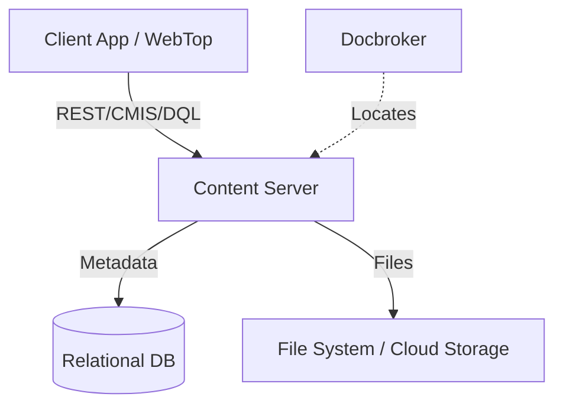

---
---

## Summary
OpenText Documentum (formerly EMC Documentum) is a pioneer in **Enterprise Content Management (ECM)**. It provides a robust, highly scalable, and object-oriented platform for managing unstructured content (documents, images, videos) and their associated metadata. It is widely used in highly regulated industries (Life Sciences, Energy, Government) due to its strong security, compliance, and lifecycle management capabilities.

## Detailed Explanation

### Core Concepts
1. **Docbase (Repository):** The central storage unit where all objects (metadata and content) reside. A single installation can host multiple Docbases.
2. **Content Server:** The core engine that manages the repository. It handles security, object persistence, versioning, and lifecycle operations.
3. **Docbroker (Connection Broker):** A name-service daemon that tells client applications where the Content Servers are located and which repositories they manage.
4. **Object-Oriented Storage:** Everything in Documentum is an **Object**. Documents, folders, users, and even internal configurations are instances of "Object Types" organized in a hierarchy.

### Architecture
Documentum uses a hybrid storage model:
*   **Metadata:** Stored in a traditional Relational Database (RDBMS) like Oracle, SQL Server, or PostgreSQL.
*   **Content:** Stored in a file system (Storage Area), or specialized storage like S3, or occasionally as BLOBs in the database.
*   **DQL (Documentum Query Language):** A superset of SQL that allows developers to query the repository using object-oriented syntax (e.g., `SELECT * FROM dm_document WHERE object_name = 'report'`).

### Integration
Modern Documentum environments favor RESTful integration over legacy Java-based DFC (Documentum Foundation Classes):
1. **REST Services:** Provides a modern API for all repository operations.
2. **CMIS (Content Management Interoperability Services):** An OASIS standard supported by Documentum, allowing interoperability with other ECM systems (like Alfresco or SharePoint).

### Mermaid Diagram: High-Level Architecture


## Go Implementation
Since Documentum is a proprietary system, Go applications typically interact with it via its **REST API** or the **CMIS** standard. Below is a conceptual example of a Go client performing a DQL query via the Documentum REST API.

```go
package main

import (
	"encoding/json"
	"fmt"
	"io/ioutil"
	"net/http"
	"net/url"
)

// DocumentumQueryResult represents the structure of a DQL response
type DocumentumQueryResult struct {
	Entries []struct {
		Title   string `json:"title"`
		Content struct {
			Src string `json:"src"`
		} `json:"content"`
	} `json:"entries"`
}

func main() {
	// Configuration
	restBaseURL := "https://documentum-server:8080/dctm-rest"
	repository := "my_docbase"
	dql := "SELECT r_object_id, object_name FROM dm_document WHERE r_creation_date > DATE('2025-01-01')"

	// Prepare URL with DQL query
	queryURL := fmt.Sprintf("%s/repositories/%s/queries/dql?dql=%s", restBaseURL, repository, url.QueryEscape(dql))

	// Create Request
	req, _ := http.NewRequest("GET", queryURL, nil)
	req.SetBasicAuth("username", "password")
	req.Header.Set("Accept", "application/json")

	client := &http.Client{}
	resp, err := client.Do(req)
	if err != nil {
		fmt.Printf("Error connecting to Documentum: %v\n", err)
		return
	}
	defer resp.Body.Close()

	if resp.StatusCode != http.StatusOK {
		fmt.Printf("Error: Status %s\n", resp.Status)
		return
	}

	body, _ := ioutil.ReadAll(resp.Body)
	var result DocumentumQueryResult
	json.Unmarshal(body, &result)

	fmt.Println("Latest Documents:")
	for _, entry := range result.Entries {
		fmt.Printf("- %s (ID: %s)\n", entry.Title, entry.Content.Src)
	}
}
```

## Interview Questions

*   **Q: What is the difference between DQL and SQL?**
    *   **A:** DQL (Documentum Query Language) is a superset of SQL designed for the Documentum object model. While SQL queries database tables, DQL queries object types. The Content Server translates DQL into optimized SQL for the underlying database, handling complex object inheritance and security automatically.
*   **Q: Explain the concept of "Renditions" in Documentum.**
    *   **A:** A rendition is an alternate format of a document (e.g., a PDF version of a Word document) associated with the same object. They share the same metadata but have different content files, allowing for easy multi-channel distribution.
*   **Q: What is a Docbroker?**
    *   **A:** The Docbroker is a name server that maintains a list of available Content Servers and their active sessions. When a client wants to connect to a repository, it first asks the Docbroker for the network address of a Content Server that can serve that repository.
*   **Q: How does Documentum handle security?**
    *   **A:** Documentum uses Access Control Lists (ACLs) associated with every object. ACLs define who can perform specific actions (Read, Write, Delete, Version, Change Permission). These checks are performed at the Content Server level, ensuring data integrity regardless of the client application.
*   **Q: What is the "Business Object Framework" (BOF)?**
    *   **A:** BOF is a layer in the Documentum Foundation Classes (DFC) that allows developers to implement business logic directly on object types (TBO - Type-based Business Objects) or as reusable service components (SBO - Service-based Business Objects), ensuring logic consistency across different applications.
