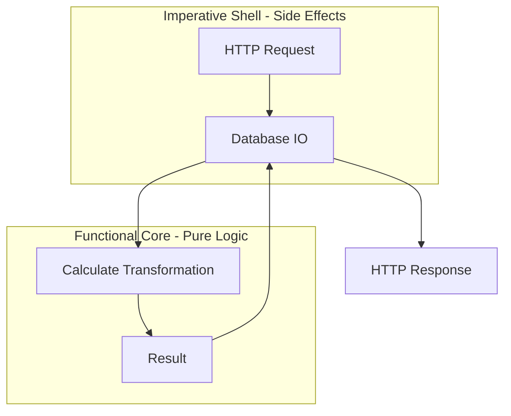

---
---

## Summary
Functional Programming (FP) is a programming paradigm that treats computation as the evaluation of mathematical functions and avoids changing-state and mutable data. For a Software Architect, FP provides a robust framework for building predictable, testable, and highly concurrent systems by minimizing side effects and emphasizing data transformation over state manipulation.

## Detailed Explanation

### Core Pillars of Functional Programming

1.  **Immutability**: Once a data structure is created, it cannot be changed. Instead of modifying an existing structure, a new one is created with the desired changes. This eliminates a whole class of bugs related to shared mutable state.
2.  **Pure Functions**: A function where the return value is determined only by its input values, without observable side effects (like modifying a global variable or performing I/O).
    *   **Referential Transparency**: You can replace a function call with its resulting value without changing the program's behavior.
3.  **Side Effects**: Any state change that occurs outside of a function's local environment. FP aims to isolate these effects to the "edges" of the system.
4.  **Higher-Order Functions (HOF)**: Functions that take other functions as arguments or return them as results. This enables powerful abstractions like `map`, `filter`, and `reduce`.

### Architectural Benefits

*   **Concurrency & Parallelism**: Since data is immutable, there are no race conditions when multiple threads access the same data. This makes FP naturally suited for modern multi-core and distributed architectures.
*   **Easier Testing**: Pure functions are inherently testable because they don't depend on external state. Tests are deterministic: same input, same output.
*   **Predictability & Debugging**: Without hidden side effects, the flow of data through the system is easier to trace.
*   **Modularity**: Composition of small, focused functions leads to highly modular and reusable codebases.

### FP Patterns in Non-FP Languages

#### 1. Go (Golang)
Go is not a pure functional language, but it supports first-class functions and closures, enabling several FP patterns.

*   **Functional Options Pattern**: Used for clean, extensible APIs.
```go
type Server struct {
    Addr string
    Port int
}

type Option func(*Server)

func WithAddr(addr string) Option {
    return func(s *Server) { s.Addr = addr }
}

func NewServer(opts ...Option) *Server {
    s := &Server{Addr: "localhost", Port: 8080}
    for _, opt := range opts {
        opt(s)
    }
    return s
}
```

#### 2. Java (21+)
Java has evolved significantly to include FP features, moving away from pure boilerplate OOP.

*   **Streams API**: For declarative data processing.
*   **Records**: Built-in immutable data carriers.
*   **Pattern Matching**: Combined with `sealed` classes for algebraic data types.
```java
public record User(String name, int age) {}

List<String> names = users.stream()
    .filter(u -> u.age() > 18)
    .map(User::name)
    .toList();
```

#### 3. TypeScript
TS/JS has a strong functional heritage, often augmented by libraries like `fp-ts`.

*   **Monad-like patterns**: Using `Promise` (async monad) or `Optional` patterns.
*   **Currying & Partial Application**:
```typescript
const add = (a: number) => (b: number) => a + b;
const addFive = add(5);
console.log(addFive(10)); // 15
```

### Architectural Design Techniques

#### Functional Core, Imperative Shell
This pattern suggests keeping the complex business logic "pure" (The Core) while handling all side effects (I/O, DB, Network) in an outer layer (The Shell).



#### Parse, Don't Validate
Instead of just checking if data is valid, transform it into a type that *guarantees* validity. This makes illegal states unrepresentable in your domain.

## Interview Questions

**Q: What is the difference between Imperative and Functional programming?**
**A:** Imperative programming focuses on *how* to achieve a result by changing state through sequences of statements. Functional programming focuses on *what* the result is by composing functions that transform data without side effects.

**Q: How does immutability help in a microservices architecture?**
**A:** Immutability simplifies event-driven systems. Events are immutable facts. When a service receives an event, it can derive new state or trigger new events without worrying about the original event being modified. It also aids in caching and idempotency.

**Q: What is a Higher-Order Function? Give an example.**
**A:** A function that takes one or more functions as arguments or returns a function. An example is Go's `http.HandlerFunc` or the `map` function in Java/TS which takes a transformation function as an argument.

**Q: Why are pure functions easier to test?**
**A:** Because they have no dependencies on global state, databases, or file systems. You don't need to "mock" the world; you only need to provide inputs and assert on the outputs.
