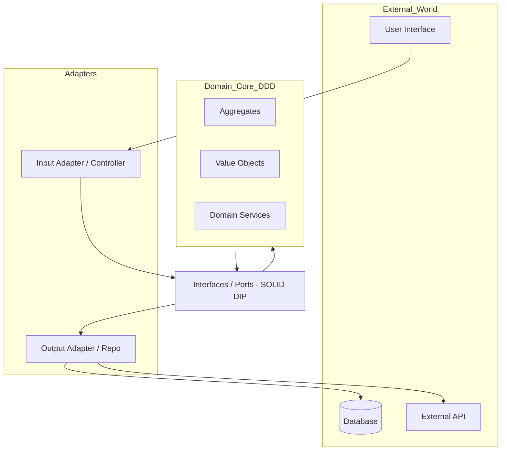

---
---

# Architectural SOLID, TDD, and DDD

## Summary
The synergy between SOLID, TDD, and DDD forms the foundation of modern software architecture. **SOLID** principles ensure components are loosely coupled and highly cohesive. **TDD** acts as a design tool that forces testability and modularity. **DDD** aligns the technical architecture with business domains, using strategic patterns to manage complexity at scale and tactical patterns to implement robust domain logic.

## Detailed Explanation

### 1. SOLID at the Architectural Level
While originally defined for Class-Oriented programming, SOLID principles are essential for architectural components (services, modules, layers).

*   **SRP (Single Responsibility)**: A component/service should have one reason to change. In architecture, this means a service should own exactly one business capability.
*   **OCP (Open/Closed)**: Systems should be "Plug-and-Play". The core business logic should be closed for modification but open for extension via adapters (e.g., adding a new Payment Gateway without changing the Checkout logic).
*   **LSP (Liskov Substitution)**: Architectural contracts. If Service A depends on an interface provided by Service B, any implementation of Service B must satisfy the contract without Service A knowing the difference.
*   **ISP (Interface Segregation)**: "Role-based" APIs. Instead of one massive API, provide smaller, consumer-specific interfaces (BFF pattern).
*   **DIP (Dependency Inversion)**: The most critical architectural principle. High-level domain policy must not depend on low-level infrastructure (DB, API, Framework).

#### Go Example: Dependency Inversion (DIP)
```go
// High-level Domain Interface (Port)
type UserRepository interface {
    Save(user *User) error
}

// High-level Business Logic
type UserService struct {
    repo UserRepository // Depends on abstraction
}

func (s *UserService) Register(user *User) error {
    return s.repo.Save(user)
}

// Low-level Infrastructure (Adapter)
type PostgresRepository struct {
    db *sql.DB
}

func (r *PostgresRepository) Save(user *User) error {
    // SQL implementation detail
    return nil
}
```

### 2. TDD Impact on Architecture
TDD is a **Design Tool** that ensures an architecture is **testable** and therefore **decoupled**.

*   **Design for Testability (D4T)**: Writing tests first forces the use of Dependency Injection. If it's hard to test, the architecture is too tightly coupled.
*   **Ports and Adapters**: TDD naturally leads to Hexagonal Architecture. To test the domain in isolation, you must define "Ports" (interfaces) for external dependencies.
*   **Rapid Feedback & Refactoring**: A high-coverage test suite allows architects to change the underlying architecture (e.g., Monolith to Microservices) without breaking business logic.

### 3. DDD: Strategic vs Tactical Patterns

#### Strategic Patterns (Architectural Design)
Focuses on the "Big Picture" and how teams/services interact.
*   **Bounded Context**: A boundary where a specific model is valid. Essential for Microservices.
*   **Ubiquitous Language**: Using the same terminology in code as the business experts use (e.g., `PolicyHolder` instead of `User`).
*   **Context Mapping**: Defining relationships between contexts (e.g., *Anti-Corruption Layer* to protect a new system from a legacy one).

#### Tactical Patterns (Implementation Design)
Focuses on how the domain logic is structured within a Bounded Context.
*   **Aggregates**: A cluster of objects treated as a unit. The **Aggregate Root** (e.g., `Order`) ensures consistency.
*   **Value Objects**: Objects without identity (e.g., `Money`). They are immutable and interchangeable.
*   **Entities**: Objects with a unique identity (e.g., `CustomerID`).

#### Synergy: The Hexagonal View


## Interview Questions

*   **Q: How does the Dependency Inversion Principle (DIP) facilitate TDD?**
*   **A:** DIP ensures that high-level logic depends on abstractions, not concrete implementations. This allows us to inject "Mocks" or "Stubs" during testing, enabling TDD of business logic without a database or network.

*   **Q: What is the difference between a Bounded Context and a Subdomain?**
*   **A:** A Subdomain is a part of the business (Problem Space), while a Bounded Context is a specific implementation of a model in code (Solution Space). Ideally, they align 1:1, but often a Bounded Context contains multiple subdomains.

*   **Q: Why are Value Objects preferred over Entities when identity isn't needed?**
*   **A:** Value Objects are immutable, making them thread-safe and easier to reason about. They reduce the complexity of identity management and allow for better side-effect-free functions.

*   **Q: How do Strategic DDD patterns help in Microservices architecture?**
*   **A:** Strategic patterns like Bounded Contexts provide the natural boundaries for Microservices, ensuring each service has a clear, independent model and reducing cross-service coupling.
