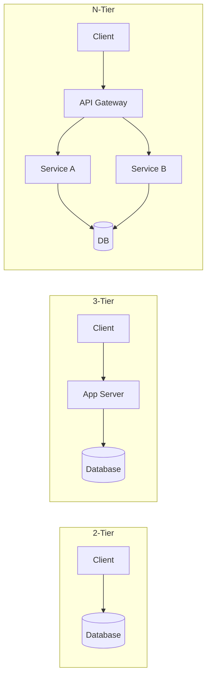

---
---

# Client-Server Architecture

## Summary
Client-server architecture is a distributed computing model where tasks are partitioned between resource providers (**servers**) and service requesters (**clients**). It has evolved from simple direct connections to complex multi-tier and microservices systems. This model is foundational to modern networking, enabling centralized data management, scalability, and specialized client experiences ranging from ultra-thin web browsers to high-performance thick clients.

## Detailed Explanation

### 1. Evolution of Architecture Tiers

The progression of client-server models reflects the need for better scalability, maintainability, and security.

*   **1-Tier Architecture**: The entire application (UI, logic, and data) resides on a single machine. (Example: MS Access, old mainframe terminals).
*   **2-Tier Architecture**: The application is split into a client (UI + Logic) and a server (Database). The client connects directly to the DB.
    *   *Pros*: Faster development for small teams.
    *   *Cons*: Low security (DB exposed), poor scalability.
*   **3-Tier Architecture**: The standard for modern web apps.
    1.  **Presentation Tier**: (Client) The UI.
    2.  **Application/Logic Tier**: (Server) Processes requests, enforces business rules.
    3.  **Data Tier**: (Database) Stores data.
*   **N-Tier (Multi-Tier) Architecture**: An extension of 3-tier where the application tier is further subdivided into specialized services (e.g., Microservices, API Gateways, Caching layers).

#### Tier Evolution Diagram


### 2. Thin Client vs. Thick Client

This distinction defines where the "heavy lifting" (processing logic) occurs.

| Feature | Thin Client | Thick (Fat) Client |
| :--- | :--- | :--- |
| **Logic Location** | Primarily on the Server | Primarily on the Client |
| **Example** | Web Browser (Basic HTML), Mobile Web | Desktop Apps (Excel), SPA (React/Angular), Gaming |
| **Maintenance** | Easy (Update server only) | Harder (Updates required on every device) |
| **Offline Capability** | Very Limited | High |
| **Security** | Higher (Logic hidden on server) | Lower (Logic exposed in client code) |

**Modern Hybrid (2025/2026 Trend):** Frameworks like **Next.js (React Server Components)** are blurring these lines by allowing developers to decide at a component level whether logic should stay on the server (Thin) or hydrate on the client (Thick).

### 3. Communication Styles

#### REST (Representational State Transfer)
*   **Philosophy**: Resource-oriented. Uses standard HTTP methods (GET, POST, PUT, DELETE).
*   **Best for**: General web APIs, public interfaces, caching-friendly apps.
*   **Go Example**:
```go
// Basic REST handler in Go
func handleRequest(w http.ResponseWriter, r *http.Request) {
    if r.Method == http.MethodGet {
        w.Header().Set("Content-Type", "application/json")
        json.NewEncoder(w).Encode(map[string]string{"message": "Hello REST"})
    }
}
```

#### GraphQL
*   **Philosophy**: Query-oriented. Clients specify exactly what data they need.
*   **Best for**: Complex frontends with nested data, reducing over-fetching.
*   **Go Application**: Often implemented using libraries like `gqlgen` to map schema fields to Go resolver functions.

#### WebSocket
*   **Philosophy**: Event-oriented. Persistent, bi-directional communication.
*   **Best for**: Real-time chats, live stock tickers, multiplayer games.

### 4. Stateless vs. Stateful Servers

*   **Stateless**: Each request from the client must contain all information needed to fulfill it. The server does not store "session" context.
    *   *Scale*: Extremely high. Requests can be routed to any server instance (e.g., behind a Load Balancer).
    *   *Mechanism*: JWT (JSON Web Tokens) or tokens in headers.
*   **Stateful**: The server maintains context about the client's session (e.g., login status, shopping cart).
    *   *Scale*: Harder. Requires "Sticky Sessions" (routing same client to same server) or shared session storage (Redis).
    *   *Mechanism*: Server-side sessions (Cookies + Session ID).

## Go Implementation Example: Simple TCP Server/Client

In Go, low-level client-server interaction is straightforward using the `net` package.

```go
// Simple Server Example
func startServer() {
    ln, _ := net.Listen("tcp", ":8080")
    for {
        conn, _ := ln.Accept()
        go func(c net.Conn) {
            fmt.Fprintf(c, "Hello from Go Server!\n")
            c.Close()
        }(conn)
    }
}

// Simple Client Example
func startClient() {
    conn, _ := net.Dial("tcp", "localhost:8080")
    status, _ := bufio.NewReader(conn).ReadString('\n')
    fmt.Println(status)
}
```

## Interview Questions

**Q: Why is 3-Tier preferred over 2-Tier in web development?**
**A:** 3-Tier adds an abstraction layer (App Server) which enhances security (database isn't directly exposed), scalability (multiple app servers can handle load), and maintainability (UI and DB logic are decoupled).

**Q: When would you choose GraphQL over REST?**
**A:** When the client needs to fetch deeply nested or relational data in a single round trip, or when the frontend needs flexibility to query specific fields to avoid over-fetching/under-fetching data.

**Q: Explain the challenge of scaling a Stateful server.**
**A:** Since the server holds session data in local memory, a load balancer must ensure the user always hits the *same* server (Sticky Sessions). If that server goes down, the session is lost. Solving this usually requires externalizing state (e.g., to Redis), effectively making the application layer stateless.

**Q: What is the impact of "Server Components" on the Thin/Thick client debate?**
**A:** They allow for a "Component-Level Hybrid" approach. We can keep data fetching and sensitive logic on the server (Thin) while only sending minimal JavaScript for interactive elements (Thick), optimizing for both performance and user experience.
