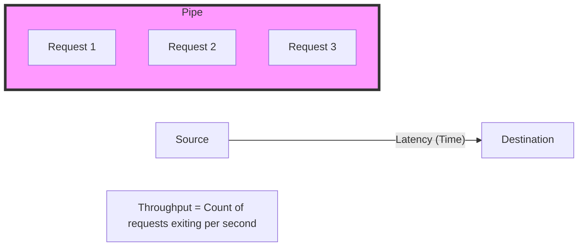

---
---

## Summary

**Latency** and **Throughput** are the two primary metrics for measuring system performance. Latency represents the **delay** (time) for a single request to complete, while Throughput represents the **capacity** (volume) of requests the system can handle in a given period. Optimizing for one often involves trade-offs with the other; for instance, batching increases throughput but also increases the latency of individual items within the batch.

## Detailed Explanation

### 1. Definitions
*   **Latency (Delay)**: The time it takes for a single unit of data to travel from the source to the destination. It is the "wait time" experienced by the user.
    *   *Unit*: Milliseconds (ms), Microseconds (μs).
    *   *Goal*: Minimize (Low latency = Fast response).
*   **Throughput (Capacity)**: The number of operations or amount of data processed by a system in a specific timeframe.
    *   *Unit*: Requests per second (RPS), Queries per second (QPS), bits per second (bps).
    *   *Goal*: Maximize (High throughput = High volume).

### 2. The "Pipe" Analogy
Imagine a water pipe:
*   **Latency**: The time it takes for a single drop of water to travel from one end of the pipe to the other.
*   **Throughput**: The volume of water flowing through the pipe per second.
*   **Bandwidth**: The diameter (width) of the pipe. A wider pipe (more bandwidth) allows more water (throughput) but doesn't necessarily make a single drop travel faster (latency).



### 3. Little's Law
In queueing theory, Little's Law describes the long-term average relationship between the number of items in a system, their arrival rate, and their wait time.

$$L = \lambda \times W$$

*   **$L$**: Average number of items in the system (In-flight requests).
*   **$\lambda$**: Average arrival rate (Throughput).
*   **$W$**: Average time spent in the system (Latency).

**Relevance**: To increase throughput ($\lambda$) while keeping latency ($W$) constant, you must increase the number of parallel requests ($L$) the system can handle (e.g., by adding more workers or scaling horizontally).

---

## Optimization Strategies

### Optimizing for Latency (Reducing Delay)
1.  **Caching**: Store frequently accessed data closer to the user to avoid expensive round-trips to the database.
2.  **CDN (Edge Computing)**: Distribute content geographically to reduce physical distance (propagation delay).
3.  **Hardware Acceleration**: Use faster disks (NVMe vs SSD), more RAM, or specialized hardware (GPUs/TPUs).
4.  **Network Optimization**: Use faster protocols (HTTP/3, gRPC) and reduce network hops.

### Optimizing for Throughput (Increasing Volume)
1.  **Batching**: Grouping small tasks into a single larger operation (e.g., bulk database inserts) to reduce per-request overhead.
2.  **Parallelism**: Use multi-threading or distributed systems to process many requests simultaneously.
3.  **Asynchronous Processing**: Use message queues (Kafka, RabbitMQ) to decouple components, allowing the system to accept new requests while background tasks complete.
4.  **Load Balancing**: Distribute traffic across multiple servers to prevent any single node from becoming a bottleneck.

---

## Go (Golang) Application

In Go, performance is often managed using concurrency primitives like channels and contexts.

### Throughput Example: Buffered Channels
Buffered channels allow a producer to continue working until the buffer is full, increasing throughput by decoupling it from the consumer's immediate availability.

```go
package main

import (
	"fmt"
	"time"
)

func main() {
	// Buffered channel with capacity 5.
	// Improves throughput by allowing the producer to 'burst' 5 tasks.
	tasks := make(chan int, 5)

	// Producer
	go func() {
		for i := 1; i <= 10; i++ {
			fmt.Printf("Producing task %d\n", i)
			tasks <- i // Blocks only if the buffer (5) is full
		}
		close(tasks)
	}()

	// Consumer
	for task := range tasks {
		fmt.Printf("Processing task %d\n", task)
		time.Sleep(100 * time.Millisecond) // Simulate work
	}
}
```

### Latency Example: Context Timeouts
Contexts are the standard way in Go to enforce SLAs and prevent long-tail latency from tying up resources.

```go
package main

import (
	"context"
	"fmt"
	"time"
)

func fetchExternalResource(ctx context.Context) (string, error) {
	select {
	case <-time.After(500 * time.Millisecond): // Simulate a slow 500ms response
		return "Success", nil
	case <-ctx.Done():
		return "", ctx.Err() // Return error if latency limit exceeded
	}
}

func main() {
	// Enforce a 200ms latency limit (SLA)
	ctx, cancel := context.WithTimeout(context.Background(), 200*time.Millisecond)
	defer cancel()

	data, err := fetchExternalResource(ctx)
	if err != nil {
		fmt.Printf("Latency limit exceeded: %v\n", err)
		return
	}
	fmt.Printf("Received: %s\n", data)
}
```

---

## Interview Questions

**Q: Can a system have high throughput but high latency?**
**A:** Yes. A batch processing system (like Hadoop) can process terabytes of data (high throughput) but may take hours to return a single result (high latency).

**Q: Why does batching increase throughput but also increase latency?**
**A:** Batching reduces the overhead per item (e.g., fewer network calls or disk I/O operations), allowing more items to be processed overall. However, the first item in the batch must wait for the entire batch to be filled and processed before it is completed, increasing its individual latency.

**Q: How does Little's Law help in capacity planning?**
**A:** It allows you to calculate the number of concurrent connections ($L$) your server needs to support to achieve a target throughput ($\lambda$) given your current average latency ($W$). If your server supports 1000 concurrent connections and your average latency is 100ms, your maximum throughput is $1000 / 0.1 = 10,000$ RPS.

**Q: What is the "Tail Latency" problem?**
**A:** In large distributed systems, the overall latency is often determined by the slowest component (p99 or p99.9 latency). Even if the average latency is low, high tail latency can degrade user experience for a significant number of users.
