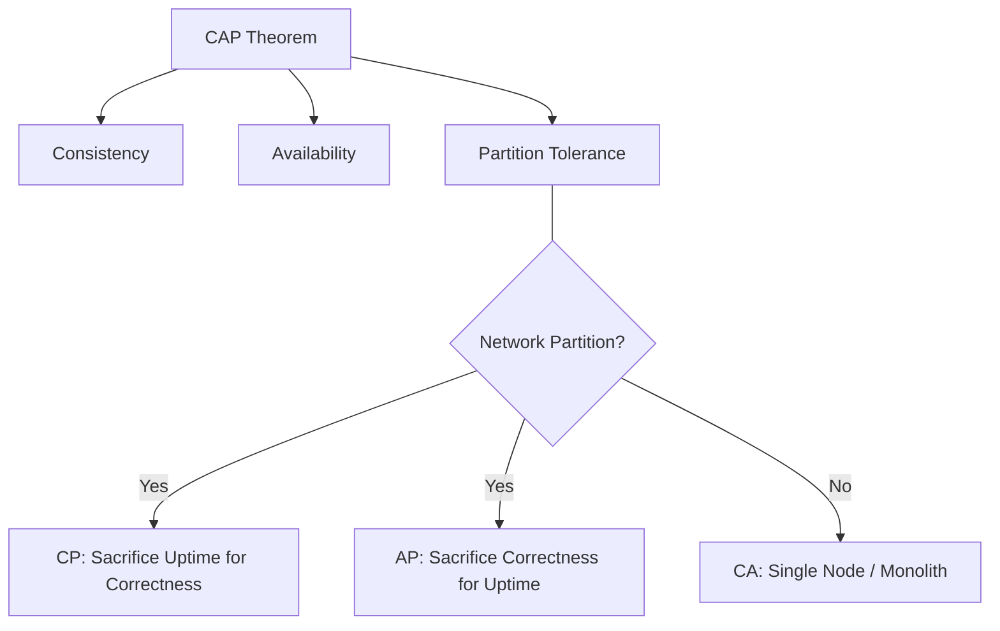

---
---
## Summary
In distributed systems, **Availability** and **Consistency** represent a fundamental trade-off governed by the CAP Theorem. Availability ensures every request receives a (non-error) response, even if some nodes are down or data is stale. Consistency ensures every read receives the most recent write or an error, providing a single-system image. Modern architects must choose between prioritizing uptime (AP systems) or data correctness (CP systems) during network partitions, often leveraging eventual consistency to balance both in practice.

## CAP Theorem and Trade-offs
The **CAP Theorem** (Brewer's Theorem) states that a distributed data store can only provide two of the following three guarantees simultaneously:
*   **Consistency (C)**: Every read receives the most recent write or an error.
*   **Availability (A)**: Every request receives a (non-error) response, without the guarantee that it contains the most recent write.
*   **Partition Tolerance (P)**: The system continues to operate despite an arbitrary number of messages being dropped or delayed by the network between nodes.

### The Trade-off: CP vs AP
For a deep dive into each, see:
* [[02-cap-theorem/01-availability-plus-partition-tolerance|AP Systems (Availability + Partition Tolerance)]]
* [[02-cap-theorem/02-consistency-plus-partition-tolerance|CP Systems (Consistency + Partition Tolerance)]]
In any distributed system, **Partition Tolerance (P) is unavoidable**. Networks fail, so we must choose:
1.  **CP (Consistency + Partition Tolerance)**: If a partition occurs, the system stops accepting writes or responding to reads to avoid serving stale data. "Better to be down than wrong."
2.  **AP (Availability + Partition Tolerance)**: If a partition occurs, nodes continue to respond even if they cannot sync. This leads to data divergence that must be resolved later. "Better to be stale than down."



## Definitions: Availability vs Consistency

### Availability (The "Uptime" Metric)
*   **Definition**: The probability that a system is operational and accessible at any given time.
*   **Measurement**: Usually expressed in "nines" (e.g., 99.9% or "Three Nines").
*   **Focus**: User experience and business continuity. A system is "available" if it responds to a user, even if the data is slightly old.

### Consistency (The "Truth" Metric)
*   **Definition**: The requirement that all nodes in a distributed system see the same data at the same time.
*   **Measurement**: Linearizability or Serializability.
*   **Focus**: Data integrity and correctness. A system is "consistent" if it prevents "split-brain" scenarios where different users see conflicting results for the same record.

## Consistency Models
Consistency is not binary; it exists on a spectrum from Strong to Weak.

### 1. Strong Consistency (Linearizability)
After a write completes, any subsequent read will return that value. It requires synchronous replication and often uses consensus algorithms like **Paxos** or **Raft**.
*   **Pros**: Simplifies application logic; behaves like a single-node DB.
*   **Cons**: High latency; reduced availability during partitions.

### 2. Eventual Consistency (BASE)
If no new updates are made to an item, eventually all accesses will return the last updated value. Used in **Amazon DynamoDB** and **Apache Cassandra**.
*   **Pros**: High performance; high availability.
*   **Cons**: Stale reads; requires conflict resolution (e.g., Last-Write-Wins).

### 3. Causal Consistency
A middle ground where operations that are "causally related" must be seen in the same order by all nodes. For example, a "Reply" to a comment must always appear *after* the original comment.
*   **Pros**: Stronger than eventual, faster than strong.
*   **Cons**: Complexity in tracking dependencies (Vector Clocks).

## Real-world Examples

| Use Case | Priority | Model | Why? |
| :--- | :--- | :--- | :--- |
| **Banking / Ledger** | Consistency | **CP** | A balance must never be "eventually" correct; double-spending is unacceptable. |
| **Social Media Feed** | Availability | **AP** | Users don't mind if a post appears 2 seconds late, but they hate it if the app won't load. |
| **DNS (Domain Name System)** | Availability | **AP** | Propagating a domain change takes time; it's okay to hit an old IP for a while. |
| **Stock Trading** | Consistency | **CP** | Prices and orders must be perfectly synchronized to prevent arbitrage or failed trades. |

## High Availability Techniques

1.  **Replication**: Keeping copies of data on multiple nodes.
    *   **Master-Slave**: Writes to master, reads from slaves.
    *   **Multi-Master**: Writes to any node (requires conflict resolution).
2.  **Failover**: Automatically switching to a standby node when a failure is detected.
    *   **Active-Passive**: Standby node waits for failure.
    *   **Active-Active**: All nodes serve traffic; if one fails, others take the load.
3.  **Health Checks & Heartbeats**: Continuous monitoring to detect node death.
4.  **Load Balancing**: Distributing traffic across multiple healthy instances to prevent single points of failure.
5.  **Redundancy**: Deploying across different Availability Zones (AZs) or Regions to survive physical data center outages.

## Go Implementation: Simulating Consistency Levels
In Go, we often deal with consistency in distributed services using tools like Etcd (Strong) or custom replication logic.

```go
package main

import (
	"fmt"
	"sync"
	"time"
)

// DistributedStore simulates a simple key-value store with eventual consistency
type DistributedStore struct {
	mu    sync.RWMutex
	nodes map[string]string // Primary source of truth
	cache map[string]string // Local "stale" node
}

// Write simulates a Strong Consistency write (updates all)
func (s *DistributedStore) WriteStrong(key, value string) {
	s.mu.Lock()
	defer s.mu.Unlock()
	s.nodes[key] = value
	s.cache[key] = value // Sync update
	fmt.Printf("[Strong Write] %s = %s\n", key, value)
}

// WriteEventual simulates an Eventual Consistency write (async sync)
func (s *DistributedStore) WriteEventual(key, value string) {
	s.mu.Lock()
	s.nodes[key] = value
	s.mu.Unlock()
	
	fmt.Printf("[Eventual Write] %s = %s (Propagating...)\n", key, value)
	
	// Simulate replication delay
	go func() {
		time.Sleep(2 * time.Second)
		s.mu.Lock()
		s.cache[key] = value
		s.mu.Unlock()
		fmt.Printf("[Replication Complete] %s synced to local cache\n", key)
	}()
}

// Read returns data from the local cache (might be stale)
func (s *DistributedStore) Read(key string) string {
	s.mu.RLock()
	defer s.mu.RUnlock()
	return s.cache[key]
}

func main() {
	store := &DistributedStore{
		nodes: make(map[string]string),
		cache: make(map[string]string),
	}

	// 1. Strong Consistency Example
	store.WriteStrong("balance", "100")
	fmt.Println("Immediate Read:", store.Read("balance")) // Returns 100

	// 2. Eventual Consistency Example
	fmt.Println("\n--- Eventual Consistency ---")
	store.WriteEventual("status", "online")
	fmt.Println("Immediate Read (Stale):", store.Read("status")) // Might be empty/old
	
	time.Sleep(3 * time.Second)
	fmt.Println("Read after 3s (Synced):", store.Read("status")) // Returns online
}
```

## Interview Questions

**Q: In a distributed system, why is CA (Consistency + Availability) usually impossible?**
**A:** Because network partitions (P) are a fact of life in distributed environments. If you choose CA, your system will fail (lose both C and A) the moment a single network link drops. In a distributed context, you MUST choose how to handle a partition, which forces the CP vs AP decision.

**Q: What is the "PACELC" theorem and how does it extend CAP?**
**A:** PACELC stands for: If **P**artition, trade **A**vailability vs **C**onsistency; **E**lse (normal operation), trade **L**atency vs **C**onsistency. It acknowledges that even without failures, strong consistency incurs a latency penalty because you must wait for data to replicate across nodes.

**Q: How does Causal Consistency differ from Eventual Consistency?**
**A:** Eventual consistency makes no guarantees about the order of updates; if you post a comment and then a reply, a user might see the reply before the comment. Causal consistency ensures that if A causes B, every node sees A before B, providing a more intuitive user experience while still being faster than strong consistency.

**Q: Can a system be both CP and AP?**
**A:** No, but many modern databases (like Cassandra or DynamoDB) are **tunable**. You can configure a query to require a Quorum of nodes (making it behave like CP) or allow any single node to respond (making it AP), allowing architects to choose the model per-operation.
