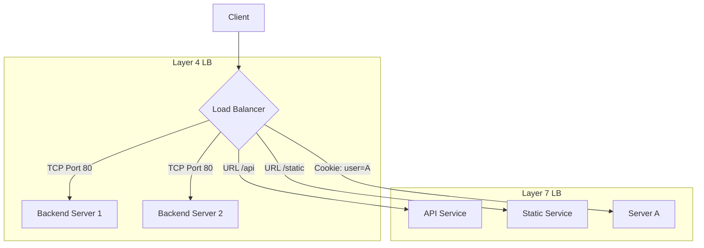

---
---

## Summary
The choice between Layer 4 (Transport) and Layer 7 (Application) load balancing depends on the specific needs of the application, such as performance requirements, security needs, and the complexity of the routing logic.

## Comparison Overview

| Feature | Layer 4 (Transport) | Layer 7 (Application) |
| :--- | :--- | :--- |
| **OSI Layer** | Layer 4 (TCP/UDP) | Layer 7 (HTTP/HTTPS/FTP) |
| **Decision Criteria** | IP Address, Port | Headers, Cookies, URL, Method |
| **Speed** | Extremely Fast (Low Latency) | Slower (Content Inspection) |
| **Resource Usage** | Low CPU/Memory | High CPU (Deep Inspection) |
| **SSL/TLS** | Pass-through (No decryption) | Termination (Decryption required) |
| **Routing** | "Dumb" (Connection-based) | "Smart" (Content-based) |
| **Protocol Support** | Any TCP/UDP protocol | Specifically application protocols |

## Layer 4 (Transport) Deep Dive
*   **Focus**: IP + Port. No packet inspection beyond the transport header.
*   **Pros**:
    *   **Extremely Fast**: Minimal overhead since it doesn't parse application data.
    *   **Secure Pass-through**: Handles encrypted traffic without needing the private keys on the LB.
    *   **Scalable**: One LB can handle millions of concurrent connections easily.
*   **Cons**:
    *   **Dumb Routing**: Cannot make decisions based on what's inside the request (e.g., can't route `/api` to a different server than `/`).
*   **Examples**:
    *   **LVS** (Linux Virtual Server)
    *   **HAProxy** (when running in TCP mode)
    *   **AWS NLB** (Network Load Balancer)

## Layer 7 (Application) Deep Dive
*   **Focus**: HTTP Headers, Cookies, URL path, Host headers.
*   **Pros**:
    *   **Smart Routing**: Essential for microservices (routing by path or header).
    *   **Auth Termination**: Can handle authentication/authorization before the request hits the backend.
    *   **Sticky Sessions**: Easy to implement session persistence using cookies.
*   **Cons**:
    *   **Slower**: Needs to wait for the whole request and potentially decrypt it.
    *   **CPU Intensive**: Parsing and decryption are computationally expensive.
*   **Examples**:
    *   **NGINX**
    *   **AWS ALB** (Application Load Balancer)
    *   **Traefik**
    *   **HAProxy** (when running in HTTP mode)

## Architecture Diagram (Mermaid)

## Interview Questions
*   **Q: When should I choose Layer 4 over Layer 7?**
*   **A:** Choose Layer 4 when performance is the absolute priority, when you need to handle non-HTTP traffic, or when you want end-to-end SSL encryption without terminating it on the load balancer.
*   **Q: Can HAProxy do both?**
*   **A:** Yes, HAProxy can operate in `mode tcp` (Layer 4) or `mode http` (Layer 7).
*   **Q: How does Layer 7 help with microservices?**
*   **A:** It allows a single entry point (the LB) to route requests to dozens of different microservices based on the URL path (e.g., `example.com/orders` vs `example.com/users`).
