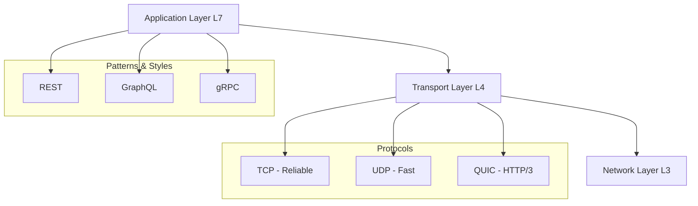
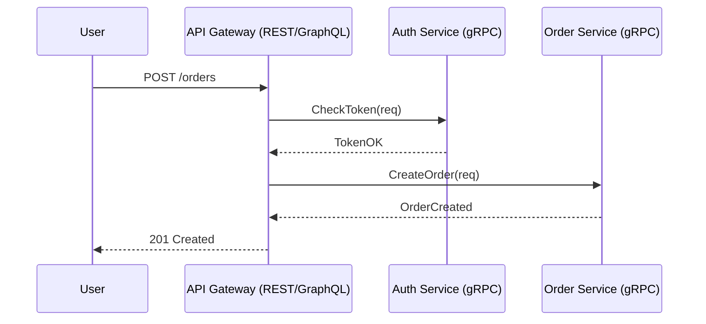

---
---

# System Communication Patterns

## Summary
System communication defines how components in a distributed system exchange information. It encompasses low-level network protocols (**TCP/UDP**), application-level architectural styles (**REST/GraphQL**), high-performance serialization frameworks (**gRPC**), and reliability patterns like **Idempotency**. Choosing the right pattern is critical for balancing performance, scalability, and consistency.

## Detailed Explanation

### 1. Communication Hierarchy
Communication can be viewed as a stack, starting from the reliability of the transport layer up to the semantics of the application layer.

### 2. Comparison Matrix

| Pattern | Style | Transport | Serialization | Best For |
| :--- | :--- | :--- | :--- | :--- |
| **REST** | Resource-based | HTTP/1.1 / 2 | JSON / XML | Public APIs, Browser clients |
| **GraphQL** | Query-based | HTTP/1.1 / 2 | JSON | Complex data relationships, Mobile |
| **gRPC** | Action-based | HTTP/2 | Protobuf (Binary) | Internal Microservices, Streaming |

### 3. Reliability and Fault Tolerance
In distributed systems, "The Network is Unreliable." We must design for failure using:
*   **Synchronous Communication**: Blocking (REST, gRPC). Easier to reason about but can lead to cascading failures.
*   **Asynchronous Communication**: Non-blocking (Message Queues, Pub/Sub). decouples services and increases resilience.
*   **Idempotency**: Ensures that retrying a failed request is safe. See [[04-idempotent-operations|Idempotent Operations]].

### Go Application: Choosing the Right Tool
Go's ecosystem is rich with tools for every communication pattern.

| Requirement | Recommended Go Library |
| :--- | :--- |
| **Standard HTTP/REST** | `net/http` (stdlib), `gin-gonic/gin` |
| **High Performance RPC** | `google.golang.org/grpc` |
| **Type-safe GraphQL** | `99designs/gqlgen` (Server), `gqlgo/gqlgenc` (Client) |
| **Low-level Networking** | `net` (stdlib) |

#### Example: Hybrid Approach
It is common to use **REST/GraphQL** for external traffic (Edge) and **gRPC** for internal service-to-service communication.

## Interview Questions
*   **Q: When should I use gRPC instead of REST?**
    *   **A:** Use gRPC for internal microservices where performance (binary serialization) and strict contracts (Protobuf) are important. Use REST for public-facing APIs where ease of consumption and browser compatibility are priorities.
*   **Q: How do you handle a "Slow Consumer" in a communication pattern?**
    *   **A:** Use **Asynchronous communication** with a Message Queue (like RabbitMQ or Kafka). The producer can send messages at its own pace, and the consumer can process them as fast as it can without blocking the producer.
*   **Q: What is the difference between Orchestration and Choreography in service communication?**
    *   **A:** **Orchestration** uses a central controller (the "orchestrator") to tell services what to do. **Choreography** is decentralized; services react to events published by other services (Event-Driven Architecture).
