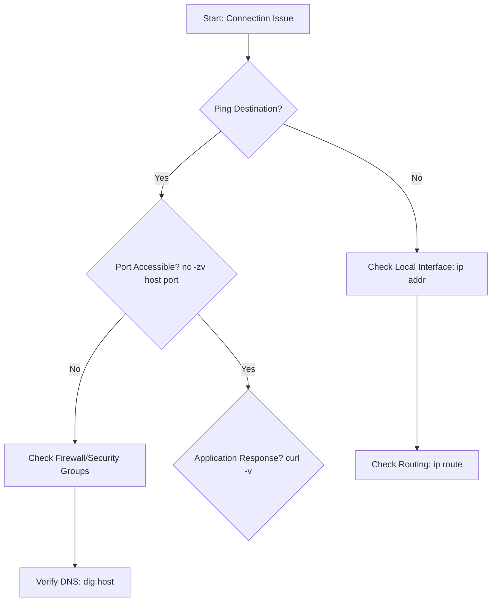

---
---

## Summary
Networking tools are essential for DevOps engineers to diagnose connectivity, performance, and security issues across distributed systems. Mastering both low-level CLI utilities (for immediate troubleshooting) and high-level programming interfaces (like Go's `net` package) allows for efficient infrastructure management and automated remediation.

## Detailed Explanation

### 1. Essential Troubleshooting CLI Tools
Modern DevOps requires a mix of classic and modern tools to inspect the network stack.

| Tool | Purpose | Modern Alternative |
| --- | --- | --- |
| `ping` | Verifies end-to-end connectivity via ICMP Echo requests. | - |
| `traceroute` | Identifies the path packets take to a destination and where delays occur. | `tracepath` |
| `mtr` | Combined `ping` and `traceroute` functionality with real-time updates. | - |
| `ifconfig` | Configures and displays network interface parameters. | `ip addr` / `ip link` |
| `netstat` | Shows network connections, routing tables, and interface statistics. | `ss` |
| `nc` (netcat) | "Swiss-army knife" for reading/writing data across network connections. | `socat` |
| `dig` | Performs DNS lookups and queries DNS name servers. | `nslookup` (Legacy) |
| `tcpdump` | Command-line packet analyzer; captures and filters network traffic. | `tshark` / Wireshark |
| `curl` / `wget` | Transfer data from or to a server (HTTP, FTP, etc.). | - |

#### Network Troubleshooting Flow


### 2. Networking in Go (Golang)
Go provides powerful networking primitives in its standard library, making it a top choice for building cloud-native tools.

#### TCP Client/Server (net package)
The `net` package is the foundation for socket programming.

```go
package main

import (
	"bufio"
	"fmt"
	"net"
	"os"
)

// Simple TCP Echo Server
func startServer() {
	ln, _ := net.Listen("tcp", ":8080")
	defer ln.Close()

	for {
		conn, _ := ln.Accept()
		go func(c net.Conn) {
			defer c.Close()
			message, _ := bufio.NewReader(c).ReadString('\n')
			c.Write([]byte("Echo: " + message))
		}(conn)
	}
}

// Simple TCP Dial (Client)
func startClient() {
	conn, _ := net.Dial("tcp", "localhost:8080")
	fmt.Fprintf(conn, "Hello Server\n")
	message, _ := bufio.NewReader(conn).ReadString('\n')
	fmt.Print("Message from server: " + message)
}
```

#### HTTP Client and Server (net/http)
For higher-level protocols, `net/http` is highly optimized and includes built-in support for HTTP/2.

```go
package main

import (
	"fmt"
	"io"
	"net/http"
	"time"
)

func main() {
	// 1. High-level HTTP Client with Timeout
	client := &http.Client{
		Timeout: 5 * time.Second,
	}
	resp, _ := client.Get("https://api.github.com")
	defer resp.Body.Close()
	body, _ := io.ReadAll(resp.Body)
	fmt.Println(string(body))

	// 2. HTTP Server
	http.HandleFunc("/", func(w http.ResponseWriter, r *http.Request) {
		fmt.Fprintf(w, "Hello, you've requested: %s\n", r.URL.Path)
	})
	// http.ListenAndServe(":8080", nil)
}
```

#### Key Concepts in Go Networking
- **Dialer**: Used to create connections with specific configurations (timeouts, deadlines).
- **Deadlines**: Crucial for production code to prevent goroutine leaks on hanging connections (`SetDeadline`, `SetReadDeadline`).
- **Context**: Used to propagate cancellation and timeouts through the networking stack.

## Interview Questions

**Q: What is the difference between `ping` and `traceroute` when troubleshooting?**
**A:** `ping` uses ICMP to check if a host is reachable and measures Round Trip Time (RTT). `traceroute` identifies every hop (router) between the source and destination by incrementing the TTL (Time to Live) of packets, helping to locate exactly where a network failure or bottleneck is occurring.

**Q: How do you identify which process is listening on a specific port?**
**A:** Using `ss -lntp` (modern) or `netstat -plnt`. These commands show listening (`-l`) TCP (`-t`) ports numerically (`-n`) and include the process ID/name (`-p`).

**Q: In Go, why should you avoid using the default `http.Client`?**
**A:** The default `http.Client` (`http.DefaultClient`) has no timeout. In a production environment, if a remote server hangs, your application will keep the connection open indefinitely, potentially leading to resource exhaustion (goroutine leaks). Always define a custom client with a reasonable `Timeout`.

**Q: Explain the difference between `TCP` and `UDP` in the context of Go's `net` package.**
**A:** TCP is connection-oriented; you use `net.Listen` and `ln.Accept` for servers, and `net.Dial` for clients. It ensures reliable delivery. UDP is connectionless; you use `net.ListenPacket` to get a `net.PacketConn`. In Go, UDP "connections" created with `net.DialUDP` are just convenience wrappers that filter packets by address but do not establish a handshake.

**Q: How does `dig` help in troubleshooting DNS issues?**
**A:** `dig` provides detailed output including the Header, Question section, Answer section, and Authority section. It allows you to query specific record types (`A`, `MX`, `TXT`, `CNAME`) and trace the resolution process from root servers using `dig +trace`, which is vital for debugging propagation or glue record issues.
