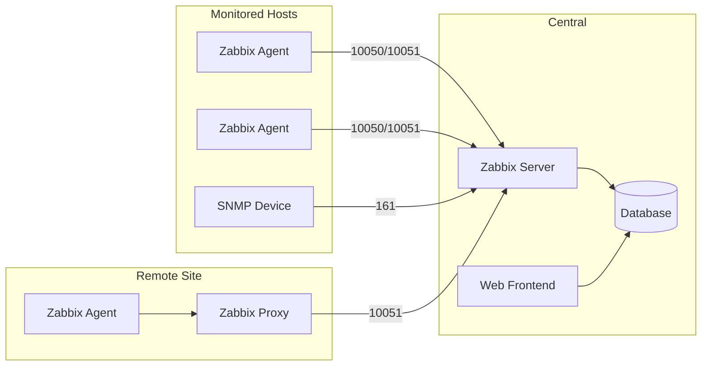

---
---

# Zabbix

Zabbix is an enterprise-level open-source monitoring solution designed for tracking the status of network services, servers, and network hardware. Unlike cloud-native tools like Prometheus, Zabbix uses a relational database (MySQL/PostgreSQL) and provides a template-driven approach to infrastructure monitoring.

## Summary

Zabbix follows a traditional agent-based model with a central server, relational database storage, and a PHP web interface. It excels at deep infrastructure monitoring (especially SNMP for network devices) and provides built-in dashboards, user management, and alerting without external dependencies. Its **Template** system allows reusable configurations across thousands of hosts.

## Detailed Explanation

### 1. Architecture



*   **Zabbix Server**: Central component that polls data, calculates triggers, and sends notifications.
*   **Database**: Stores configuration, history, and trends (MySQL, PostgreSQL, TimescaleDB).
*   **Web Interface**: PHP-based frontend for configuration and visualization.
*   **Zabbix Agent**: Deployed on targets to gather local metrics (CPU, memory, disk).
    *   **Passive Mode**: Server requests data from agent (agent listens on port 10050).
    *   **Active Mode**: Agent pushes data to server (server listens on port 10051).
*   **Zabbix Proxy**: Collects data from remote locations and forwards to the server. Essential for distributed monitoring and offloading the main server.
*   **Java Gateway**: For monitoring JMX-based applications.

### 2. Core Concepts

| Concept | Description |
| :--- | :--- |
| **Host** | A networked device to monitor (server, switch, VM) |
| **Template** | Reusable set of items, triggers, graphs, discovery rules |
| **Item** | Specific metric to collect (e.g., `system.cpu.load[all,avg1]`) |
| **Trigger** | Logical expression defining a problem threshold |
| **Action** | What happens when trigger fires (notification, remote command) |
| **LLD** | Low-Level Discovery - auto-creates items for dynamic entities |

### 3. Zabbix vs. Prometheus vs. Nagios

| Feature | Zabbix | Prometheus | Nagios |
| :--- | :--- | :--- | :--- |
| **Data Model** | Relational (Host-based) | Time-series (Metric-based) | Status-based (Check-based) |
| **Collection** | Pull & Push (Trapper) | Primarily Pull | Primarily Pull |
| **Storage** | SQL Database | Custom TSDB | Flat files |
| **Service Discovery** | Built-in (Network/LLD) | Dynamic (K8s, Consul) | Manual/scripts |
| **Visualization** | Built-in Dashboards | Relies on Grafana | Basic/NagVis |
| **Best For** | Infrastructure/SNMP | Microservices/Containers | Simple health checks |

---

## Go Implementation Example

### Zabbix Sender: Pushing Custom Metrics

Using `github.com/AlekSi/zabbix-sender` to push metrics to a Zabbix Trapper item.

```go
package main

import (
	"fmt"
	"time"

	zabbix "github.com/AlekSi/zabbix-sender"
)

func main() {
	// 1. Initialize sender with Zabbix Server/Proxy address
	addr := "zabbix-server.local:10051"
	s := zabbix.NewSender(addr)

	// 2. Define metrics to push
	// 'Host' must match the Hostname configured in Zabbix
	// 'Key' must match a 'Zabbix Trapper' item key
	metrics := []*zabbix.Metric{
		zabbix.NewMetric("AppServer01", "app.request.count", "150", time.Now().Unix()),
		zabbix.NewMetric("AppServer01", "app.latency.ms", "42", time.Now().Unix()),
	}

	// 3. Send the packet
	packet := zabbix.NewPacket(metrics)
	res, err := s.Send(packet)
	if err != nil {
		fmt.Printf("Error sending to Zabbix: %v\n", err)
		return
	}

	fmt.Printf("Zabbix Response: %s\n", res)
}
```

### Zabbix API: Managing Hosts Programmatically

```go
package main

import (
	"bytes"
	"encoding/json"
	"fmt"
	"net/http"
)

type ZabbixRequest struct {
	JSONRPC string      `json:"jsonrpc"`
	Method  string      `json:"method"`
	Params  interface{} `json:"params"`
	ID      int         `json:"id"`
	Auth    string      `json:"auth,omitempty"`
}

func main() {
	apiURL := "http://zabbix.local/api_jsonrpc.php"

	// 1. Authenticate
	authReq := ZabbixRequest{
		JSONRPC: "2.0",
		Method:  "user.login",
		Params: map[string]string{
			"username": "Admin",
			"password": "zabbix",
		},
		ID: 1,
	}

	token, err := callAPI(apiURL, authReq)
	if err != nil {
		panic(err)
	}
	fmt.Printf("Auth Token: %s\n", token)

	// 2. Get all hosts
	hostReq := ZabbixRequest{
		JSONRPC: "2.0",
		Method:  "host.get",
		Params: map[string]interface{}{
			"output": []string{"hostid", "host", "name"},
		},
		Auth: token,
		ID:   2,
	}

	hosts, _ := callAPI(apiURL, hostReq)
	fmt.Printf("Hosts: %s\n", hosts)
}

func callAPI(url string, req ZabbixRequest) (string, error) {
	body, _ := json.Marshal(req)
	resp, err := http.Post(url, "application/json", bytes.NewReader(body))
	if err != nil {
		return "", err
	}
	defer resp.Body.Close()

	var result map[string]interface{}
	json.NewDecoder(resp.Body).Decode(&result)

	if res, ok := result["result"].(string); ok {
		return res, nil
	}
	resBytes, _ := json.Marshal(result["result"])
	return string(resBytes), nil
}
```

## Interview Questions

**Q1: What is the difference between a Zabbix Agent and a Zabbix Proxy?**
**A:** An **Agent** is installed on the target host to collect metrics locally. A **Proxy** is a middle-man that collects data from multiple agents/devices and forwards it to the Zabbix Server. Proxies are used for remote locations (behind firewalls) or to offload processing from the main server.

**Q2: Explain "Active" vs. "Passive" Agent checks.**
**A:** In **Passive mode**, the Zabbix Server connects to the agent (port 10050) and polls for data. In **Active mode**, the agent connects to the server (port 10051), downloads its list of items, and pushes data periodically. Active mode is better for scaling and monitoring hosts behind NAT.

**Q3: What is "Low-Level Discovery" (LLD) in Zabbix?**
**A:** LLD automatically creates items, triggers, and graphs for dynamic entities on a host (e.g., discovering all network interfaces or disk partitions) without manual configuration for each one. It uses discovery rules and item prototypes.

**Q4: How does Zabbix handle alerting when a service goes down?**
**A:** Zabbix uses **Triggers** to evaluate state. When a trigger condition is met (e.g., `{host:net.tcp.service[http].last()}=0`), it enters "Problem" state. An **Action** is then triggered, which can send notifications (Email, Slack, PagerDuty) or execute a **Remote Command** to attempt recovery.

**Q5: Why would you choose Zabbix over Prometheus?**
**A:** Choose Zabbix for:
1. Deep infrastructure monitoring (SNMP for switches/routers)
2. Centralized relational database for audit logs
3. Built-in user management and role-based access
4. All-in-one solution without external dependencies (no Grafana needed)
5. Legacy or regulated environments requiring structured data retention
