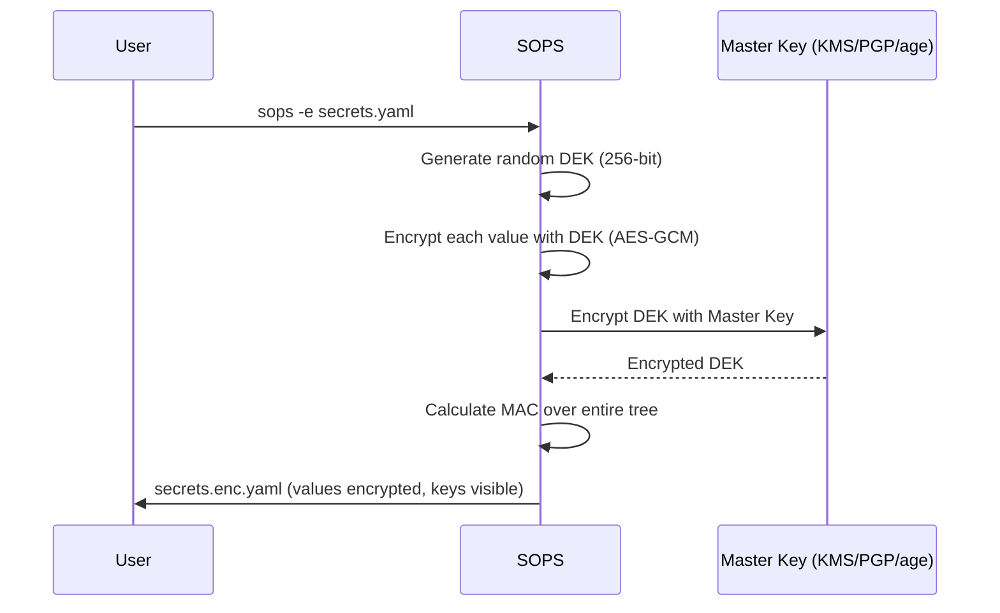

---
---

# SOPS (Secrets OPerationS)

Mozilla SOPS is a decentralized secret management tool that encrypts **values** within structured data files while leaving **keys** unencrypted. This "Git-friendly" approach enables developers to version control secrets without exposing sensitive data.

## Summary

SOPS encrypts YAML, JSON, ENV, and INI files using an "envelope encryption" pattern. It generates a random Data Encryption Key (DEK) for each file, encrypts values with AES-GCM, then encrypts the DEK with one or more Master Keys (AWS KMS, GCP KMS, Azure Key Vault, age, PGP). This allows multiple parties to decrypt the same file using different keys.

## Detailed Explanation

### 1. Key Concepts

| Concept | Description |
| :--- | :--- |
| **DEK** | Data Encryption Key - unique 32-byte AES key per file |
| **Master Keys** | External keys (KMS, PGP, age) used to encrypt the DEK |
| **MAC** | Message Authentication Code - HMAC ensuring integrity of all fields |
| **Key Groups** | Sets of master keys for Shamir secret sharing |

### 2. Encryption Flow (Envelope Pattern)



### 3. File Structure

```yaml
# secrets.enc.yaml - Safe to commit to Git
database:
    host: ENC[AES256_GCM,data:abc123...,iv:xyz...]
    password: ENC[AES256_GCM,data:def456...,iv:uvw...]
sops:
    kms:
        - arn: arn:aws:kms:us-east-1:123456789:key/abc-123
          enc: AQICAHh...  # Encrypted DEK
    age:
        - recipient: age1ql3z7...
          enc: -----BEGIN AGE ENCRYPTED FILE-----...
    mac: ENC[AES256_GCM,data:...,tag:...]
    lastmodified: "2024-01-15T10:30:00Z"
    version: 3.8.1
```

---

## Go Implementation Example

### Decrypting SOPS Files in Go

Using `github.com/getsops/sops/v3/decrypt`:

```go
package main

import (
	"fmt"
	"log"
	"os"

	"github.com/getsops/sops/v3/decrypt"
	"gopkg.in/yaml.v3"
)

type Config struct {
	Database struct {
		Host     string `yaml:"host"`
		Password string `yaml:"password"`
	} `yaml:"database"`
}

func main() {
	// 1. Decrypt the SOPS-encrypted file
	// Requires appropriate credentials (AWS_PROFILE, SOPS_AGE_KEY_FILE, etc.)
	cleartext, err := decrypt.File("secrets.enc.yaml", "yaml")
	if err != nil {
		log.Fatalf("Failed to decrypt: %v", err)
	}

	// 2. Parse the decrypted YAML
	var cfg Config
	if err := yaml.Unmarshal(cleartext, &cfg); err != nil {
		log.Fatalf("Failed to parse YAML: %v", err)
	}

	fmt.Printf("Database Host: %s\n", cfg.Database.Host)
	fmt.Printf("Password length: %d chars\n", len(cfg.Database.Password))
}
```

### CLI Examples

```bash
# 1. Create .sops.yaml for automatic key selection
cat > .sops.yaml << 'EOF'
creation_rules:
  - path_regex: .*\.enc\.yaml$
    kms: arn:aws:kms:us-east-1:123456789:key/abc-123
  - path_regex: .*\.local\.yaml$
    age: age1ql3z7hjy54pw3hyww5ayyfg7zqgvc7w3j2elw8zmrj2kg5sfn9aqmcac8p
EOF

# 2. Encrypt a file (uses rules from .sops.yaml)
sops -e secrets.yaml > secrets.enc.yaml

# 3. Edit encrypted file in-place (decrypts, opens $EDITOR, re-encrypts)
sops secrets.enc.yaml

# 4. Decrypt to stdout
sops -d secrets.enc.yaml

# 5. Rotate DEK to new master keys
sops -r secrets.enc.yaml

# 6. Add a new KMS key to existing file
sops -r --add-kms arn:aws:kms:eu-west-1:123456789:key/def-456 secrets.enc.yaml

# 7. Use with age (modern PGP alternative)
export SOPS_AGE_KEY_FILE=~/.config/sops/age/keys.txt
sops -e --age age1ql3z7... secrets.yaml > secrets.enc.yaml
```

### GitOps Integration

**Flux (Native Support)**:
```yaml
# kustomization.yaml
apiVersion: kustomize.toolkit.fluxcd.io/v1
kind: Kustomization
metadata:
  name: my-app
spec:
  decryption:
    provider: sops
    secretRef:
      name: sops-age  # Secret containing age private key
```

**ArgoCD (via Plugin)**:
```yaml
# ConfigManagementPlugin
apiVersion: v1
kind: ConfigMap
metadata:
  name: cmp-plugin
data:
  plugin.yaml: |
    apiVersion: argoproj.io/v1alpha1
    kind: ConfigManagementPlugin
    metadata:
      name: sops
    spec:
      generate:
        command: ["sh", "-c"]
        args: ["sops -d secrets.enc.yaml | kubectl apply -f - --dry-run=client -o yaml"]
```

## Comparison: SOPS vs Sealed Secrets vs Vault

| Feature | SOPS | Sealed Secrets | HashiCorp Vault |
| :--- | :--- | :--- | :--- |
| **Storage** | Encrypted in Git | Encrypted in Git | Centralized server |
| **Decryption** | Client-side / CI | In-cluster (Controller) | Server-side (API) |
| **Keys** | KMS, PGP, age | Cluster-specific RSA | Identity-based |
| **Multi-party** | Yes (multiple master keys) | No (single cluster key) | Yes (policies) |
| **Best For** | GitOps, IaC | Pure K8s environments | Dynamic secrets, enterprise |

## Interview Questions

**Q1: Why does SOPS only encrypt values and not keys in a YAML file?**
**A:** This is deliberate for **Git-friendly workflows**. By leaving keys in cleartext, teams can see what changed via `git diff` (e.g., "was DB_PASSWORD updated?") without exposing the actual value. It also enables easier merge conflict resolution.

**Q2: How does SOPS handle key rotation?**
**A:** SOPS supports key rotation via `sops -r` (rotate). This re-encrypts the Data Encryption Key (DEK) with new/updated Master Keys. For full secret rotation (changing the password itself), you would edit the file with `sops secrets.enc.yaml`, update the value, and save.

**Q3: What is the purpose of the MAC in a SOPS file?**
**A:** The MAC ensures **integrity**. Since keys and metadata are unencrypted, someone could theoretically change a key name (e.g., `prod_db` to `dev_db`). The MAC prevents this by validating that no part of the file has been tampered with since encryption.

**Q4: How does SOPS implement quorum-based decryption?**
**A:** Using **Shamir Secret Sharing**. You define multiple "Key Groups" and a threshold. For example, require 2 out of 3 groups to succeed for the DEK to be recovered. This enables scenarios like "any 2 of: AWS KMS, GCP KMS, or PGP key."

**Q5: When would you choose SOPS over Sealed Secrets?**
**A:** Choose SOPS when:
1. You need secrets outside Kubernetes (Terraform, Ansible, Docker Compose)
2. Multiple teams/systems need to decrypt the same secret
3. You want to use existing KMS infrastructure
4. You need to edit secrets locally before committing

Choose Sealed Secrets when:
1. You're purely Kubernetes-focused
2. You want zero client-side tooling (just `kubectl apply`)
3. You prefer cluster-managed keys
