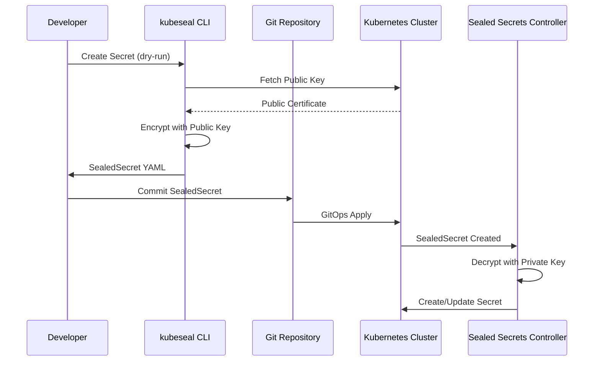

---
---

# Sealed Secrets

Bitnami Sealed Secrets solves the "Secrets in Git" problem. Standard Kubernetes Secrets are only Base64 encoded (not encrypted). Sealed Secrets allows you to store **one-way encrypted** manifests in Git repositories safely.

## Summary

Sealed Secrets uses asymmetric cryptography (RSA). A controller running in the cluster holds the private key. Developers use the `kubeseal` CLI to encrypt secrets using the cluster's public key. The encrypted `SealedSecret` resource can be safely committed to Git. When applied to the cluster, the controller decrypts it into a standard Kubernetes `Secret`.

## Detailed Explanation

### 1. Architecture



### 2. Key Components

| Component | Description |
| :--- | :--- |
| **Controller** | Pod in cluster holding private key. Watches `SealedSecret` CRs and creates `Secret` objects |
| **kubeseal CLI** | Client tool that encrypts secrets using the cluster's public key |
| **Private Key** | Stored as a K8s Secret in `kube-system`. **MUST be backed up for DR** |
| **Public Key** | Can be shared freely, used for encryption only |

### 3. Encryption Scopes

To prevent credential stealing across namespaces:

| Scope | Behavior |
| :--- | :--- |
| **Strict** (default) | Tied to specific **name + namespace**. Cannot be renamed or moved |
| **Namespace-wide** | Can rename secret within same namespace |
| **Cluster-wide** | Can be unsealed in any namespace with any name |

---

## Go Implementation Example

### Using Sealed Secrets API Types

```go
package main

import (
	"context"
	"fmt"

	ssv1alpha1 "github.com/bitnami-labs/sealed-secrets/pkg/apis/sealedsecrets/v1alpha1"
	metav1 "k8s.io/apimachinery/pkg/apis/meta/v1"
	"k8s.io/apimachinery/pkg/runtime"
	"k8s.io/client-go/tools/clientcmd"
	"sigs.k8s.io/controller-runtime/pkg/client"
)

func main() {
	// 1. Setup client
	cfg, _ := clientcmd.BuildConfigFromFlags("", clientcmd.RecommendedHomeFile)
	
	scheme := runtime.NewScheme()
	ssv1alpha1.AddToScheme(scheme)
	
	k8sClient, _ := client.New(cfg, client.Options{Scheme: scheme})

	// 2. List all SealedSecrets in a namespace
	var sealedSecrets ssv1alpha1.SealedSecretList
	err := k8sClient.List(context.TODO(), &sealedSecrets, client.InNamespace("default"))
	if err != nil {
		panic(err)
	}

	fmt.Println("SealedSecrets in 'default' namespace:")
	for _, ss := range sealedSecrets.Items {
		fmt.Printf("- %s (created: %s)\n", ss.Name, ss.CreationTimestamp)
	}
}
```

### CLI Examples

```bash
# 1. Fetch public certificate for offline use
kubeseal --fetch-cert > pub-cert.pem

# 2. Encrypt a secret (Strict scope - default)
kubectl create secret generic db-pass \
  --from-literal=password=supersecret \
  --dry-run=client -o json \
  | kubeseal --cert pub-cert.pem > db-pass-sealed.json

# 3. Encrypt with namespace-wide scope
kubectl create secret generic api-key \
  --from-literal=key=abc123 \
  --dry-run=client -o json \
  | kubeseal --cert pub-cert.pem --scope namespace-wide > api-key-sealed.json

# 4. Re-encrypt with latest cluster key (key rotation)
kubeseal --re-encrypt < old-sealed.json > new-sealed.json

# 5. Apply to cluster
kubectl apply -f db-pass-sealed.json
```

### GitOps Integration (Flux/ArgoCD)

```yaml
# sealed-secret.yaml - Safe to commit to Git
apiVersion: bitnami.com/v1alpha1
kind: SealedSecret
metadata:
  name: database-credentials
  namespace: production
spec:
  encryptedData:
    username: AgBy3i4OJSWK+PiTySYZZA9rO43cGDEq...
    password: AgBjt3L2PY0qqPLbEGmZPnVzFhxeKw...
  template:
    metadata:
      labels:
        app: my-app
```

## Comparison: Sealed Secrets vs SOPS vs External Secrets

| Feature | Sealed Secrets | SOPS | External Secrets |
| :--- | :--- | :--- | :--- |
| **Decryption** | In-cluster (Controller) | Client-side / CI | In-cluster (pulls from Vault) |
| **Key Storage** | K8s Secret (in-cluster) | KMS, PGP, age | External Vault |
| **Philosophy** | One-way sealing | Multi-party decryption | Sync from source of truth |
| **Best For** | Simple GitOps | Devs editing secrets | Enterprise with central vaults |

## Interview Questions

**Q1: Why is it safe to commit a SealedSecret to a public GitHub repo?**
**A:** The encryption is asymmetric (RSA). The file is encrypted with a public key that can only be decrypted by the matching private key, which resides exclusively inside the Kubernetes cluster. Without that cluster-resident private key, the file is computationally impossible to decrypt.

**Q2: What happens if I delete the Sealed Secrets Controller?**
**A:** Your secrets are NOT lost, provided you didn't delete the **private key Secret** (usually `sealed-secrets-key` in `kube-system`). Reinstalling the controller will pick up the existing key. **Critical**: Back up this private key as part of your Disaster Recovery plan.

**Q3: How does Sealed Secrets handle key rotation?**
**A:** The controller generates a new "active" sealing key every **30 days** by default. Old keys are kept to decrypt existing secrets, but new secrets use the latest key. To fully rotate, you must: (1) rotate the underlying password, (2) create a new K8s Secret, (3) re-run `kubeseal`.

**Q4: A developer sealed a secret for namespace `prod` but it fails in `dev`. Why?**
**A:** This is the **Strict Scope** in action. By default, `kubeseal` hashes the name and namespace into the encrypted blob. If decryption is attempted in a different namespace, the hash won't match. This prevents credential theft across namespaces.

**Q5: How do you back up Sealed Secrets for disaster recovery?**
**A:** Back up the controller's private key:
```bash
kubectl get secret -n kube-system -l sealedsecrets.bitnami.com/sealed-secrets-key \
  -o yaml > sealed-secrets-master-key.yaml
```
Store this securely (e.g., in Vault or offline). To restore, apply this secret before installing the controller.
