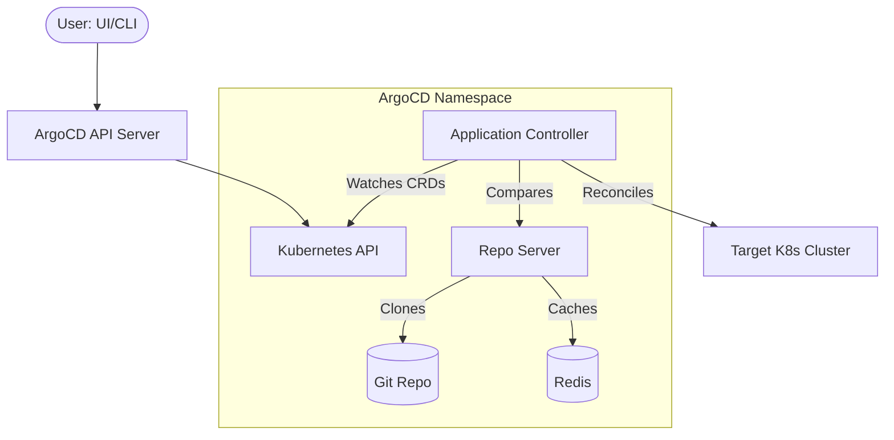

---
---

# ArgoCD

ArgoCD is a declarative, GitOps-based continuous delivery (CD) tool for Kubernetes. It follows the **GitOps** philosophy where Git is the "Source of Truth" for the desired state of applications.

## Summary

ArgoCD automates the deployment of Kubernetes manifests, ensuring the cluster state matches the Git repository. It provides a rich Web UI, CLI, and API for managing applications. The core abstraction is the **Application** Custom Resource (CRD), which links a Git source to a destination cluster/namespace.

## Detailed Explanation

### 1. Architecture



### 2. Components

| Component | Description |
| :--- | :--- |
| **API Server** | Exposes gRPC/REST API for UI, CLI, and integrations. Handles RBAC and auth (Dex) |
| **Repository Server** | Clones Git repos, caches them, generates manifests (Helm, Kustomize, Jsonnet) |
| **Application Controller** | The "brain" - monitors apps and compares Live State vs Desired State |
| **Redis** | Cache for manifest generation and session state |
| **ApplicationSet Controller** | Automates creation of multiple Applications across clusters |

### 3. Sync Strategies

| Strategy | Description |
| :--- | :--- |
| **Manual Sync** | Requires trigger from UI/CLI to apply changes |
| **Auto-Sync** | Automatically applies changes when Git diverges |
| **Self-Heal** | Reverts manual cluster changes to match Git |
| **Prune** | Deletes resources no longer present in Git |

### 4. ApplicationSet (Multi-Cluster/Tenant)

ApplicationSet uses **Generators** to create applications dynamically:

| Generator | Use Case |
| :--- | :--- |
| **List** | Literal list of clusters/values |
| **Cluster** | Target all registered ArgoCD clusters |
| **Git** | Scan Git directories for app definitions |
| **Matrix/Merge** | Combine generators (e.g., app × all prod clusters) |

---

## Go Implementation Example

### Creating an Application Programmatically

```go
package main

import (
	"context"
	"fmt"

	"github.com/argoproj/argo-cd/v2/pkg/apis/application/v1alpha1"
	metav1 "k8s.io/apimachinery/pkg/apis/meta/v1"
	"k8s.io/apimachinery/pkg/runtime"
	"k8s.io/client-go/tools/clientcmd"
	"sigs.k8s.io/controller-runtime/pkg/client"
)

func main() {
	// 1. Setup client
	cfg, _ := clientcmd.BuildConfigFromFlags("", clientcmd.RecommendedHomeFile)
	
	scheme := runtime.NewScheme()
	v1alpha1.AddToScheme(scheme)
	
	k8sClient, _ := client.New(cfg, client.Options{Scheme: scheme})

	// 2. Create Application
	app := &v1alpha1.Application{
		ObjectMeta: metav1.ObjectMeta{
			Name:      "guestbook",
			Namespace: "argocd",
		},
		Spec: v1alpha1.ApplicationSpec{
			Project: "default",
			Source: &v1alpha1.ApplicationSource{
				RepoURL:        "https://github.com/argoproj/argocd-example-apps.git",
				Path:           "guestbook",
				TargetRevision: "HEAD",
			},
			Destination: v1alpha1.ApplicationDestination{
				Server:    "https://kubernetes.default.svc",
				Namespace: "guestbook",
			},
			SyncPolicy: &v1alpha1.SyncPolicy{
				Automated: &v1alpha1.SyncPolicyAutomated{
					Prune:    true,
					SelfHeal: true,
				},
			},
		},
	}

	err := k8sClient.Create(context.TODO(), app)
	if err != nil {
		panic(err)
	}
	fmt.Println("Application created!")
}
```

### CLI Examples

```bash
# Login to ArgoCD
argocd login argocd.example.com

# Create an application
argocd app create guestbook \
    --repo https://github.com/argoproj/argocd-example-apps.git \
    --path guestbook \
    --dest-server https://kubernetes.default.svc \
    --dest-namespace default

# Enable auto-sync with self-heal and prune
argocd app set guestbook --sync-policy automated --self-heal --auto-prune

# Manually sync an app
argocd app sync guestbook

# Check health and sync status
argocd app get guestbook

# Rollback to previous deployment
argocd app rollback guestbook 1
```

### Application YAML

```yaml
apiVersion: argoproj.io/v1alpha1
kind: Application
metadata:
  name: guestbook
  namespace: argocd
spec:
  project: default
  source:
    repoURL: https://github.com/argoproj/argocd-example-apps.git
    targetRevision: HEAD
    path: guestbook
  destination:
    server: https://kubernetes.default.svc
    namespace: guestbook
  syncPolicy:
    automated:
      prune: true
      selfHeal: true
    syncOptions:
      - CreateNamespace=true
```

## ArgoCD vs FluxCD

| Feature | ArgoCD | FluxCD |
| :--- | :--- | :--- |
| **Interface** | Rich Web UI + CLI | CLI-centric (modular) |
| **Architecture** | Centralized controller | Decentralized multi-controller |
| **Multi-tenancy** | AppProjects (built-in) | RBAC via K8s Namespaces |
| **State** | Maintains own database | No internal state (uses etcd) |
| **Best For** | Teams wanting UI visibility | Pure GitOps, CI/CD pipelines |

## Interview Questions

**Q1: How does ArgoCD handle secrets?**
**A:** ArgoCD does not encrypt secrets natively. Best practices:
1. **Sealed Secrets**: Encrypt before committing to Git
2. **External Secrets Operator**: Sync from AWS Secrets Manager/Vault
3. **ArgoCD Vault Plugin**: Inject secrets during manifest generation
4. **SOPS**: Decrypt during repo-server processing

**Q2: What is an AppProject?**
**A:** An `AppProject` is a logical grouping providing security boundaries. It restricts:
- Which Git repositories can be used
- Which clusters can be deployed to
- Which Kubernetes resources can be created
- Which users can access the project

**Q3: Difference between "OutOfSync" and "Unhealthy"?**
**A:**
- **OutOfSync**: Cluster state differs from Git (needs sync)
- **Unhealthy**: Resources exist but aren't working (e.g., Pod in `CrashLoopBackOff`)

**Q4: Explain the role of `argocd-repo-server`.**
**A:** It acts as a manifest generator. It clones repositories, caches them, and executes tools like `helm template` or `kustomize build` to generate raw YAML that the Application Controller applies.

**Q5: How do you rollback in ArgoCD?**
**A:** In true GitOps, you `git revert` the change. However, ArgoCD provides a `rollback` feature (UI/CLI) that targets a previous successful deployment. This temporarily disables auto-sync until the Git state catches up.
