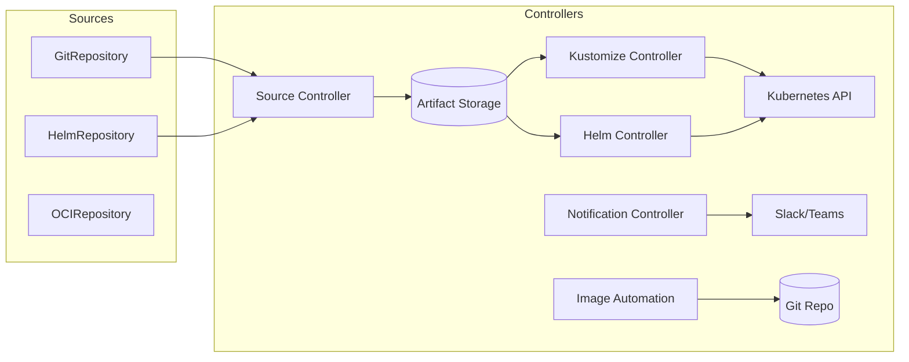
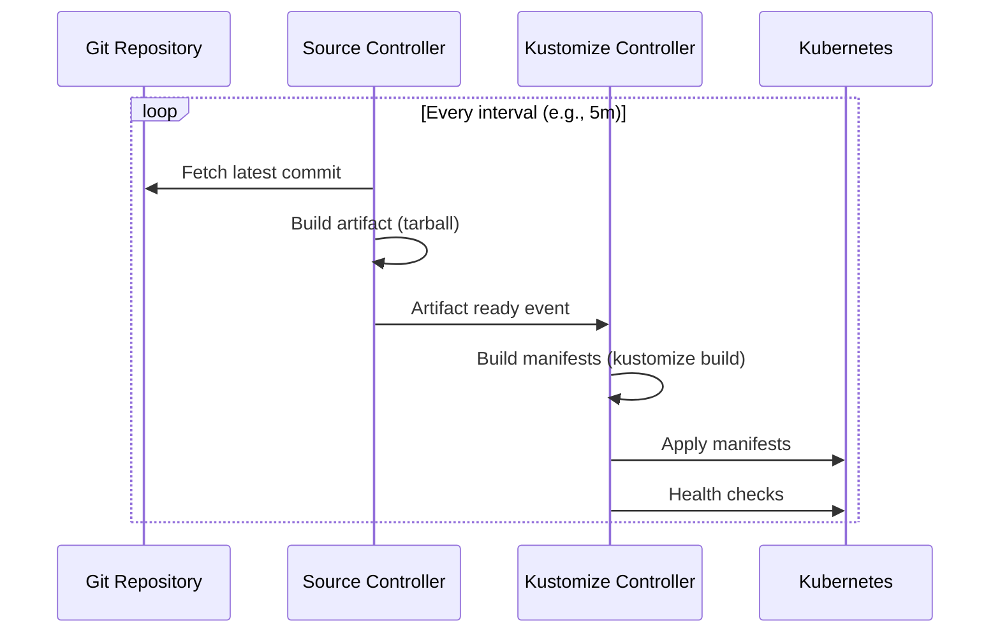

---
---

# FluxCD

FluxCD v2 is an open-source, extensible continuous delivery solution for Kubernetes, powered by the **GitOps Toolkit**. It is a set of specialized, interoperable Kubernetes controllers that manage applications through a declarative **pull-based** GitOps model.

## Summary

Unlike its monolithic predecessor (v1), FluxCD v2 is modular. Each controller handles a specific part of the reconciliation process: fetching sources, applying Kustomize/Helm, handling notifications, and automating image updates. Flux is Kubernetes-native—everything is a Custom Resource.

## Detailed Explanation

### 1. Architecture: GitOps Toolkit



### 2. Core Controllers & CRDs

| Controller | CRDs | Purpose |
| :--- | :--- | :--- |
| **Source Controller** | `GitRepository`, `HelmRepository`, `OCIRepository`, `Bucket` | Fetches artifacts from external sources |
| **Kustomize Controller** | `Kustomization` | Applies Kustomize/YAML manifests to cluster |
| **Helm Controller** | `HelmRelease` | Manages Helm chart releases declaratively |
| **Notification Controller** | `Provider`, `Alert`, `Receiver` | Handles webhooks and alerts |
| **Image Automation** | `ImageRepository`, `ImagePolicy`, `ImageUpdateAutomation` | Updates Git when new images are pushed |

### 3. Reconciliation Loop



---

## Go Implementation Example

### Importing Flux APIs

```go
package main

import (
	"context"
	"fmt"
	"time"

	sourcev1 "github.com/fluxcd/source-controller/api/v1"
	kustomizev1 "github.com/fluxcd/kustomize-controller/api/v1"
	metav1 "k8s.io/apimachinery/pkg/apis/meta/v1"
	"k8s.io/apimachinery/pkg/runtime"
	"k8s.io/client-go/tools/clientcmd"
	"sigs.k8s.io/controller-runtime/pkg/client"
)

func main() {
	// 1. Setup client with Flux schemes
	cfg, _ := clientcmd.BuildConfigFromFlags("", clientcmd.RecommendedHomeFile)
	
	scheme := runtime.NewScheme()
	sourcev1.AddToScheme(scheme)
	kustomizev1.AddToScheme(scheme)
	
	k8sClient, _ := client.New(cfg, client.Options{Scheme: scheme})

	// 2. Create GitRepository source
	gitRepo := &sourcev1.GitRepository{
		ObjectMeta: metav1.ObjectMeta{
			Name:      "web-app",
			Namespace: "flux-system",
		},
		Spec: sourcev1.GitRepositorySpec{
			URL: "https://github.com/org/web-app",
			Interval: metav1.Duration{Duration: 5 * time.Minute},
			Reference: &sourcev1.GitRepositoryRef{
				Branch: "main",
			},
		},
	}

	err := k8sClient.Create(context.TODO(), gitRepo)
	if err != nil {
		panic(err)
	}
	fmt.Println("GitRepository created!")

	// 3. Create Kustomization
	ks := &kustomizev1.Kustomization{
		ObjectMeta: metav1.ObjectMeta{
			Name:      "web-app",
			Namespace: "flux-system",
		},
		Spec: kustomizev1.KustomizationSpec{
			Interval: metav1.Duration{Duration: 10 * time.Minute},
			Path:     "./deploy/prod",
			Prune:    true,
			SourceRef: kustomizev1.CrossNamespaceSourceReference{
				Kind: "GitRepository",
				Name: "web-app",
			},
		},
	}

	err = k8sClient.Create(context.TODO(), ks)
	if err != nil {
		panic(err)
	}
	fmt.Println("Kustomization created!")
}
```

### CLI Examples

```bash
# 1. Bootstrap Flux on a GitHub repo
flux bootstrap github \
  --owner=$GITHUB_USER \
  --repository=fleet-infra \
  --branch=main \
  --path=./clusters/my-cluster

# 2. Create a GitRepository source
flux create source git web-app \
  --url=https://github.com/org/web-app \
  --branch=main \
  --interval=5m

# 3. Create a Kustomization (applies manifests)
flux create kustomization web-app \
  --source=GitRepository/web-app \
  --path="./deploy/prod" \
  --prune=true \
  --interval=10m

# 4. Create a HelmRelease
flux create helmrelease nginx \
  --source=HelmRepository/bitnami \
  --chart=nginx \
  --target-namespace=web

# 5. Manual reconcile (trigger sync)
flux reconcile kustomization web-app --with-source

# 6. Check status
flux get kustomizations
flux get sources git
```

### SOPS Integration

```yaml
# Kustomization with SOPS decryption
apiVersion: kustomize.toolkit.fluxcd.io/v1
kind: Kustomization
metadata:
  name: my-secrets
  namespace: flux-system
spec:
  interval: 10m
  path: ./secrets
  prune: true
  sourceRef:
    kind: GitRepository
    name: fleet-infra
  decryption:
    provider: sops
    secretRef:
      name: sops-age  # Secret containing age private key
```

## FluxCD vs ArgoCD

| Feature | FluxCD | ArgoCD |
| :--- | :--- | :--- |
| **Model** | Modular (Toolkit) | Monolithic |
| **Philosophy** | Kubernetes-native CRDs | Application-centric UI |
| **State** | No internal state (uses etcd) | Maintains own database |
| **Loop** | Pull-based only | Pull + Push (UI-driven) |
| **Secrets** | Native SOPS integration | Requires plugins |
| **Image Updates** | Built-in automation | Requires Argo Image Updater |

## Interview Questions

**Q1: How does FluxCD handle drift detection?**
**A:** Flux uses a **reconciliation loop**. The `kustomize-controller` compares desired state (Git) with live state (Kubernetes) at defined intervals. If drift is detected, Flux automatically overwrites it with the Git state.

**Q2: What is the GitOps Toolkit?**
**A:** The set of APIs and controllers that make up Flux v2. It's modular to allow using only what you need (e.g., just `helm-controller`) and enables easier scaling/maintenance of components.

**Q3: How do you handle secrets in Flux with a public Git repo?**
**A:** Using **SOPS** or **Sealed Secrets**:
1. Encrypt secrets locally with `age`, PGP, or KMS
2. Commit encrypted YAML to Git
3. Configure `kustomize-controller` with decryption provider
4. Flux decrypts in-memory during reconciliation

**Q4: Difference between `GitRepository` and `Kustomization`?**
**A:**
- `GitRepository`: Defines **where** to get manifests (source) and pull frequency
- `Kustomization`: Defines **how** to apply manifests (path, namespace, health checks, decryption)

**Q5: How does Flux handle multi-tenancy?**
**A:** Through **Service Account Impersonation**. Each `Kustomization` can run as a specific `ServiceAccount`. Even if a user can create a `Kustomization` CRD, they're restricted by the RBAC of the assigned ServiceAccount.
