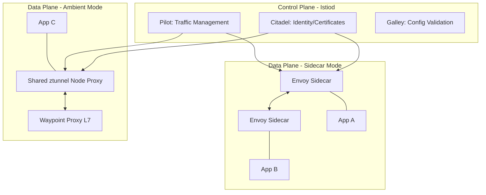

---
---

# Istio Service Mesh

Istio is a mature, production-grade service mesh that provides traffic management, security, and observability for microservices. It is the industry standard, with **Ambient Mesh** (sidecar-less mode) as the preferred deployment for resource-constrained environments.

## Summary

Istio uses Envoy proxies as sidecars (or shared node proxies in Ambient mode) to intercept all network traffic. The control plane (Istiod) manages configuration, certificates, and policies. Istio enables mTLS encryption, traffic splitting, circuit breaking, and distributed tracing without changing application code.

## Detailed Explanation

### 1. Architecture



### 2. Components

| Component | Description |
| :--- | :--- |
| **Istiod** | Unified control plane binary (Pilot + Citadel + Galley) |
| **Envoy** | High-performance C++ proxy, handles all data plane traffic |
| **ztunnel** | Node-level proxy for Ambient mode (L4 only) |
| **Waypoint** | Optional L7 proxy for Ambient mode |

### 3. Key CRDs

| Resource | Purpose |
| :--- | :--- |
| **Gateway** | Entry/exit point for mesh (Ingress/Egress) |
| **VirtualService** | How requests are routed (traffic splitting, retries, timeouts) |
| **DestinationRule** | What happens after routing (load balancing, circuit breaking, TLS) |
| **PeerAuthentication** | mTLS mode (STRICT, PERMISSIVE, DISABLE) |
| **AuthorizationPolicy** | Fine-grained RBAC for services |

---

## Traffic Management Examples

### Canary Release (80/20 Split)

```yaml
apiVersion: networking.istio.io/v1beta1
kind: VirtualService
metadata:
  name: reviews-route
spec:
  hosts:
  - reviews
  http:
  - route:
    - destination:
        host: reviews
        subset: v1
      weight: 80
    - destination:
        host: reviews
        subset: v2
      weight: 20
---
apiVersion: networking.istio.io/v1beta1
kind: DestinationRule
metadata:
  name: reviews-destination
spec:
  host: reviews
  subsets:
  - name: v1
    labels:
      version: v1
  - name: v2
    labels:
      version: v2
  trafficPolicy:
    loadBalancer:
      simple: LEAST_CONN
```

### Circuit Breaker

```yaml
apiVersion: networking.istio.io/v1beta1
kind: DestinationRule
metadata:
  name: backend-circuit-breaker
spec:
  host: backend
  trafficPolicy:
    connectionPool:
      tcp:
        maxConnections: 100
      http:
        h2UpgradePolicy: UPGRADE
        http1MaxPendingRequests: 100
        http2MaxRequests: 1000
    outlierDetection:
      consecutive5xxErrors: 5
      interval: 30s
      baseEjectionTime: 30s
      maxEjectionPercent: 50
```

## Security Examples

### Enforce STRICT mTLS Mesh-Wide

```yaml
apiVersion: security.istio.io/v1
kind: PeerAuthentication
metadata:
  name: default
  namespace: istio-system
spec:
  mtls:
    mode: STRICT  # Rejects all non-TLS traffic
```

### Authorization Policy (RBAC)

```yaml
apiVersion: security.istio.io/v1
kind: AuthorizationPolicy
metadata:
  name: allow-frontend-to-backend
spec:
  selector:
    matchLabels:
      app: backend
  action: ALLOW
  rules:
  - from:
    - source:
        principals: ["cluster.local/ns/default/sa/frontend"]
    to:
    - operation:
        methods: ["GET", "POST"]
        paths: ["/api/v1/*"]
```

## Go Implementation Example

### Using `istio.io/client-go`

```go
package main

import (
	"context"
	"fmt"

	"istio.io/client-go/pkg/clientset/versioned"
	metav1 "k8s.io/apimachinery/pkg/apis/meta/v1"
	"k8s.io/client-go/tools/clientcmd"
)

func main() {
	// 1. Build config
	config, err := clientcmd.BuildConfigFromFlags("", clientcmd.RecommendedHomeFile)
	if err != nil {
		panic(err)
	}

	// 2. Create Istio client
	ic, err := versioned.NewForConfig(config)
	if err != nil {
		panic(err)
	}

	// 3. List VirtualServices
	vsList, err := ic.NetworkingV1beta1().VirtualServices("default").List(
		context.Background(),
		metav1.ListOptions{},
	)
	if err != nil {
		panic(err)
	}

	fmt.Println("VirtualServices in 'default' namespace:")
	for _, vs := range vsList.Items {
		fmt.Printf("- %s (hosts: %v)\n", vs.Name, vs.Spec.Hosts)
	}

	// 4. List DestinationRules
	drList, err := ic.NetworkingV1beta1().DestinationRules("default").List(
		context.Background(),
		metav1.ListOptions{},
	)
	if err != nil {
		panic(err)
	}

	fmt.Println("\nDestinationRules:")
	for _, dr := range drList.Items {
		fmt.Printf("- %s (host: %s)\n", dr.Name, dr.Spec.Host)
	}
}
```

## Observability Integration

| Tool | Purpose |
| :--- | :--- |
| **Prometheus** | Metrics (request rate, error rate, latency) |
| **Grafana** | Dashboards and visualization |
| **Jaeger/Zipkin** | Distributed tracing |
| **Kiali** | Service mesh visualization and config health |

## Istio vs Linkerd

| Feature | Istio | Linkerd |
| :--- | :--- | :--- |
| **Proxy** | Envoy (C++), extensible via WASM | linkerd2-proxy (Rust), ultralight |
| **Complexity** | High (feature-rich) | Low (simple) |
| **Resource Usage** | High | Very low |
| **Ambient Mode** | Yes (GA) | No |
| **Best For** | Complex traffic management, enterprise | Simple mTLS + observability |

## Interview Questions

**Q1: What is the difference between VirtualService and DestinationRule?**
**A:** 
- **VirtualService**: Handles **routing** - how to get to the destination (e.g., "send 20% to v2")
- **DestinationRule**: Handles **policies** - what happens at the destination (e.g., "use mTLS", "circuit breaker settings")

**Q2: How does Istio handle mTLS with services outside the mesh?**
**A:** By default, Istio uses `PERMISSIVE` mode, allowing both plaintext and mTLS. To secure the mesh, switch to `STRICT` mode, which rejects all plaintext traffic from unmeshed services.

**Q3: What is Circuit Breaking in Istio?**
**A:** Circuit breaking prevents cascading failures. If a service instance is slow or error-prone, `OutlierDetection` in `DestinationRule` temporarily ejects it from the load-balancing pool, stopping traffic to the "broken" instance.

**Q4: Explain the role of Envoy in Istio.**
**A:** Envoy is the data plane proxy. It intercepts all traffic, implements L7 routing, load balancing, mTLS encryption, and telemetry collection. Configuration is pushed to it by Istiod (control plane).

**Q5: What is Ambient Mesh and why use it?**
**A:** Ambient Mesh removes sidecars by using:
1. **ztunnel**: Node-level proxy for L4 (mTLS, basic telemetry)
2. **Waypoint proxies**: Optional L7 processing per-namespace

Benefits: Reduced overhead, no sidecar lifecycle management, better performance for L4-only use cases.
