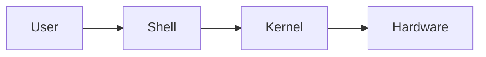

# What is a Shell?

## Summary

A **shell** is a command-line interpreter that provides a user interface for accessing the services of an operating system. It acts as a bridge between the user and the kernel, translating human-readable commands into system calls. Shells can be interactive (accepting commands from a user) or non-interactive (executing scripts). The shell is fundamental to Unix/Linux systems and is essential for automation, system administration, and software development.

## Detailed Explanation

### The Role of a Shell

The shell sits between the user and the operating system kernel:



When you type a command like `ls -la`, the shell:
1. **Parses** the input into command and arguments
2. **Locates** the executable in the PATH
3. **Forks** a new process
4. **Executes** the command via system calls
5. **Returns** output to the terminal

### Types of Shells

| Shell | Description | Default On |
|-------|-------------|------------|
| **sh** | Bourne Shell - the original Unix shell | Historical |
| **bash** | Bourne Again Shell - most common | Linux, macOS (pre-Catalina) |
| **zsh** | Z Shell - extended features | macOS (Catalina+) |
| **fish** | Friendly Interactive Shell | User preference |
| **dash** | Debian Almquist Shell - POSIX compliant, fast | Debian/Ubuntu (`/bin/sh`) |

### Interactive vs Non-Interactive

```bash
# Interactive shell - you type commands directly
$ echo "Hello, World!"
Hello, World!

# Non-interactive shell - running a script
$ bash script.sh
```

### Shell as a Programming Language

The shell is also a complete programming environment:

```bash
#!/bin/bash
# A simple shell program

name="Developer"
echo "Welcome, $name!"

for i in {1..5}; do
    echo "Iteration $i"
done
```

### Key Shell Concepts

- **Environment Variables**: Configuration values available to all processes
- **PATH**: Directories where the shell looks for executables
- **Exit Codes**: Return values indicating success (0) or failure (non-zero)
- **Pipes**: Connect output of one command to input of another
- **Redirection**: Control where input comes from and output goes

### Checking Your Current Shell

```bash
# See your current shell
echo $SHELL

# See available shells on the system
cat /etc/shells

# See the actual running shell
echo $0
```

## Interview Questions

**Q: What is the difference between a shell and a terminal?**
**A:** A terminal (or terminal emulator) is the application that provides a window where you can type. The shell is the program running inside that terminal that interprets your commands. The terminal handles display and input; the shell handles command interpretation and execution.

**Q: What happens when you type a command in the shell?**
**A:** The shell first checks if it's a built-in command. If not, it searches directories in PATH for the executable. Once found, it forks a child process, executes the command in that process, waits for completion, and returns the exit status.

**Q: What is the purpose of the shebang (`#!/bin/bash`)?**
**A:** The shebang tells the kernel which interpreter to use when executing the script as a program. Without it, the system uses the default shell, which may not be compatible with the script's syntax.

**Q: How do you check which shell you're currently using?**
**A:** Use `echo $0` to see the current shell process name, or `echo $SHELL` to see your default login shell. The actual running shell might differ from the default if you've switched shells.
