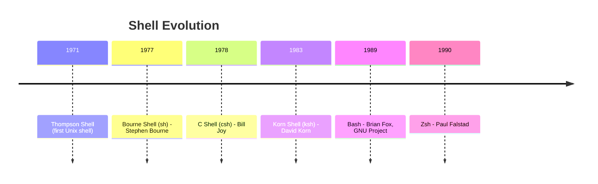

# What is Bash?

## Summary

**Bash** (Bourne Again SHell) is a Unix shell and command language written by Brian Fox for the GNU Project as a free replacement for the Bourne shell (sh). Released in 1989, it has become the default shell on most Linux distributions and was the default on macOS until Catalina. Bash combines features from sh, ksh, and csh, offering powerful scripting capabilities, command-line editing, and job control.

## Detailed Explanation

### History and Evolution



### Why "Bourne Again"?

The name is a pun on "Bourne Shell" (sh) created by Stephen Bourne. Bash is:
- **Born again** - a rebirth/replacement
- **GNU's** free software implementation
- **Backward compatible** with sh

### Key Features of Bash

```bash
# 1. Command-line editing (readline)
# Use arrow keys, Ctrl+A, Ctrl+E, Ctrl+R for history search

# 2. Command history
history          # Show command history
!42              # Run command #42 from history
!!               # Run last command
!$               # Last argument of previous command

# 3. Tab completion
cd /usr/lo<TAB>  # Completes to /usr/local/

# 4. Aliases
alias ll='ls -la'
alias ..='cd ..'

# 5. Job control
sleep 100 &      # Run in background
jobs             # List background jobs
fg %1            # Bring job 1 to foreground
```

### Bash vs Bourne Shell (sh)

| Feature | sh | Bash |
|---------|-----|------|
| Arrays | No | Yes |
| Associative Arrays | No | Yes (4.0+) |
| `[[` compound command | No | Yes |
| Process Substitution | No | Yes |
| Command-line editing | No | Yes |
| Brace expansion | No | Yes |
| `$RANDOM` | No | Yes |

### Bash Version and Configuration

```bash
# Check Bash version
bash --version
echo $BASH_VERSION

# Bash configuration files (in order of execution)
# Login shells:
#   /etc/profile → ~/.bash_profile → ~/.bash_login → ~/.profile

# Non-login interactive shells:
#   ~/.bashrc

# Non-interactive shells (scripts):
#   $BASH_ENV (if set)
```

### Bash-Specific Features

```bash
# Brace expansion
echo {a,b,c}           # a b c
echo file{1..5}.txt    # file1.txt file2.txt file3.txt file4.txt file5.txt

# Extended globbing (shopt -s extglob)
ls !(*.txt)            # All files except .txt

# Process substitution
diff <(sort file1) <(sort file2)

# Here strings
cat <<< "Hello, World!"

# Arrays
arr=("one" "two" "three")
echo ${arr[1]}         # two

# Associative arrays (Bash 4.0+)
declare -A map
map[key]="value"
echo ${map[key]}
```

### POSIX Compliance

Bash can run in POSIX mode for better portability:

```bash
# Enable POSIX mode
set -o posix

# Or invoke as sh
/bin/sh script.sh

# Check if running as bash or sh
if [ -n "$BASH_VERSION" ]; then
    echo "Running Bash"
else
    echo "Running sh or other shell"
fi
```

## Interview Questions

**Q: What is the difference between Bash and sh?**
**A:** `sh` (Bourne Shell) is the original Unix shell with basic features. Bash is a superset that adds arrays, extended pattern matching, command-line editing, improved scripting features, and better interactivity while maintaining backward compatibility with sh scripts.

**Q: What are the main configuration files for Bash?**
**A:** For login shells: `/etc/profile`, then `~/.bash_profile` or `~/.bash_login` or `~/.profile`. For non-login interactive shells: `~/.bashrc`. For scripts: the file specified by `$BASH_ENV` if set.

**Q: What is the difference between `~/.bashrc` and `~/.bash_profile`?**
**A:** `~/.bash_profile` is executed for login shells (when you log in via console or SSH). `~/.bashrc` is executed for non-login interactive shells (when you open a new terminal window). Many users source `.bashrc` from `.bash_profile` to have consistent settings.

**Q: How do you check if a script is running in Bash?**
**A:** Check the `$BASH_VERSION` variable: `if [ -n "$BASH_VERSION" ]; then echo "Bash"; fi`. Alternatively, check `$0` or use `ps -p $$` to see the current shell process.
