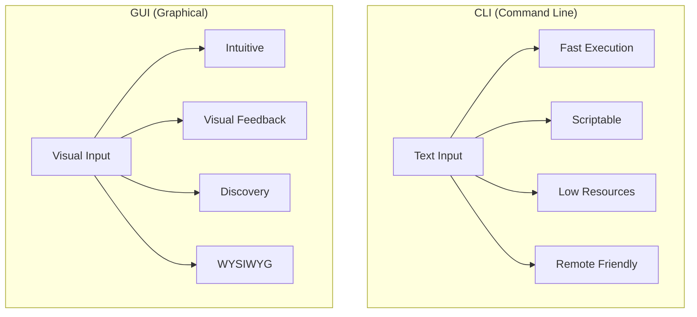

# CLI vs GUI

## Summary

**CLI** (Command Line Interface) and **GUI** (Graphical User Interface) are two paradigms for interacting with computers. CLI uses text commands typed into a terminal, while GUI uses visual elements like windows, icons, and menus. For developers and system administrators, CLI offers superior automation, scripting, remote access, and resource efficiency. Understanding when to use each is essential for productivity.

## Detailed Explanation

### Comparison Overview



### CLI Advantages

```bash
# 1. SPEED - Rename 1000 files in seconds
for f in *.txt; do mv "$f" "${f%.txt}.md"; done

# 2. AUTOMATION - Schedule backups
0 2 * * * /home/user/backup.sh

# 3. REPRODUCIBILITY - Document exact steps
cat install.sh
#!/bin/bash
apt update
apt install -y nginx
systemctl enable nginx

# 4. REMOTE ACCESS - Full control over SSH
ssh server.example.com "df -h && free -m"

# 5. RESOURCE EFFICIENCY - No graphics overhead
# A headless server uses ~50MB RAM vs 500MB+ with GUI

# 6. PIPING & COMPOSITION - Chain commands
cat access.log | grep ERROR | sort | uniq -c | sort -rn | head
```

### GUI Advantages

| Use Case | Why GUI is Better |
|----------|-------------------|
| Image/Video editing | Visual manipulation required |
| Web browsing | Visual content consumption |
| Learning new software | Discoverable menus and tooltips |
| Complex data visualization | Charts, graphs, dashboards |
| CAD/3D modeling | Spatial manipulation |

### Real-World Comparison

**Task: Find all large files (>100MB) and list them by size**

```bash
# CLI: One command, instant results
find /home -size +100M -exec ls -lh {} \; 2>/dev/null | sort -k5 -h

# GUI equivalent:
# 1. Open file manager
# 2. Navigate to /home
# 3. Open search dialog
# 4. Set size filter
# 5. Wait for indexing
# 6. Click column to sort
# 7. Scroll through results
```

**Task: Create 50 users with home directories**

```bash
# CLI: Simple loop
for i in {1..50}; do
    useradd -m "user$i"
    echo "user$i:password123" | chpasswd
done

# GUI: Click through user management 50 times...
```

### When to Use Each

| Scenario | Best Choice | Reason |
|----------|-------------|--------|
| Server administration | CLI | Remote access, no GUI available |
| Automation/scripting | CLI | Reproducible, schedulable |
| Quick file operations | CLI | Faster than clicking |
| Batch processing | CLI | Easily loop through items |
| Photo editing | GUI | Visual manipulation needed |
| Learning new tool | GUI | Discoverable interface |
| Complex troubleshooting | CLI | Detailed output, logs |

### Hybrid Approach

Modern development often combines both:

```bash
# Use CLI for Git operations
git add -p                    # Interactive patch staging
git log --oneline --graph     # Visual history in terminal

# Use GUI for:
# - IDE (VS Code, IntelliJ)
# - Git visualization (gitk, GitKraken)
# - Database browsing (pgAdmin, DBeaver)
# - API testing (Postman, Insomnia)
```

### CLI Learning Curve

```bash
# The power of CLI grows with knowledge

# Beginner
ls
cd documents
cat file.txt

# Intermediate  
find . -name "*.log" -mtime +7 -delete
grep -r "TODO" --include="*.py"

# Advanced
awk '{sum+=$1} END {print sum/NR}' data.txt
while read -r line; do process "$line"; done < input.txt
```

## Interview Questions

**Q: Why do servers typically run without a GUI?**
**A:** GUIs consume significant resources (RAM, CPU, disk) that could serve application needs. Servers are managed remotely via SSH where CLI is native. Security is improved with smaller attack surface. Additionally, automation and configuration management work through CLI/scripts, not GUI interactions.

**Q: When would you choose GUI over CLI?**
**A:** When tasks are inherently visual (image editing, data visualization), when exploring unfamiliar software with discoverable menus, when working with spatial data (3D, CAD), or when collaboration requires real-time visual feedback.

**Q: How does CLI enable better automation?**
**A:** CLI commands are text-based, so they can be saved in scripts, version-controlled, scheduled with cron, chained with pipes, parameterized with variables, and executed remotely. GUI actions require screen recording/macro tools and are fragile to UI changes.

**Q: What is the main productivity benefit of CLI for developers?**
**A:** Command composition - the ability to combine simple commands using pipes and redirections to perform complex operations. For example, `grep ERROR log.txt | cut -d' ' -f3 | sort | uniq -c` performs filtering, extraction, sorting, and counting in one line.
