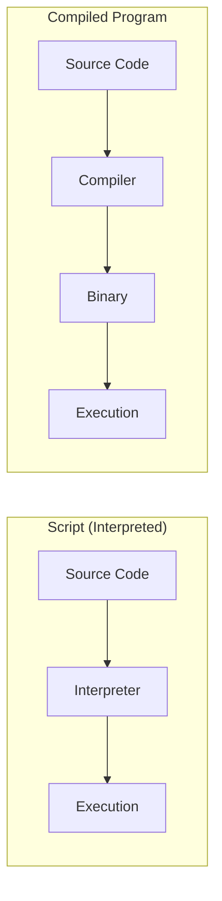

# What is Scripting?

## Summary

**Shell scripting** is writing a series of commands in a file to be executed by the shell interpreter. Unlike compiled languages, scripts are interpreted at runtime, making them ideal for automation, system administration, and quick prototyping. Bash scripts automate repetitive tasks, configure systems, process text, and glue together other programs. Mastering shell scripting is essential for DevOps, system administration, and efficient development workflows.

## Detailed Explanation

### Scripts vs Compiled Programs



| Aspect | Script | Compiled Program |
|--------|--------|------------------|
| Execution | Interpreted line by line | Runs as binary |
| Speed | Slower | Faster |
| Portability | Needs interpreter | Platform-specific binary |
| Development | Edit and run | Edit, compile, run |
| Use case | Automation, glue code | Performance-critical apps |

### Anatomy of a Bash Script

```bash
#!/bin/bash
# Shebang: tells the system to use bash interpreter

# Script metadata (optional but recommended)
# Author: Developer Name
# Date: 2024-01-15
# Purpose: Demonstrate script structure

# Variables
LOG_DIR="/var/log"
MAX_SIZE=100

# Functions
log_message() {
    echo "[$(date '+%Y-%m-%d %H:%M:%S')] $1"
}

# Main logic
log_message "Script started"

# Command execution
for logfile in "$LOG_DIR"/*.log; do
    size=$(du -m "$logfile" | cut -f1)
    if [[ $size -gt $MAX_SIZE ]]; then
        log_message "Large file: $logfile ($size MB)"
    fi
done

log_message "Script completed"

# Exit with status
exit 0
```

### Running a Script

```bash
# Method 1: Make executable and run directly
chmod +x script.sh
./script.sh

# Method 2: Pass to bash explicitly
bash script.sh

# Method 3: Source (runs in current shell)
source script.sh
# or
. script.sh
```

### Common Scripting Use Cases

```bash
# 1. AUTOMATION - Daily backup
#!/bin/bash
BACKUP_DIR="/backup/$(date +%Y%m%d)"
mkdir -p "$BACKUP_DIR"
tar -czf "$BACKUP_DIR/home.tar.gz" /home
find /backup -mtime +30 -delete

# 2. SYSTEM MONITORING
#!/bin/bash
while true; do
    cpu=$(top -bn1 | grep "Cpu(s)" | awk '{print $2}')
    mem=$(free -m | awk 'NR==2{printf "%.2f%%", $3*100/$2}')
    echo "CPU: $cpu%, MEM: $mem"
    sleep 5
done

# 3. BATCH PROCESSING
#!/bin/bash
for img in *.jpg; do
    convert "$img" -resize 800x600 "resized_$img"
done

# 4. DEPLOYMENT
#!/bin/bash
git pull origin main
npm install
npm run build
systemctl restart myapp
```

### Scripting Best Practices

```bash
#!/bin/bash

# 1. Use strict mode
set -euo pipefail

# 2. Use meaningful variable names (UPPERCASE for constants)
readonly CONFIG_FILE="/etc/myapp/config.yaml"
readonly LOG_FILE="/var/log/myapp.log"

# 3. Quote variables to prevent word splitting
file_path="/path/with spaces/file.txt"
cat "$file_path"  # Correct
# cat $file_path  # WRONG - breaks on spaces

# 4. Use functions for reusability
cleanup() {
    rm -f "$TEMP_FILE"
    echo "Cleanup complete"
}
trap cleanup EXIT

# 5. Validate inputs
if [[ $# -lt 1 ]]; then
    echo "Usage: $0 <filename>" >&2
    exit 1
fi

# 6. Use descriptive exit codes
readonly E_SUCCESS=0
readonly E_INVALID_ARG=1
readonly E_FILE_NOT_FOUND=2
```

### Scripts vs One-Liners

```bash
# One-liner: Quick, ad-hoc task
find . -name "*.tmp" -mtime +7 -delete

# Script: Reusable, documented, maintainable
#!/bin/bash
# clean_temp.sh - Remove old temporary files
# Usage: clean_temp.sh [days] [directory]

days="${1:-7}"
dir="${2:-.}"

echo "Cleaning files older than $days days in $dir"
find "$dir" -name "*.tmp" -mtime +"$days" -delete -print
echo "Done"
```

### The Power of Scripting

```bash
# Real example: Process server logs
#!/bin/bash
# Find top 10 IPs hitting 404 errors

grep " 404 " /var/log/nginx/access.log \
    | awk '{print $1}' \
    | sort \
    | uniq -c \
    | sort -rn \
    | head -10

# This would take hours manually but runs in seconds
```

## Interview Questions

**Q: What is the difference between a script and a program?**
**A:** Scripts are interpreted at runtime by another program (the shell), while programs are typically compiled to machine code. Scripts are text files executed line-by-line; programs are binary executables. Scripts are ideal for automation and glue code; programs for performance-critical applications.

**Q: What does `set -euo pipefail` do?**
**A:** `-e` exits immediately on any command failure. `-u` treats unset variables as errors. `-o pipefail` causes a pipeline to fail if any command in it fails, not just the last one. Together, they make scripts more robust and fail-fast.

**Q: Why use `#!/bin/bash` instead of `#!/bin/sh`?**
**A:** `#!/bin/bash` ensures Bash-specific features (arrays, `[[`, extended globbing) work correctly. `#!/bin/sh` may link to different shells (dash on Ubuntu) which lack these features. Use `/bin/bash` when you need Bash features; `/bin/sh` for maximum portability.

**Q: How do you make a script executable?**
**A:** Use `chmod +x script.sh` to add execute permission. Then run with `./script.sh`. Alternatively, explicitly call the interpreter: `bash script.sh` (doesn't require execute permission on the script itself).
