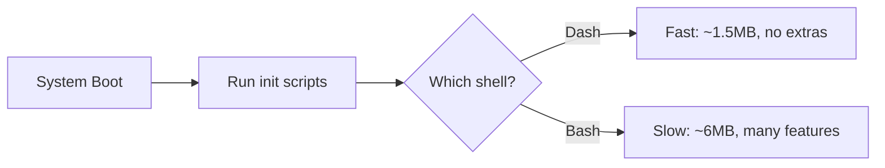

# Dash (Debian Almquist Shell)

## Summary

**Dash** is a minimal, POSIX-compliant shell optimized for speed. It's the default `/bin/sh` on Debian and Ubuntu systems, used for running system scripts during boot. Dash is 4x faster than Bash for script execution due to its small size and lack of interactive features. It's ideal for scripts that prioritize portability and performance over advanced features.

## Detailed Explanation

### Why Dash Exists



### Dash vs Bash

| Aspect | Dash | Bash |
|--------|------|------|
| **Size** | ~1.5 MB | ~6 MB |
| **Speed** | 4x faster | Slower startup |
| **POSIX** | Strict compliance | Extensions beyond POSIX |
| **Arrays** | No | Yes |
| **`[[`** | No | Yes |
| **Interactive** | Basic | Full featured |
| **Use Case** | System scripts | Interactive + scripts |

### Features Dash Lacks

```bash
# These work in Bash but NOT in Dash:

# Arrays
arr=(one two three)        # FAILS in Dash

# Extended test
[[ $var == pattern* ]]     # FAILS - use [ ] instead

# Brace expansion
echo {1..5}                # FAILS - prints literally

# Process substitution
diff <(cmd1) <(cmd2)       # FAILS

# $RANDOM
echo $RANDOM               # FAILS - variable not set

# source (use . instead)
source script.sh           # Use: . script.sh
```

### Writing Portable Scripts

```bash
#!/bin/sh
# POSIX-compliant script (works in Dash)

# Use [ ] instead of [[
if [ "$var" = "value" ]; then
    echo "Match"
fi

# Use command substitution with $()
result=$(ls -la)

# Use expr for arithmetic (or $(())) 
count=$((count + 1))

# Use printf instead of echo -e
printf "Line1\nLine2\n"

# Check for optional features
if command -v bash >/dev/null 2>&1; then
    exec bash "$0" "$@"
fi
```

### Testing Scripts with Dash

```bash
# Run script with Dash to check POSIX compliance
dash ./script.sh

# Check script with shellcheck
shellcheck -s dash script.sh

# Common Bashisms to avoid:
# - function keyword: use name() { } instead
# - [[ ]]: use [ ]
# - ==: use = for string comparison
# - $RANDOM, $BASH_VERSION
# - arrays
```

## Interview Questions

**Q: Why is Dash the default `/bin/sh` on Debian/Ubuntu?**
**A:** Speed and efficiency. Dash is 4x faster than Bash for script execution and uses less memory. During boot, hundreds of shell scripts run, so faster execution significantly reduces boot time. It's also strictly POSIX-compliant, ensuring portable scripts work correctly.

**Q: How do you write scripts that work in both Bash and Dash?**
**A:** Stick to POSIX features: use `[ ]` instead of `[[`, avoid arrays, brace expansion, and `$RANDOM`. Use `#!/bin/sh` shebang. Test with `dash script.sh` and validate with `shellcheck -s dash`.

**Q: When should you use Dash over Bash?**
**A:** For system scripts that need to be fast and portable (init scripts, package maintainer scripts). For personal scripts needing Bash features, use `#!/bin/bash` explicitly.
