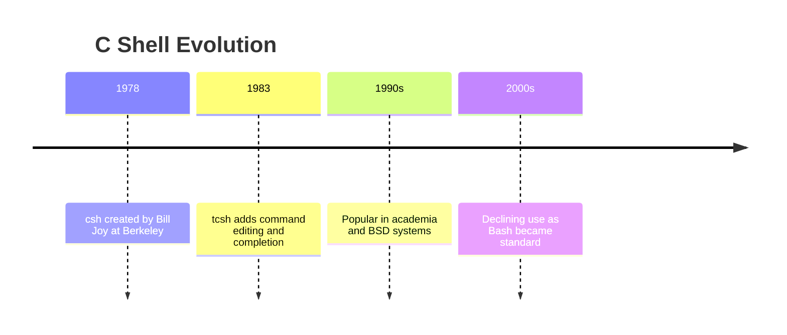

# Tcsh (TENEX C Shell)

## Summary

**Tcsh** is an enhanced version of the C shell (csh), adding command-line editing, completion, and spelling correction. Developed at Carnegie Mellon, it was historically popular on BSD systems and in academic settings. Its C-like syntax differentiates it from Bourne-family shells. While less common today, tcsh is still the default on some BSD variants and legacy systems.

## Detailed Explanation

### Csh/Tcsh History



### C-Shell Syntax (Different from Bash)

```tcsh
# Variables (different syntax)
set name = "World"
echo "Hello, $name"

# Environment variables
setenv PATH "/usr/local/bin:$PATH"

# Arrays (1-indexed)
set arr = (one two three)
echo $arr[1]              # "one"

# Conditionals
if ( $count > 10 ) then
    echo "Large"
else if ( $count > 5 ) then
    echo "Medium"
else
    echo "Small"
endif

# Loops
foreach file ( *.txt )
    echo $file
end

while ( $count < 10 )
    @ count++
end

# Arithmetic (@ is the arithmetic operator)
@ result = 5 + 3
echo $result
```

### Why Avoid Csh for Scripting

Famous essay: "Csh Programming Considered Harmful" (Tom Christiansen)

```tcsh
# Problems with csh scripting:

# 1. No stderr redirection in older versions
command >& file           # Merges stdout and stderr

# 2. Quoting is inconsistent
set var = "hello world"   # Works
set var = 'hello world'   # Different behavior

# 3. No functions
# Must use aliases or external scripts

# 4. Exit status handling is awkward
# No $? equivalent in same way

# 5. Piping issues with control flow
# foreach x ( `cmd` ) breaks on spaces
```

### Tcsh Improvements Over Csh

```tcsh
# Command-line editing
bindkey -e                # Emacs mode
bindkey -v                # Vi mode

# Programmable completion
complete cd 'p/1/d/'      # Complete directories

# Spelling correction
set correct = cmd         # Correct commands
set correct = all         # Correct everything

# History features
history
!42                       # Run command 42
!!                        # Repeat last command

# Prompt customization
set prompt = "%n@%m:%~> "
```

### Configuration Files

```tcsh
# System-wide
/etc/csh.cshrc
/etc/csh.login

# User files
~/.tcshrc          # Interactive shells
~/.cshrc           # Fallback if no .tcshrc
~/.login           # Login shells
~/.logout          # On exit
```

## Interview Questions

**Q: Why is csh considered poor for scripting?**
**A:** Inconsistent quoting, no proper functions, awkward error handling, issues with pipes and loops, and non-POSIX syntax make csh scripts harder to write correctly. The essay "Csh Programming Considered Harmful" documents these issues. Use Bash or POSIX sh for scripts.

**Q: When might you encounter tcsh today?**
**A:** On FreeBSD (historically default for root), legacy BSD systems, some academic environments, and old Solaris installations. Some users prefer its C-like syntax for interactive use.

**Q: What is the key difference between tcsh and Bash syntax?**
**A:** Tcsh uses `set` for variables, `setenv` for environment, `@` for arithmetic, `foreach`/`end` for loops, and `if`/`endif` for conditionals. Bash uses `=`, `export`, `$(())`, `for`/`done`, and `if`/`fi` respectively.
