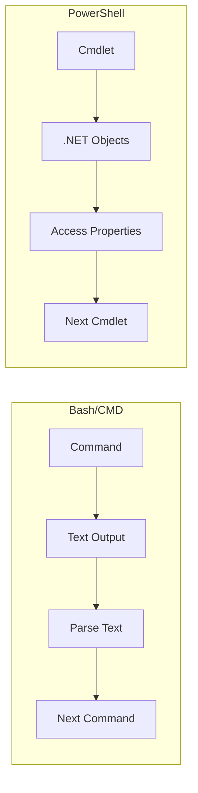

# PowerShell

## Summary

**PowerShell** is Microsoft's modern task automation framework combining a command-line shell with a scripting language built on .NET. Unlike traditional shells that pass text, PowerShell passes objects, enabling powerful data manipulation. PowerShell Core (7.x) is cross-platform, running on Windows, Linux, and macOS, making it valuable for multi-platform automation and cloud management (Azure, AWS, GCP).

## Detailed Explanation

### PowerShell vs Traditional Shells



### Object Pipeline (Key Concept)

```powershell
# Get processes and filter/select properties directly
Get-Process | Where-Object { $_.CPU -gt 100 } | Select-Object Name, CPU

# Compare to Bash (parsing text):
# ps aux | awk '$3 > 100 {print $1, $3}'

# Objects have properties and methods
$proc = Get-Process -Name "code"
$proc.Id
$proc.Kill()

# Format output
Get-Process | Format-Table Name, CPU, WorkingSet -AutoSize
Get-Process | Format-List *
Get-Process | ConvertTo-Json
```

### Cmdlet Naming Convention

```powershell
# Verb-Noun pattern
Get-Process          # Get = retrieve
Set-Location         # Set = modify
New-Item             # New = create
Remove-Item          # Remove = delete
Start-Service        # Start = begin
Stop-Process         # Stop = end

# Common aliases (for convenience)
ls    → Get-ChildItem
cd    → Set-Location
cat   → Get-Content
rm    → Remove-Item
cp    → Copy-Item
mv    → Move-Item
echo  → Write-Output
```

### PowerShell Scripting

```powershell
# Variables
$name = "World"
Write-Host "Hello, $name!"

# Arrays
$arr = @(1, 2, 3, 4, 5)
$arr | ForEach-Object { $_ * 2 }

# Hash tables
$hash = @{
    Name = "John"
    Age = 30
}
$hash.Name

# Conditionals
if ($value -gt 10) {
    "Large"
} elseif ($value -gt 5) {
    "Medium"  
} else {
    "Small"
}

# Loops
foreach ($item in $collection) {
    Write-Output $item
}

1..10 | ForEach-Object { Write-Output $_ }

# Functions
function Get-Greeting {
    param (
        [string]$Name = "World"
    )
    "Hello, $Name!"
}
Get-Greeting -Name "Developer"
```

### Comparison Operators

```powershell
# PowerShell uses different operators than Bash
-eq       # Equal (not ==)
-ne       # Not equal
-gt       # Greater than
-lt       # Less than
-ge       # Greater or equal
-le       # Less or equal
-like     # Wildcard match
-match    # Regex match
-contains # Array contains
-in       # Value in array
```

### Cross-Platform PowerShell

```powershell
# Check version
$PSVersionTable

# PowerShell Core (7.x) on Linux/macOS
# Install via package manager or:
# https://github.com/PowerShell/PowerShell

# Cross-platform script
if ($IsWindows) {
    # Windows-specific
} elseif ($IsLinux) {
    # Linux-specific
} elseif ($IsMacOS) {
    # macOS-specific
}
```

## Interview Questions

**Q: What is the fundamental difference between PowerShell and Bash?**
**A:** PowerShell passes .NET objects through the pipeline; Bash passes text streams. This means PowerShell can access object properties and methods directly without parsing text. For example, `Get-Process | Where-Object CPU -gt 100` works on actual Process objects.

**Q: Why is PowerShell valuable for cloud automation?**
**A:** PowerShell has native modules for Azure, AWS, and GCP. It handles JSON/XML natively, works with REST APIs easily, runs cross-platform (7.x), and integrates with configuration management tools. Object handling makes API responses easy to work with.

**Q: How do PowerShell comparison operators differ from Bash?**
**A:** PowerShell uses `-eq`, `-ne`, `-gt`, `-lt` instead of `==`, `!=`, `>`, `<`. This is because `>` and `<` are reserved for redirection. PowerShell also has `-like` (wildcards), `-match` (regex), and `-contains` (array membership).
