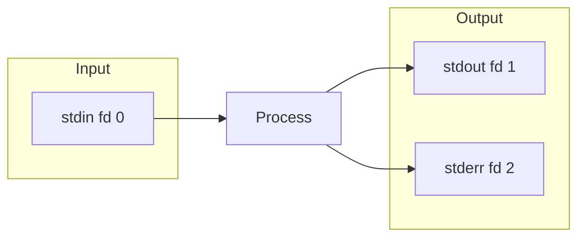

# stdin, stdout, stderr

## Summary

Unix/Linux processes have three standard I/O streams: **stdin** (standard input, fd 0), **stdout** (standard output, fd 1), and **stderr** (standard error, fd 2). These streams enable programs to receive input, produce output, and report errors independently. Understanding these file descriptors is fundamental to shell redirection, piping, and proper error handling in scripts.

## Detailed Explanation

### The Three Standard Streams



| Stream | File Descriptor | Default | Purpose |
|--------|----------------|---------|---------|
| stdin | 0 | Keyboard | Input to program |
| stdout | 1 | Terminal | Normal output |
| stderr | 2 | Terminal | Error messages |

### Basic Examples

```bash
# stdin: Input from keyboard
read -p "Enter name: " name    # Reads from stdin

# stdout: Normal output
echo "Hello, World!"           # Writes to stdout
ls -la                         # Output goes to stdout

# stderr: Error messages
ls /nonexistent 2>/dev/null    # Errors go to stderr
```

### Why Separate stderr?

```bash
# stdout and stderr go to terminal by default
$ ls /home /nonexistent
/home:
user1  user2
ls: cannot access '/nonexistent': No such file or directory

# You can redirect them independently
$ ls /home /nonexistent > output.txt
ls: cannot access '/nonexistent': No such file or directory
# Only stdout goes to file, stderr still on terminal

$ ls /home /nonexistent 2> errors.txt
/home:
user1  user2
# Only stderr goes to file, stdout still on terminal

$ ls /home /nonexistent > output.txt 2> errors.txt
# Both redirected to separate files
```

### Writing to stderr in Scripts

```bash
#!/bin/bash

# Print error messages to stderr
echo "Error: File not found" >&2

# Function for error handling
error() {
    echo "[ERROR] $*" >&2
}

log() {
    echo "[INFO] $*"   # stdout
}

# Usage
if [[ ! -f "$1" ]]; then
    error "File '$1' does not exist"
    exit 1
fi

log "Processing file..."
```

### Checking File Descriptors

```bash
# See open file descriptors
ls -la /proc/$$/fd/
# 0 -> /dev/pts/0 (stdin)
# 1 -> /dev/pts/0 (stdout)
# 2 -> /dev/pts/0 (stderr)

# Check if stdin is a terminal
if [ -t 0 ]; then
    echo "stdin is a terminal"
else
    echo "stdin is a pipe or file"
fi

# Common pattern for detecting piped input
if [ -p /dev/stdin ]; then
    while read -r line; do
        echo "Got: $line"
    done
fi
```

### Practical Patterns

```bash
# Suppress all output
command > /dev/null 2>&1

# Log everything to file AND terminal
command 2>&1 | tee output.log

# Separate success and error logs
./script.sh > success.log 2> error.log

# Check if command succeeded (uses exit code, not output)
if command > /dev/null 2>&1; then
    echo "Success"
else
    echo "Failed"
fi
```

## Interview Questions

**Q: What are the file descriptor numbers for stdin, stdout, and stderr?**
**A:** stdin is 0, stdout is 1, stderr is 2. These numbers are used in redirection like `2>&1` (redirect fd 2 to fd 1).

**Q: Why does Unix separate stdout and stderr?**
**A:** To allow independent handling of normal output and errors. You can redirect output to a file while still seeing errors, or discard errors while keeping output. In pipelines, stderr bypasses the pipe so errors are visible.

**Q: How do you redirect stderr to stdout?**
**A:** Use `2>&1`. This duplicates file descriptor 1 (stdout) onto file descriptor 2 (stderr). Common pattern: `command > file.txt 2>&1` redirects both to the file.

**Q: How do you print error messages in a script?**
**A:** Use `echo "Error message" >&2`. The `>&2` redirects echo's stdout to stderr. This ensures error messages are separate from normal output and follow Unix conventions.
