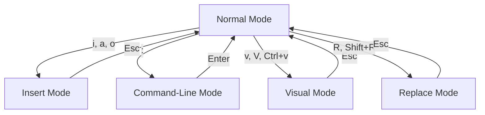

# Vim

## Summary

**Vim** (Vi IMproved) is a highly configurable, modal text editor built for efficient text editing. An enhanced version of the original vi editor, Vim adds features like syntax highlighting, multiple undo/redo, plugins, and extensive customization. While Vim has a steep learning curve, its modal editing model enables incredible editing speed once mastered.

## Detailed Explanation

### Vim Philosophy

| Concept | Description |
|----------|-------------|
| **Modal Editing** | Different modes for typing vs. commands |
| **Hjkl Navigation** | Keep hands on home row |
| **Composability** | Combine commands for complex operations |
| **Efficiency** | Few keystrokes for common tasks |
| **Extensibility** | Plugins, scripts, extensive config |

### Vim Modes



| Mode | Purpose | Enter | Exit |
|-------|---------|--------|-------|
| **Normal** | Navigation, commands | Default/`Esc` | N/A |
| **Insert** | Typing text | `i`, `a`, `o`, `O` | `Esc` |
| **Visual** | Select text | `v`, `V`, `Ctrl+V` | `Esc` |
| **Command-line** | Ex commands | `:` | `Enter` |
| **Replace** | Overwrite text | `R`, `Shift+R` | `Esc` |

### Essential Vim Commands

#### Normal Mode (Navigation)

| Command | Action |
|---------|--------|
| `h`, `j`, `k`, `l` | Left, down, up, right |
| `w`, `b` | Next/previous word |
| `e` | End of word |
| `0`, `$` | Start/end of line |
| `^` | First non-blank character |
| `gg`, `G` | First/last line of file |
| `10G` | Go to line 10 |
| `H`, `M`, `L` | Top/middle/bottom of screen |
| `Ctrl+f`, `Ctrl+b` | Page down/up |
| `Ctrl+d`, `Ctrl+u` | Half page down/up |
| `zz` | Center cursor on screen |

#### Insert Mode

| Command | Action |
|---------|--------|
| `i` | Insert before cursor |
| `I` | Insert at beginning of line |
| `a` | Append after cursor |
| `A` | Append at end of line |
| `o` | Open new line below |
| `O` | Open new line above |

#### Editing

| Command | Action |
|---------|--------|
| `x` | Delete character |
| `X` | Delete character before cursor |
| `dw` | Delete word |
| `dd` | Delete line |
| `d$` | Delete to end of line |
| `d0` | Delete to start of line |
| `dG` | Delete to end of file |
| `dgg` | Delete to start of file |
| `u` | Undo |
| `Ctrl+r` | Redo |
| `.` | Repeat last command |

#### Copy (Yank) and Paste

| Command | Action |
|---------|--------|
| `yw` | Yank (copy) word |
| `yy` | Yank line |
| `p` | Paste after cursor |
| `P` | Paste before cursor |
| `"ay` | Yank into register a |
| `"ap` | Paste from register a |

#### Visual Mode

| Command | Action |
|---------|--------|
| `v` | Visual (character) |
| `V` | Visual line |
| `Ctrl+v` | Visual block |
| `o` | Move to other end of selection |
| `aw`, `aw` | Select a word/inner word |

#### Command-Line Mode

| Command | Action |
|---------|--------|
| `:w` | Write (save) |
| `:q` | Quit |
| `:wq` | Write and quit |
| `:q!` | Quit without saving |
| `:e filename` | Edit file |
| `:bn`, `:bp` | Next/previous buffer |
| `:ls` | List buffers |
| `:help` | Open help |

### Search and Replace

```vim
" Search forward
/pattern        " Search for pattern
n               " Next occurrence
N               " Previous occurrence

" Search backward
?pattern
n               " Previous occurrence
N               " Next occurrence

" Basic replace
:s/old/new/     " Replace first occurrence on line
:s/old/new/g    " Replace all on line
:%s/old/new/g   " Replace all in file

" Replace with confirmation
:%s/old/new/gc  " Ask before each replacement

" Replace in visual selection
:'<,'>s/old/new/g

" Case-insensitive replace
:%s/old/new/gi
```

### Advanced Features

#### Multiple Files

```vim
" Open multiple files
vim file1.txt file2.txt file3.txt

" Navigate between files
:n              " Next file
:N              " Previous file
:b#             " Alternate file
:bn             " Next buffer
:bp             " Previous buffer
:ls             " List all buffers
:b2             " Go to buffer 2
```

#### Split Windows

```vim
" Split horizontally
:split           " or :sp
:split file.txt

" Split vertically
:vsplit          " or :vsp
:vsplit file.txt

" Navigate splits
Ctrl+w, Ctrl+w    " Next window
Ctrl+w, j         " Down
Ctrl+w, k         " Up
Ctrl+w, h         " Left
Ctrl+w, l         " Right
Ctrl+w, q         " Close current split
Ctrl+w, o         " Close all but current
```

#### Macros

```vim
" Record macro
q<letter>        " Start recording to register <letter>
" ... perform actions ...
q                " Stop recording

" Execute macro
@<letter>        " Execute once
@@               " Execute last macro
10@a             " Execute 10 times

" Example: Add comment to multiple lines
qa               " Record to register a
0                " Go to start of line
i                " Enter insert mode
#                " Type #
Esc               " Back to normal mode
j                " Go down one line
q                " Stop recording
" Move to first line, execute 10 times
gg
10@a
```

#### Registers

```vim
" Unnamed register
"p or "P        " Paste from unnamed

" Numbered registers (last 9 deletes)
"1p, "2p, etc.

" Named registers
"a, "b, "c, etc.
"ay              " Yank into register a
"ap              " Paste from register a

" System register (clipboard)
"+y              " Yank to clipboard
"+p              " Paste from clipboard

" Delete register (black hole)
"_d              " Delete without affecting registers
```

#### Visual Block Mode

```vim
Ctrl+v           " Enter visual block mode
j, k             " Extend block vertically
I or A           " Edit all lines in block
Esc              " Apply to all lines

" Example: Comment multiple lines
gg                " Go to first line
Ctrl+v             " Visual block
10j                " Select 10 lines
I                  " Insert at start of line
#                  " Type #
Esc                " Apply to all lines
```

### Configuration (.vimrc)

```vim
" ~/.vimrc

" Basic settings
set number              " Show line numbers
set relativenumber      " Relative line numbers
set autoindent          " Auto indentation
set tabstop=4          " Tab width
set shiftwidth=4        " Indent width
set expandtab          " Use spaces instead of tabs
set smartindent        " Smart indentation
set hlsearch           " Highlight search matches
set ignorecase         " Case-insensitive search
set incsearch          " Incremental search
set cursorline         " Highlight current line
set showmatch          " Highlight matching brackets
set wildmenu           " Enhanced command completion

" Enable syntax highlighting
syntax enable

" Enable file type detection
filetype plugin indent on

" Key mappings
:map <F2> :w<CR>       " F2 to save
:map <F3> :q<CR>       " F3 to quit
:map <F4> :wq<CR>      " F4 to save and quit

" Leader key (default is \)
let mapleader = ","
:map <leader>w :w<CR>
:map <leader>q :q<CR>

" Plugins example (requires vim-plug, Vundle, etc.)
call plug#begin('~/.vim/plugs')
Plug 'tpope/vim-sensible'
Plug 'preservim/nerdtree'
Plug 'airblade/vim-gitgutter'
call plug#end()
```

### Vim vs GVim vs Neovim

| Version | Description |
|---------|-------------|
| **Vim** | Terminal-based, standard |
| **GVim** | GUI version of Vim (mouse support, menus) |
| **Neovim** | Modern fork, Lua support, better performance |

### Practical Workflows

#### Debugging Code

```vim
" 1. Jump to error line
vim +123 app.py

" 2. Search for function
/function_name

" 3. View context
Ctrl+w, v
:split app.py

" 4. Make changes, save
:w

" 5. Reload file
:e
```

#### Editing Config Files

```vim
" Edit as root
sudo vim /etc/ssh/sshd_config

" Jump to specific section
/^Port

" Modify and save
:w

" Reload service
:!systemctl reload sshd
```

#### Quick Edit Pattern

```vim
" Open multiple files for quick switching
vim *.c

" Search across all buffers
:bufdo /TODO

" Replace across all buffers
:bufdo %s/TODO/FIXME/g | update
```

### Learning Resources

```bash
" Built-in tutorial
vimtutor

" Vim commands
:help
:help user-manual
:help index

" Online resources
vimcasts.org       " Video tutorials
vimawesome.com     " Plugin repository
github.com/vim/vim  " Official repo
```

### Vim for Modern Development

```bash
" Why Vim is still relevant:
" - Speed: Once learned, very fast
" - Ubiquity: Available everywhere
" - Customization: Make it your own
" - Ecosystem: 10,000+ plugins
" - Modal editing: Efficient, reduces RSI

" Common plugins:
" - coc.nvim: LSP support
" - NERDTree: File explorer
" - vim-airline: Status bar
" - fzf: Fuzzy finding
" - vim-gitgutter: Git diff in gutter
```

## Interview Questions

**Q: What are Vim modes and why does Vim have them?**
**A:** Vim has Normal (navigation/commands), Insert (typing), Visual (selection), Command-line, and Replace modes. Modes separate navigation from typing, allowing powerful, efficient commands. Press `Esc` to return to Normal mode.

**Q: How do you copy, cut, and paste in Vim?**
**A:** Yank (copy): `yy` for line, `yw` for word. Cut (delete): `dd` for line, `dw` for word. Paste: `p` after cursor, `P` before cursor. Use registers (`"ay`) to store multiple items.

**Q: What is the difference between `:wq`, `:q`, and `:q!`?**
**A:** `:wq` writes (saves) and quits. `:q` quits only if no changes. `:q!` quits without saving (discards changes). Use `:wqa` to quit all buffers.

**Q: How do you perform search and replace in Vim?**
**A:** Search: `/pattern` for forward, `?pattern` for backward. Replace: `:%s/old/new/g` replaces all in file; `:%s/old/new/gc` asks for confirmation; `:s/old/new/g` replaces only on current line.

**Q: What are Vim registers?**
**A:** Registers store text for yank/delete/paste operations. Unnamed register (`""`) stores last operation. Named registers (`"a`-`"z`) store specific content. Clipboard register (`"+`) holds system clipboard. Use `"ap` to paste from register a.
