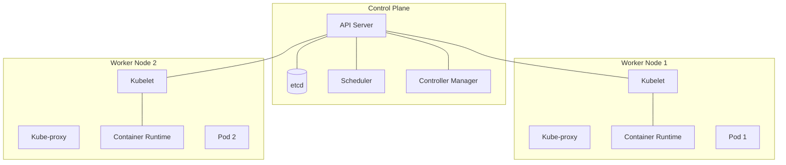

# Overview of Kubernetes

## Summary
Kubernetes (also known as K8s) is an open-source container orchestration platform designed to automate the deployment, scaling, and management of containerized applications. Originally developed by Google and now maintained by the Cloud Native Computing Foundation (CNCF), it has become the industry standard for cloud-native infrastructure. Kubernetes provides a declarative way to manage complex distributed systems, ensuring high availability through self-healing and automated rollouts. It abstracts the underlying hardware, allowing developers to focus on application logic rather than infrastructure details.

## Detailed Explanation

### What is Kubernetes?
Kubernetes is a portable, extensible, open-source platform for managing containerized workloads and services. It facilitates both declarative configuration and automation. It manages a cluster of compute nodes and schedules containers to run on those nodes based on available resources and defined requirements.

### Why use Kubernetes?
1.  **Service Discovery and Load Balancing**: K8s can expose a container using the DNS name or using their own IP address. If traffic to a container is high, K8s can load balance and distribute the network traffic.
2.  **Storage Orchestration**: Automatically mount a storage system of your choice, such as local storage, public cloud providers, and more.
3.  **Automated Rollouts and Rollbacks**: You can describe the desired state for your deployed containers, and K8s can change the actual state to the desired state at a controlled rate.
4.  **Automatic Bin Packing**: You provide K8s with a cluster of nodes that it can use to run containerized tasks. You tell K8s how much CPU and memory (RAM) each container needs. K8s can fit containers onto your nodes to make the best use of your resources.
5.  **Self-healing**: K8s restarts containers that fail, replaces containers, kills containers that don't respond to your user-defined health check, and doesn't advertise them to clients until they are ready to serve.

### How it works (Architecture)
A Kubernetes cluster consists of two types of resources:
*   **The Control Plane**: The brains of the cluster. It makes global decisions about the cluster (e.g., scheduling), and detects and responds to cluster events.
*   **Nodes**: The worker machines that run your applications.

#### Architecture Diagram


## Go Application

For Go developers, Kubernetes is more than just a deployment target; it's a platform you can interact with programmatically.

### 1. Deploying a Go App
To deploy a Go application to Kubernetes, you typically:
1.  **Containerize**: Create a Dockerfile (usually using a multi-stage build to keep the image small).
2.  **Manifest**: Define a Deployment and a Service in YAML.

### 2. Using `client-go`
The `client-go` library is the official Go client for Kubernetes. It allows you to perform CRUD operations on cluster resources.

#### Example: In-Cluster Configuration
This is used when your Go binary is running *inside* a Pod in the cluster.

```go
package main

import (
	"context"
	"fmt"
	"time"

	metav1 "k8s.io/apimachinery/pkg/apis/meta/v1"
	"k8s.io/client-go/kubernetes"
	"k8s.io/client-go/rest"
)

func main() {
	// creates the in-cluster config
	config, err := rest.InClusterConfig()
	if err != nil {
		panic(err.Error())
	}
	// creates the clientset
	clientset, err := kubernetes.NewForConfig(config)
	if err != nil {
		panic(err.Error())
	}
	for {
		// get pods in all namespaces
		pods, err := clientset.CoreV1().Pods("").List(context.TODO(), metav1.ListOptions{})
		if err != nil {
			panic(err.Error())
		}
		fmt.Printf("There are %d pods in the cluster\n", len(pods.Items))
		time.Sleep(10 * time.Second)
	}
}
```

## Interview Questions

1.  **What are the main components of the Kubernetes Control Plane?**
    *   **Answer**: API Server (entry point), etcd (distributed key-value store), Scheduler (places pods on nodes), and Controller Manager (maintains desired state).

2.  **What is a Pod in Kubernetes?**
    *   **Answer**: The smallest deployable unit in K8s. It represents a single instance of a running process in your cluster and can contain one or more containers that share storage and network.

3.  **Explain the role of Kubelet.**
    *   **Answer**: An agent that runs on each node in the cluster. It ensures that containers are running in a Pod by following instructions from the Control Plane.

4.  **What is the difference between a Deployment and a StatefulSet?**
    *   **Answer**: Deployments are for stateless applications where pods are interchangeable. StatefulSets are for stateful applications (like databases) that require stable identifiers, persistent storage, and ordered deployment/scaling.

5.  **How does Kubernetes handle "Self-healing"?**
    *   **Answer**: Through the use of Controllers (like the Deployment Controller). It constantly monitors the current state of the cluster against the desired state defined in manifests. If a Pod fails, the controller detects the discrepancy and triggers the creation of a new Pod to match the desired count.
