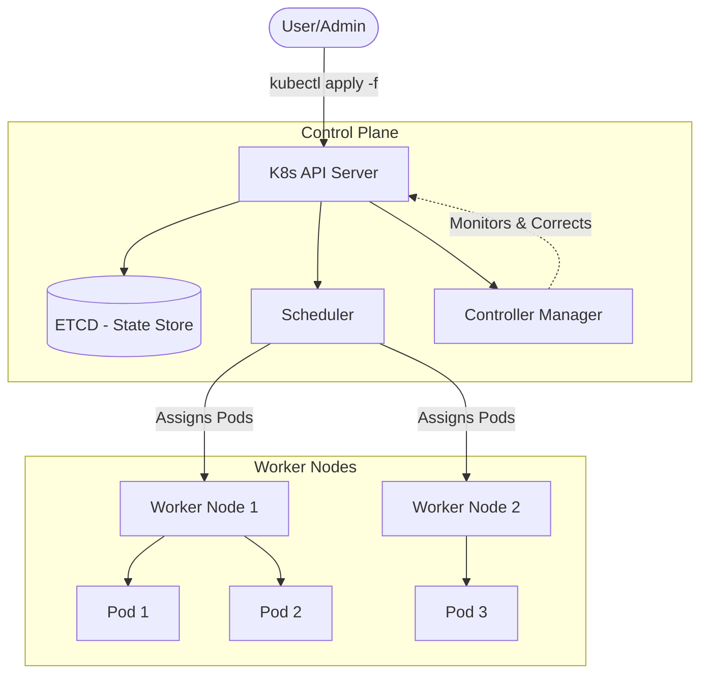

# Why use Kubernetes

## Summary
Kubernetes (K8s) is the industry-standard container orchestration platform designed to automate the deployment, scaling, and management of containerized applications. It solves the complexity of managing large-scale distributed systems by providing features like self-healing, automated rollouts, and efficient resource utilization. For developers, it ensures environment parity and simplifies the path from development to production.

## Detailed Explanation

### **What is Kubernetes?**
Kubernetes is a portable, extensible, open-source platform for managing containerized workloads and services. Originally developed by Google and now maintained by the Cloud Native Computing Foundation (CNCF), it has become the "OS of the Cloud."

### **Why use Kubernetes? (Key Benefits)**

1.  **High Availability & Self-Healing**: 
    Kubernetes monitors your containers constantly. If a container crashes, K8s restarts it. If a node fails, K8s reschedules the pods onto healthy nodes.
2.  **Scalability**: 
    With the Horizontal Pod Autoscaler (HPA), K8s can automatically increase or decrease the number of running pods based on CPU/memory usage or custom metrics.
3.  **Service Discovery & Load Balancing**: 
    K8s provides a single DNS name for a set of pods (Service) and can load balance traffic across them, preventing any single pod from being overwhelmed.
4.  **Automated Rollouts and Rollbacks**: 
    You can describe the desired state for your deployed containers, and K8s can change the actual state to the desired state at a controlled rate. If something goes wrong, you can roll back the change immediately.
5.  **Resource Optimization (Bin Packing)**: 
    Kubernetes automatically places containers onto nodes to make the best use of resources while respecting constraints and requirements.

### **How it works (The Declarative Model)**
Kubernetes works on a **declarative model**. Instead of telling the system *how* to do something (imperative), you tell it *what* you want (e.g., "I want 3 replicas of my Go app running"). The **Control Plane** then works continuously to ensure the current state matches this desired state.



---

## Go Application

### **Why Go and Kubernetes?**
Kubernetes is written in **Go**, and the two share a deep synergy:
-   **Static Binaries**: Go compiles to a single static binary, which results in tiny Docker images (using `scratch` or `alpine`), ideal for K8s.
-   **Concurrency**: Go's goroutines align perfectly with the distributed nature of K8s controllers.
-   **Fast Startup**: Go apps start quickly, enabling K8s to scale or restart them efficiently.

### **Using client-go**
To interact with a Kubernetes cluster from a Go application, you use the official [client-go](https://github.com/kubernetes/client-go) library. This is how you build **Operators** or custom automation tools.

#### Example: Listing Pods in the Default Namespace
```go
package main

import (
	"context"
	"fmt"
	"path/filepath"

	metav1 "k8s.io/apimachinery/pkg/apis/meta/v1"
	"k8s.io/client-go/kubernetes"
	"k8s.io/client-go/tools/clientcmd"
	"k8s.io/client-go/util/homedir"
)

func main() {
	// Use kubeconfig for authentication
	kubeconfig := filepath.Join(homedir.HomeDir(), ".kube", "config")
	config, _ := clientcmd.BuildConfigFromFlags("", kubeconfig)
	clientset, _ := kubernetes.NewForConfig(config)

	// List pods in default namespace
	pods, _ := clientset.CoreV1().Pods("default").List(context.TODO(), metav1.ListOptions{})
	
	fmt.Printf("There are %d pods in the default namespace\n", len(pods.Items))
	for _, pod := range pods.Items {
		fmt.Printf("- %s\n", pod.Name)
	}
}
```

---

## Interview Questions

**Q: What is the main difference between Docker Swarm and Kubernetes?**
**A:** While both are orchestrators, Swarm is simpler and better for smaller setups. Kubernetes is much more feature-rich, offering advanced auto-scaling, complex networking, and a massive ecosystem (Helm, Operators, Service Meshes). Swarm is imperative, whereas K8s is primarily declarative.

**Q: What is "Self-Healing" in Kubernetes?**
**A:** It refers to the cluster's ability to maintain the desired state without human intervention. This includes restarting failed containers, replacing pods when nodes die, and killing containers that don't respond to user-defined health checks (liveness probes).

**Q: Explain the concept of a "Controller" in the context of K8s architecture.**
**A:** A Controller is a control loop that watches the shared state of the cluster through the API server and makes changes attempting to move the current state toward the desired state. Examples include the Deployment Controller, Job Controller, and Cloud Controller.

**Q: How does Kubernetes handle sensitive data like passwords or API keys?**
**A:** It uses **Secrets**. Secrets allow you to store and manage sensitive information separately from your container images. They can be mounted into pods as files or exposed as environment variables, keeping them out of your source code and image layers.

**Q: Why is Go the preferred language for writing Kubernetes Controllers and Operators?**
**A:** Beyond being the language K8s is written in, Go provides the `client-go` library and `controller-runtime`, which are the most mature tools for the job. Its performance, strong typing, and excellent support for JSON/YAML make it ideal for cloud-native infrastructure.
