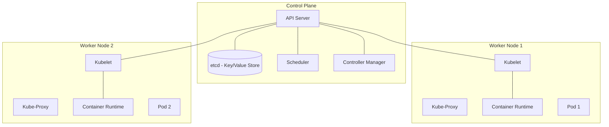

---
---

# Key Concepts and Terminologies

## Summary
Kubernetes (K8s) is an open-source container orchestration platform designed to automate the deployment, scaling, and management of containerized applications. It provides a robust framework for running distributed systems resiliently, handling service discovery, load balancing, and self-healing of containers. By abstracting the underlying infrastructure, Kubernetes allows developers to focus on application logic while ensuring high availability and efficient resource utilization across a cluster of machines.

## Detailed Explanation

### What is Kubernetes?
Kubernetes is a production-grade orchestration engine that manages the lifecycle of containerized applications. It was originally developed by Google (based on their internal system called Borg) and is now maintained by the Cloud Native Computing Foundation (CNCF).

### Why Use Kubernetes?
*   **Scalability:** Automatically scale applications up or down based on resource usage or custom metrics.
*   **High Availability:** Ensures applications stay running by restarting failed containers and rescheduling them if a node fails.
*   **Service Discovery & Load Balancing:** Provides containers with their own IP addresses and a single DNS name for a set of containers, balancing traffic across them.
*   **Declarative Configuration:** You describe the *desired state* of your system in YAML or JSON, and Kubernetes works to maintain that state.

### How it Works: Architecture
The Kubernetes architecture follows a master-worker model, consisting of a **Control Plane** and multiple **Worker Nodes**.



### Key Terminologies

| Term | Description |
| :--- | :--- |
| **Cluster** | A set of nodes (machines) for running containerized applications. |
| **Node** | A physical or virtual machine in the cluster. |
| **Control Plane** | The "brain" of the cluster that makes global decisions (e.g., scheduling). |
| **Pod** | The smallest deployable unit; a group of one or more containers sharing storage/network. |
| **Service** | An abstraction that defines a logical set of Pods and a policy to access them (Stable IP). |
| **Deployment** | Describes the desired state for Pods and ReplicaSets; handles rolling updates. |
| **Namespace** | A virtual cluster within a physical cluster used to divide resources between users/teams. |
| **ConfigMap/Secret** | Objects used to store non-confidential and confidential configuration data respectively. |

---

## Go Application

Kubernetes is built with **Go**, making it the "native" language for the ecosystem. Go developers interact with Kubernetes primarily by deploying Go-based microservices or by writing custom controllers using **client-go**.

### Deploying a Go App
A typical workflow involves containerizing the Go binary and defining a Deployment.

**deployment.yaml**
```yaml
apiVersion: apps/v1
kind: Deployment
metadata:
  name: go-webapp
spec:
  replicas: 3
  selector:
    matchLabels:
      app: go-webapp
  template:
    metadata:
      labels:
        app: go-webapp
    spec:
      containers:
      - name: server
        image: my-go-app:v1.0.0
        ports:
        - containerPort: 8080
```

### Using client-go
Developers can use the official [client-go](https://github.com/kubernetes/client-go) library to programmatically manage Kubernetes resources.

```go
package main

import (
	"context"
	"fmt"
	"k8s.io/client-go/kubernetes"
	"k8s.io/client-go/tools/clientcmd"
	metav1 "k8s.io/apimachinery/pkg/apis/meta/v1"
)

func main() {
	// Use local kubeconfig
	config, _ := clientcmd.BuildConfigFromFlags("", "/path/to/kubeconfig")
	clientset, _ := kubernetes.NewForConfig(config)

	// List Pods in default namespace
	pods, _ := clientset.CoreV1().Pods("default").List(context.TODO(), metav1.ListOptions{})
	for _, pod := range pods.Items {
		fmt.Printf("Pod Name: %s\n", pod.Name)
	}
}
```

---

## Interview Questions

### 1. What is the difference between a Pod and a Container?
A container is a single runtime instance of an image (e.g., Docker). A **Pod** is the smallest unit in Kubernetes and can contain one or more containers that share the same network namespace (localhost) and storage volumes.

### 2. Explain the role of the `etcd` component.
`etcd` is a consistent and highly-available key-value store used as Kubernetes' backing store for all cluster data. It stores the configuration, state, and metadata of the entire cluster.

### 3. What is a Service in Kubernetes and why do we need it?
Pods are ephemeral; they can be killed and replaced, changing their IP addresses. A **Service** provides a stable IP address and DNS name that acts as a load balancer for a group of Pods, ensuring reliable communication even as Pods cycle.

### 4. What happens when a Node fails in a Kubernetes cluster?
The **Controller Manager** detects the node failure via the lack of heartbeats. The **Scheduler** then identifies the Pods that were running on the failed node and reschedules them onto other healthy nodes in the cluster to maintain the desired replica count.

### 5. Deployment vs. ReplicaSet?
A **ReplicaSet** ensures that a specified number of pod replicas are running at any given time. A **Deployment** is a higher-level abstraction that manages ReplicaSets and provides declarative updates to Pods, such as rolling updates and rollbacks.
