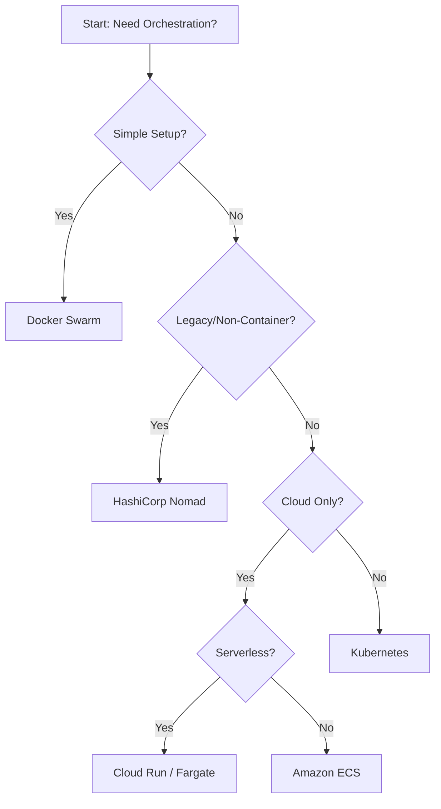

# Kubernetes Alternatives

## Summary
While Kubernetes is the industry standard for container orchestration, it is often criticized for its steep learning curve and operational complexity. Alternatives exist to address specific needs, ranging from simpler orchestration tools like Docker Swarm to flexible workload managers like HashiCorp Nomad and serverless offerings like AWS Fargate or Google Cloud Run. Choosing an alternative typically depends on the team's size, the existing cloud ecosystem, and whether the overhead of managing a full Kubernetes control plane is justified for the application's scale.

## Detailed Explanation

### Why Look for Alternatives?
Kubernetes (K8s) is a "platform for building platforms," which means it provides a vast array of primitives but requires significant configuration. Organizations might seek alternatives due to:
- **Complexity**: Managing etcd, networking (CNI), and RBAC can be overwhelming for small teams.
- **Resource Overhead**: K8s control plane components consume significant CPU and RAM, even for small clusters.
- **Specialized Workloads**: Some applications (like legacy binaries or Windows apps) might be easier to manage in Nomad.
- **Vendor Lock-in/Integration**: Teams heavily invested in AWS might find ECS more "natural" than EKS.

### Main Alternatives

#### 1. Docker Swarm
The "native" clustering solution for Docker. It is built into the Docker Engine, making it extremely easy to set up.
- **Pros**: Zero installation (it's already there), uses standard Docker Compose files, very low learning curve.
- **Cons**: Limited feature set compared to K8s (no advanced scheduling, limited self-healing, smaller ecosystem).

#### 2. HashiCorp Nomad
A lightweight, flexible orchestrator that can manage both containers and non-containerized applications (Java jars, raw binaries).
- **Pros**: Single binary for client/server, extremely scalable, handles diverse workloads, integrates perfectly with Consul (service mesh) and Vault (secrets).
- **How it works**: Uses HCL (HashiCorp Configuration Language) to define jobs.

#### 3. Managed Services (PaaS/Serverless)
- **Amazon ECS (Elastic Container Service)**: A highly opinionated, AWS-native orchestrator. It's simpler than K8s but deeply integrated with AWS IAM and VPCs.
- **AWS Fargate / Google Cloud Run**: "Serverless containers." You provide the container image, and the cloud provider handles the infrastructure, scaling to zero when not in use.
- **Red Hat OpenShift**: Essentially "Enterprise Kubernetes." While built on K8s, it provides a much more integrated developer experience with built-in CI/CD, monitoring, and registry.

### Decision Matrix (Mermaid)



## Go Application

Go is uniquely suited for alternatives like Nomad or even simple Linux services because it produces **statically linked binaries**. Unlike Python or Node.js, a Go app doesn't need a complex container image just to run; often, a `scratch` or `alpine` image is enough.

### Deploying Go to Nomad
Nomad can run Go binaries directly using the `raw_exec` driver, which is even lighter than Docker.

```hcl
job "go-webapp" {
  datacenters = ["dc1"]
  type        = "service"

  group "web" {
    count = 3
    task "server" {
      driver = "docker" # Or "raw_exec" for the binary directly
      config {
        image = "my-go-app:latest"
        ports = ["http"]
      }
      resources {
        cpu    = 500
        memory = 256
      }
    }
  }
}
```

### Using Go SDKs for Alternatives
While K8s has `client-go`, other orchestrators have their own Go libraries. For example, interacting with Nomad programmatically:

```go
package main

import (
	"fmt"
	"log"

	"github.com/hashicorp/nomad/api"
)

func main() {
	// Initialize the Nomad client
	client, err := api.NewClient(api.DefaultConfig())
	if err != nil {
		log.Fatalf("Error creating client: %s", err)
	}

	// List all jobs
	jobs, _, err := client.Jobs().List(nil)
	if err != nil {
		log.Fatalf("Error listing jobs: %s", err)
	}

	for _, job := range jobs {
		fmt.Printf("Job: %s (Status: %s)\n", *job.ID, *job.Status)
	}
}
```

## Interview Questions

**Q: When would you recommend Docker Swarm over Kubernetes?**
**A:** Docker Swarm is ideal for small teams or projects that need simple orchestration without the management overhead of K8s. It's great for internal tools, development environments, or simple microservices where the advanced features of K8s (like Custom Resource Definitions or complex affinity rules) are not required.

**Q: What is the main architectural difference between Nomad and Kubernetes?**
**A:** Nomad follows the Unix philosophy—it does one thing (scheduling) and does it well. It relies on Consul for service discovery and Vault for secrets management. Kubernetes, on the other hand, is an all-in-one platform that includes its own primitives for service discovery, secrets, and more, leading to a much larger and more complex binary.

**Q: Why would a company choose AWS ECS instead of AWS EKS (Kubernetes)?**
**A:** ECS is chosen for its deep integration with the AWS ecosystem. It uses standard AWS IAM roles for tasks, integrates seamlessly with CloudWatch, and has a much simpler control plane. It's preferred by teams that want to stay within the AWS "comfort zone" and avoid the complexities of managing a K8s-compliant cluster.

**Q: What are the benefits of using "Serverless Containers" like Google Cloud Run?**
**A:** The primary benefits are "scale-to-zero" (saving costs when there's no traffic), simplified operations (no node management), and a focus on code rather than infrastructure. It is perfect for stateless APIs, event-driven microservices, and web applications with variable traffic patterns.
