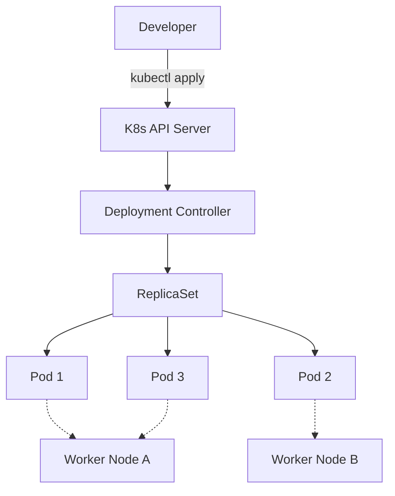

# Deploying Your First Application in Kubernetes

This guide covers the fundamental process of taking a containerized application and running it on a Kubernetes cluster. It bridges the gap between local development and cloud-native orchestration.

## Summary
Deploying your first application in Kubernetes involves packaging your code into a container image, defining a declarative **Deployment** manifest, and submitting it to the cluster's API server. A Deployment ensures that a specified number of application instances (**Pods**) are running and healthy at all times, providing self-healing and automated updates. By abstracting the infrastructure, Kubernetes allows developers to focus on defining the desired state of their applications while the platform handles the placement and lifecycle management.

---

## Detailed Explanation

### **What** is a Deployment?
In Kubernetes, you rarely manage individual Pods. Instead, you use a **Deployment**, which is a high-level controller that manages a set of identical Pods. It allows you to describe the "desired state" of your application (e.g., "I want 3 replicas of my web app running version 1.2").

### **Why** use a Deployment?
1.  **Self-healing**: If a node fails or a Pod crashes, the Deployment controller automatically recreates the Pod on a healthy node.
2.  **Scalability**: You can increase or decrease the number of replicas with a single command or manifest change.
3.  **Rolling Updates**: Deployments can update your application to a new version without downtime by replacing Pods one by one.
4.  **Rollbacks**: If a new version is buggy, you can easily revert to a previous stable state.

### **How** it Works (The Flow)



### Steps to Deploy
1.  **Containerize**: Build a Docker image and push it to a registry (e.g., Docker Hub, ECR).
2.  **Define Manifest**: Create a YAML file describing the Deployment.
3.  **Apply**: Use `kubectl apply -f deployment.yaml` to send the manifest to the cluster.
4.  **Expose**: Create a **Service** to route traffic to the Pods.

---

## Go Application: Implementation for Go Developers

For Go developers, deploying to Kubernetes typically means creating a small, efficient binary and wrapping it in a secure container.

### 1. Simple Go HTTP Server
```go
// main.go
package main

import (
	"fmt"
	"net/http"
	"os"
)

func main() {
	http.HandleFunc("/", func(w http.ResponseWriter, r *http.Request) {
		hostname, _ := os.Hostname()
		fmt.Fprintf(w, "Hello from Go! Running on: %s\n", hostname)
	})

	fmt.Println("Server starting on :8080...")
	if err := http.ListenAndServe(":8080", nil); err != nil {
		panic(err)
	}
}
```

### 2. Multi-stage Dockerfile (Best Practice)
Go binaries are statically linked, so we can use a multi-stage build to keep the final image tiny (using `alpine` or `scratch`).

```dockerfile
# Build stage
FROM golang:1.23-alpine AS builder
WORKDIR /app
COPY . .
RUN go build -o main .

# Final stage
FROM alpine:latest
WORKDIR /root/
COPY --from=builder /app/main .
EXPOSE 8080
CMD ["./main"]
```

### 3. Kubernetes Deployment Manifest
```yaml
apiVersion: apps/v1
kind: Deployment
metadata:
  name: go-app-deployment
  labels:
    app: go-web
spec:
  replicas: 3
  selector:
    matchLabels:
      app: go-web
  template:
    metadata:
      labels:
        app: go-web
    spec:
      containers:
      - name: go-app
        image: your-registry/go-app:v1.0.0
        ports:
        - containerPort: 8080
        # Best Practice: Readiness and Liveness probes
        readinessProbe:
          httpGet:
            path: /
            port: 8080
          initialDelaySeconds: 5
          periodSeconds: 10
        livenessProbe:
          httpGet:
            path: /
            port: 8080
          initialDelaySeconds: 15
          periodSeconds: 20
```

---

## Interview Questions

**Q: What is the difference between a Pod and a Deployment?**
**A:** A **Pod** is the smallest deployable unit in K8s, containing one or more containers. A **Deployment** is a controller that manages Pods, providing features like scaling, rolling updates, and self-healing. You almost never deploy a "bare Pod" in production; you use a Deployment.

**Q: How does Kubernetes know if your Go application is ready to receive traffic?**
**A:** Via **Readiness Probes**. If the probe fails, the Service controller removes the Pod's IP from the load balancer. This prevents "black-hole" traffic during application startup or when the app is overloaded.

**Q: What happens if you delete a Pod that was created by a Deployment?**
**A:** The Deployment controller (via its ReplicaSet) will immediately detect that the current state (N-1 pods) doesn't match the desired state (N pods) and will spin up a new Pod to replace it.

**Q: Why is a multi-stage Docker build recommended for Go applications in Kubernetes?**
**A:** It reduces the attack surface and the image size. A smaller image results in faster pull times (faster scaling/rollouts) and costs less to store. Since Go produces a standalone binary, the final image doesn't need the Go toolchain or source code.

**Q: How do you update an existing Deployment to use a new image version?**
**A:** You can use `kubectl set image deployment/name container=new-image:tag` or, preferably, update the YAML manifest and run `kubectl apply -f manifest.yaml`. K8s will then perform a Rolling Update.
