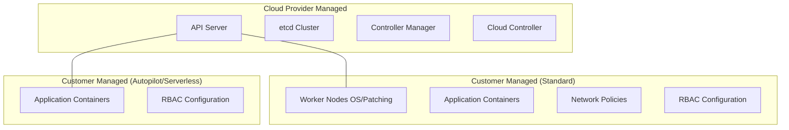

# Choosing a Managed Provider

## Abstract
Choosing a managed Kubernetes provider is a strategic decision that balances operational overhead against control and cost. Managed services like **GKE**, **EKS**, and **AKS** handle the complexity of the control plane, including master node maintenance, automated upgrades, and high availability, allowing teams to focus on application logic. In 2026, the choice often hinges on the existing cloud ecosystem of the organization, the level of automation desired (e.g., "Serverless" Kubernetes), and specific regional or compliance requirements.

## Development

### What is Managed Kubernetes?
A Managed Kubernetes Service (mK8s) is a platform where the cloud provider manages the **Control Plane** (API Server, etcd, Scheduler, Controller Manager). Users are typically only responsible for the **Worker Nodes**, though some "autopilot" modes even manage the nodes.

### Why use a Managed Provider?
1. **Reduced Operational Overhead**: No need to manually bootstrap clusters (e.g., with `kubeadm`) or manage etcd backups.
2. **High Availability**: Providers offer Service Level Agreements (SLAs) for the API server availability.
3. **Automated Upgrades**: Simplified patching of the control plane and, in many cases, automated rolling updates for worker nodes.
4. **Cloud Integration**: Native support for Load Balancers (LBs), Block Storage (PVs), and Identity Management (IAM).

### The Big Three: Comparison (2026)

| Feature | GKE (Google) | EKS (Amazon) | AKS (Azure) |
|---------|--------------|--------------|-------------|
| **Ease of Use** | **Best** (Google pioneered K8s) | Moderate (Improving) | High |
| **Automation** | **GKE Autopilot** (Fully managed) | EKS Fargate (Serverless nodes) | AKS Automatic |
| **Control Plane Cost**| ~$0.10 / hour | ~$0.10 / hour | Free (no SLA) / Paid (SLA) |
| **Upgrades** | Highly automated | Manual triggers / Managed | Automated / Scheduled |
| **Ecosystem** | Best for Google Cloud native | Deep AWS integration (IAM, VPC) | Best for Enterprise/AD users |

### Shared Responsibility Model
The primary "How" of managed providers is understanding what you still need to manage.



## Go Application & Ecosystem

For Go developers, interacting with managed providers involves the **client-go** library and cloud-specific authentication plugins.

### 1. Authentication
Managed clusters use cloud IAM for authentication. In Go applications running outside the cluster, you must ensure the `kubeconfig` is updated and the appropriate auth plugin is available.

```go
package main

import (
	"context"
	"fmt"
	"os"
	"path/filepath"

	metav1 "k8s.io/apimachinery/pkg/apis/meta/v1"
	"k8s.io/client-go/kubernetes"
	"k8s.io/client-go/tools/clientcmd"
	
	// Import auth plugins for GCP/Azure/AWS if needed
	_ "k8s.io/client-go/plugin/pkg/client/auth" 
)

func main() {
	// 1. Get kubeconfig from home directory
	home, _ := os.UserHomeDir()
	kubeconfig := filepath.Join(home, ".kube", "config")

	// 2. Build configuration from the config file
	config, err := clientcmd.BuildConfigFromFlags("", kubeconfig)
	if err != nil {
		panic(err.Error())
	}

	// 3. Create the clientset
	clientset, err := kubernetes.NewForConfig(config)
	if err != nil {
		panic(err.Error())
	}

	// 4. Interact with the managed cluster (e.g., GKE or EKS)
	pods, err := clientset.CoreV1().Pods("").List(context.TODO(), metav1.ListOptions{})
	if err != nil {
		panic(err.Error())
	}
	fmt.Printf("There are %d pods in the cluster\n", len(pods.Items))
}
```

## Interview Preparation

### Common Questions

1. **When should you choose GKE over EKS?**
   - **Answer**: Choose **GKE** if you prioritize automation and ease of use. Choose **EKS** if your infrastructure is already heavily invested in the AWS ecosystem.

2. **What is the difference between GKE Standard and GKE Autopilot?**
   - **Answer**: In **Standard**, you manage worker nodes. In **Autopilot**, Google manages nodes and security; you pay per pod resource request.

3. **What are the hidden costs of managed Kubernetes?**
   - **Answer**: Control plane fees (~$70/mo), Inter-AZ data transfer, and managed Load Balancer costs.
