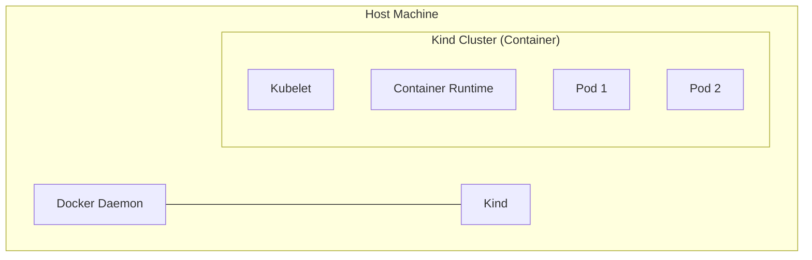

# Installing a Local Cluster

## Summary
Installing a local Kubernetes cluster enables developers to test, experiment, and develop applications in a safe, isolated environment before deploying to production. Tools like **Minikube**, **Kind** (Kubernetes in Docker), and **k3d** provide lightweight, conformant clusters that run on a personal machine. These tools are essential for the "inner development loop," allowing for rapid feedback and iteration.

## Detailed Explanation

### Why run Kubernetes locally?
*   **Rapid Development**: No need to wait for CI/CD pipelines to see if your manifest syntax is correct.
*   **Cost**: Local clusters are free.
*   **Offline Access**: Develop without an internet connection.
*   **Debugging**: Easier to attach debuggers and inspect application state locally.

### Top Local Cluster Tools (2026)

| Tool | Architecture | Best For | Go Support |
| :--- | :--- | :--- | :--- |
| **Kind** | Runs K8s nodes as Docker containers | CI/CD, Multi-node testing | Excellent (Written in Go) |
| **Minikube** | VM or Docker container | Beginners, Feature-rich (Add-ons) | Good (Written in Go) |
| **k3d** | k3s in Docker | Ultra-lightweight, Fast startup | Excellent (Based on k3s/Go) |
| **MicroK8s** | Snap package (Linux) | IoT, Edge, Linux Desktop | Good |

### How Kind Works
Kind is particularly popular because it uses Docker containers to simulate "nodes," making it very fast and lightweight.



### Installation Example (Kind)
```bash
# 1. Install Kind (Go install)
go install sigs.k8s.io/kind@v0.20.0

# 2. Create Cluster
kind create cluster --name dev-cluster

# 3. Use kubectl
kubectl cluster-info --context kind-dev-cluster
```

## Go Application: Inner Loop Development

For Go developers, the "inner loop" often involves building a binary, containerizing it, and running it on the local cluster.

### 1. Loading Images into Kind
Instead of pushing to a remote registry (slow), load the image directly into Kind nodes.

```bash
# Build Go App Image
docker build -t my-go-app:dev .

# Load into Kind
kind load docker-image my-go-app:dev --name dev-cluster
```

### 2. Programmatic Interaction (Go)
You can create ephemeral clusters for testing your Go tools using the Kind packages directly.

```go
package main

import (
    "sigs.k8s.io/kind/pkg/cluster"
)

func main() {
    provider := cluster.NewProvider()
    
    // Create a cluster named "test-cluster"
    if err := provider.Create("test-cluster"); err != nil {
        panic(err)
    }
    
    // ... run tests ...
    
    // Delete the cluster
    // provider.Delete("test-cluster", "") 
}
```

## Interview Questions

**Q: What is the main difference between Minikube and Kind?**
**A:** Minikube traditionally runs a single-node cluster inside a Virtual Machine (VM), though it can also use Docker. Kind (Kubernetes in Docker) runs Kubernetes nodes *as* Docker containers. This makes Kind generally faster to start and easier to use in CI/CD pipelines where nested virtualization might be an issue.

**Q: Why might you use `k3d` over `Kind`?**
**A:** `k3d` is a wrapper around `k3s`, which is a stripped-down, lightweight Kubernetes distribution. It starts up faster and consumes less memory than Kind (which runs full upstream Kubernetes), making it ideal for resource-constrained local machines or running many clusters simultaneously.

**Q: How do you access a Service running in a local cluster from your host machine?**
**A:** You can use `kubectl port-forward` to forward a local port to a port on the Service or Pod. Alternatively, Minikube has `minikube tunnel`, and Kind supports extra port mappings configuration during cluster creation to expose NodePorts to the host.

**Q: What is "Headless Service" and is it useful locally?**
**A:** A Headless Service (ClusterIP: None) allows you to resolve the IPs of individual pods directly via DNS. While useful in production for stateful sets, locally it behaves similarly, but accessing it from the host usually still requires port-forwarding or a VPN-like solution (like Telepresence) because the pod IPs are internal to the cluster network.
