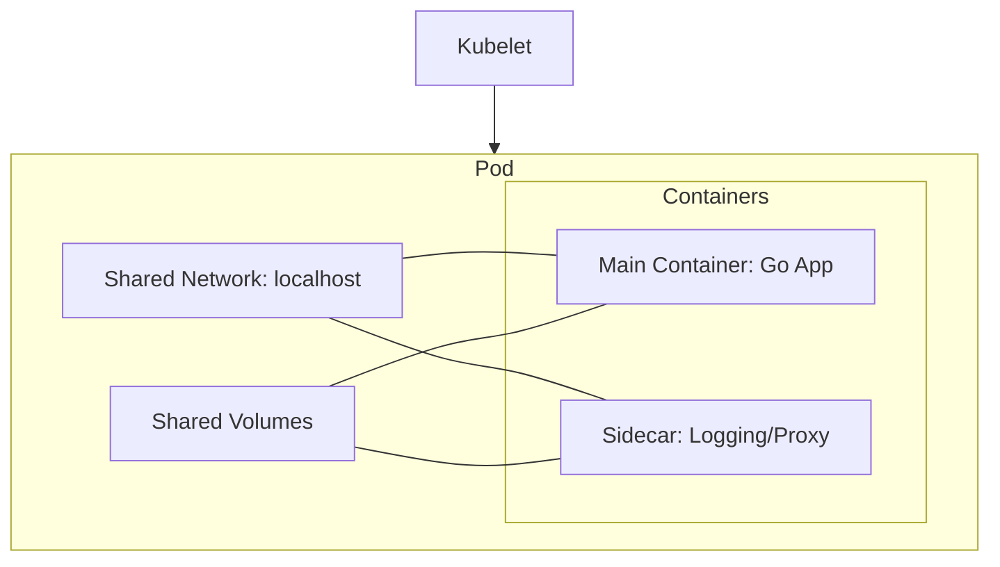

# Pods

## Summary
A Pod is the smallest deployable unit of computing that you can create and manage in Kubernetes. It represents a single instance of a running process in your cluster and can contain one or more containers that share storage, network resources, and a specification for how to run the containers. Pods are designed to be ephemeral; they are created, assigned a unique ID, and scheduled to nodes where they remain until termination or deletion. In a microservices architecture, Pods typically wrap a single application container, but they can also host tightly coupled helper containers (sidecars) that work together.

## Detailed Explanation

### What is a Pod?
In Kubernetes, a Pod is an abstraction that represents a group of one or more application containers (such as Docker) and some shared resources for those containers. Those resources include:
- **Shared Storage:** As Volumes.
- **Networking:** A unique cluster IP address and a set of ports.
- **Container Specs:** Information about how to run each container, such as the image version or specific ports to use.

### Why use Pods?
Pods provide a model where containers can share resources and communicate with each other easily. 
- **Resource Sharing:** Containers in a Pod share the same network namespace, meaning they can reach each other via `localhost`.
- **Atomic Scheduling:** Kubernetes schedules Pods as a single unit. All containers in a Pod are guaranteed to run on the same physical or virtual node.
- **Co-location:** It allows "sidecar" patterns where a secondary container assists the main application (e.g., a log shipper or a proxy).

### How Pods Work
When you create a Pod, the Kubernetes Control Plane schedules it to a healthy Node in the cluster. The `kubelet` on that node is responsible for pulling the container images and starting the containers defined in the Pod specification.

#### **Pod Architecture**


## Go Application

### Deploying a Go App as a Pod
For a Go developer, deploying an application usually involves containerizing the Go binary and defining a Pod (usually via a Deployment). Below is a simple `pod.yaml` for a Go service.

```yaml
apiVersion: v1
kind: Pod
metadata:
  name: go-app-pod
  labels:
    app: go-backend
spec:
  containers:
  - name: go-container
    image: my-go-app:v1.0.0
    ports:
    - containerPort: 8080
    env:
    - name: APP_COLOR
      value: "blue"
```

### Programmatic Access with `client-go`
Go developers often interact with the Kubernetes API using the `client-go` library to list, monitor, or manage Pods within their applications (e.g., for custom controllers or internal tooling).

```go
package main

import (
	"context"
	"fmt"
	"k8s.io/client-go/kubernetes"
	"k8s.io/client-go/tools/clientcmd"
	metav1 "k8s.io/apimachinery/pkg/apis/meta/v1"
)

func main() {
	// Load kubeconfig from default location
	config, _ := clientcmd.BuildConfigFromFlags("", "/path/to/kubeconfig")
	clientset, _ := kubernetes.NewForConfig(config)

	// List all pods in the "default" namespace
	pods, err := clientset.CoreV1().Pods("default").List(context.TODO(), metav1.ListOptions{})
	if err != nil {
		panic(err)
	}

	fmt.Printf("There are %d pods in the default namespace\n", len(pods.Items))
	for _, pod := range pods.Items {
		fmt.Printf("- Pod Name: %s, Status: %s\n", pod.Name, pod.Status.Phase)
	}
}
```

## Interview Questions

### **1. What is the difference between a Pod and a Container?**
A container is a single executable image that encapsulates an application and its dependencies. A Pod is a Kubernetes abstraction that can host one or more containers. Containers within the same Pod share the same network (IP/port space) and storage volumes, whereas containers in different Pods are isolated from each other.

### **2. Why would you run multiple containers in a single Pod?**
You should run multiple containers in a single Pod only if they are tightly coupled and need to share resources like local storage or network. This is common in the **Sidecar Pattern**, where a helper container performs tasks like log rotation, monitoring, or acting as a network proxy (e.g., Istio's envoy proxy) for the main application container.

### **3. What is the Pod lifecycle?**
A Pod's lifecycle consists of several phases:
- **Pending:** The Pod has been accepted by the system but is waiting for one or more containers to be set up (e.g., downloading images).
- **Running:** The Pod has been bound to a node, and all containers have been created. At least one container is still running or is in the process of starting.
- **Succeeded:** All containers in the Pod have terminated successfully (exit code 0).
- **Failed:** All containers have terminated, and at least one container exited with a non-zero status.
- **Unknown:** The state of the Pod cannot be determined, usually due to a communication error with the node.

### **4. How do containers within a Pod communicate with each other?**
Containers within the same Pod communicate using `localhost`. Since they share the same network namespace, they can access each other's ports directly. For example, if a Go app is running on port 8080 and a sidecar is running on port 9090, the Go app can reach the sidecar at `localhost:9090`.

### **5. What happens if a Pod's container crashes?**
Kubernetes, through the `kubelet`, will automatically attempt to restart the crashed container based on the Pod's `restartPolicy`. The default policy is `Always`, but it can also be `OnFailure` or `Never`. Note that if the entire node fails, the Pods on that node are deleted after a timeout and may be rescheduled elsewhere if managed by a Controller (like a Deployment).
