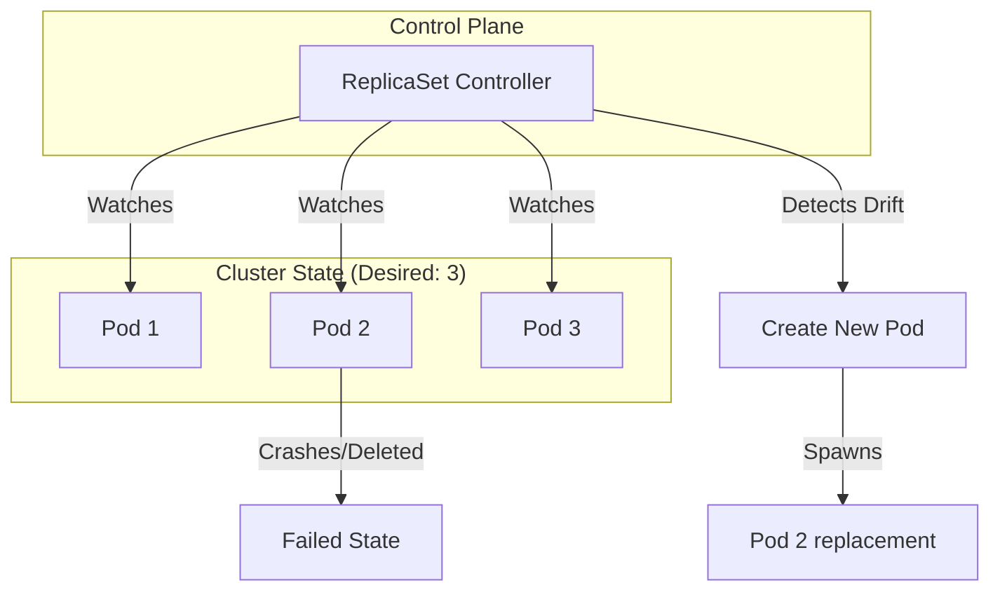

# ReplicaSets

## Summary
A **ReplicaSet** is a core Kubernetes controller whose primary purpose is to maintain a stable set of replica Pods running at any given time. It functions as a self-healing mechanism that ensures high availability by automatically creating or deleting Pods to match a desired state defined in its specification. While ReplicaSets are the successors to ReplicationControllers, they are rarely managed directly by users; instead, they are typically orchestrated by **Deployments**, which handle rolling updates and canary releases.

## Detailed Explanation

### **What is a ReplicaSet?**
A ReplicaSet (RS) is a declarative object that ensures a specified number of identical Pod instances are running simultaneously. If a Pod fails, is evicted, or is manually deleted, the ReplicaSet controller detects the drift from the "desired state" and reconciles it by spinning up a new Pod.

### **Why use ReplicaSets?**
1.  **High Availability**: Ensures that even if a node fails, the requested number of Pods will be rescheduled on healthy nodes.
2.  **Scaling**: Provides a simple way to scale workloads horizontally by updating the `replicas` field.
3.  **Self-Healing**: Continuously monitors the cluster state and recovers from Pod failures.

### **How it Works: The Reconciliation Loop**
The ReplicaSet uses a **selector** to identify the Pods it is responsible for. It doesn't actually "own" the Pods in a strict sense; rather, it looks for Pods with matching labels. If it finds too few, it creates more using the provided `template`. If it finds too many (e.g., if you scale down), it deletes the extras.



### **Core Components**
*   **Selector**: A label selector (e.g., `app: my-go-app`). This is how the RS knows which Pods to manage.
*   **Replicas**: The desired number of Pods (e.g., `3`).
*   **Pod Template**: The definition of the Pod to be created (image, ports, env vars).

---

## Go Application

For Go developers, interacting with ReplicaSets usually happens through the `client-go` library or when designing operators. Below is an example of how to list ReplicaSets in a namespace and a typical Pod template used for a Go microservice.

### **1. Using `client-go` to List ReplicaSets**
This is common when building internal tools or custom controllers.

```go
package main

import (
	"context"
	"fmt"
	metav1 "k8s.io/apimachinery/pkg/apis/meta/v1"
	"k8s.io/client-go/kubernetes"
	"k8s.io/client-go/tools/clientcmd"
)

func main() {
	// Load kubeconfig
	config, _ := clientcmd.BuildConfigFromFlags("", "/path/to/kubeconfig")
	clientset, _ := kubernetes.NewForConfig(config)

	// List ReplicaSets in the "default" namespace
	rss, err := clientset.AppsV1().ReplicaSets("default").List(context.TODO(), metav1.ListOptions{})
	if err != nil {
		panic(err)
	}

	for _, rs := range rss.Items {
		fmt.Printf("ReplicaSet Name: %s | Desired Replicas: %d | Available: %d\n", 
			rs.Name, *rs.Spec.Replicas, rs.Status.AvailableReplicas)
	}
}
```

### **2. ReplicaSet Manifest for a Go App**
Note that while we define a `ReplicaSet` here, in production you should wrap this in a `Deployment`.

```yaml
apiVersion: apps/v1
kind: ReplicaSet
metadata:
  name: go-api-rs
  labels:
    app: go-api
spec:
  replicas: 3
  selector:
    matchLabels:
      app: go-api
  template:
    metadata:
      labels:
        app: go-api
    spec:
      containers:
      - name: go-api-container
        image: my-registry/go-api:v1.2.0
        ports:
        - containerPort: 8080
```

---

## Interview Questions

**Q: What is the main difference between a ReplicationController (RC) and a ReplicaSet (RS)?**
**A:** The primary difference is the **selector support**. ReplicationControllers only support equality-based selectors (e.g., `env=prod`), whereas ReplicaSets support set-based selectors (e.g., `env in (prod, staging)` or `version notin (v1)`), allowing for more complex filtering.

**Q: Why is it recommended to use Deployments instead of ReplicaSets directly?**
**A:** Deployments are a higher-level abstraction that manages ReplicaSets. They provide declarative updates to Pods (rolling updates), the ability to roll back to previous versions, and pause/resume functionality. Managing a ReplicaSet directly makes version transitions manual and error-prone.

**Q: How does a ReplicaSet identify which Pods to manage? What happens if you manually create a Pod with the same labels?**
**A:** A ReplicaSet identifies Pods using its `spec.selector`. If you manually create a Pod that matches the ReplicaSet's selector, the ReplicaSet controller will "adopt" it. If the total number of Pods then exceeds the `replicas` count, the ReplicaSet will immediately delete one of the Pods (possibly the one you just created) to maintain the desired state.

**Q: What is the role of `ownerReferences` in the context of ReplicaSets?**
**A:** When a ReplicaSet creates a Pod, it adds itself to the Pod's `metadata.ownerReferences`. This link is used by the Kubernetes garbage collector to ensure that when a ReplicaSet is deleted, its dependent Pods are also cleaned up (unless orphan deletion is specified).

**Q: Can a ReplicaSet manage Pods across different Nodes?**
**A:** Yes. The ReplicaSet controller creates Pods, but the **Kube-Scheduler** decides which Node they land on. One of Kubernetes' strengths is spreading these replicas across different nodes to ensure fault tolerance.
