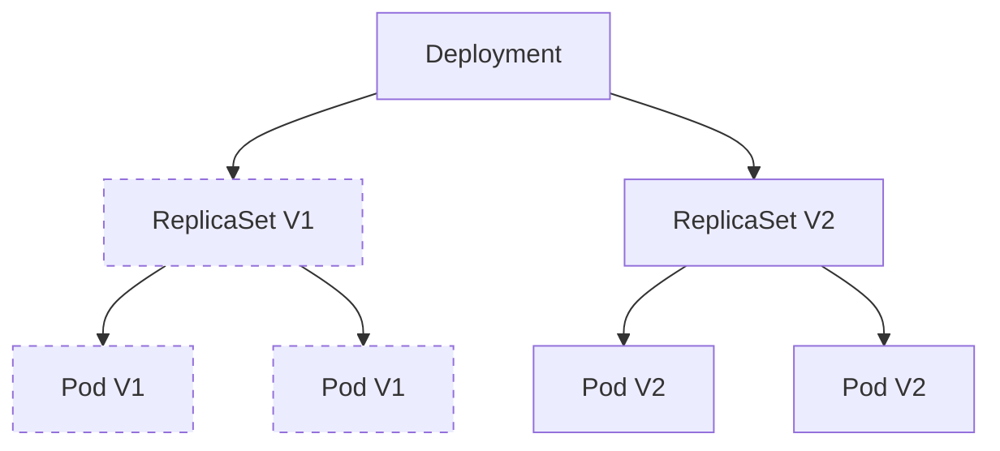

## Summary
A Kubernetes Deployment is a higher-level API object that provides declarative updates for Pods and ReplicaSets. It manages the lifecycle of stateless applications by ensuring the desired number of replicas are running at any given time. Deployments automate complex tasks like rolling updates, self-healing through Pod replacement, and version rollbacks, making them the standard choice for running production workloads.

## Detailed Explanation

### What is a Deployment?
A **Deployment** is a controller that defines the desired state for a set of Pods. It belongs to the `apps/v1` API group and is primarily used for stateless applications. Unlike managing Pods directly, a Deployment allows you to define a template and a replication factor, which it maintains even if nodes fail.

### Why use Deployments?
*   **Declarative Updates**: You describe the desired state in YAML, and Kubernetes makes it happen.
*   **Scalability**: Easily increase or decrease the number of replicas with a single command or manifest change.
*   **Self-healing**: If a Pod or Node fails, the Deployment Controller ensures a new one is created on a healthy node.
*   **Rollouts and Rollbacks**: Switch between application versions without downtime using rolling updates, or revert to a previous stable version if a rollout fails.

### How it Works
The Deployment Controller manages a **ReplicaSet**, which in turn manages the **Pods**. When you update a Deployment (e.g., changing the container image), the controller creates a new ReplicaSet and scales it up while gradually scaling down the old one.



### Deployment Strategies
*   **RollingUpdate (Default)**: Replaces old Pods with new ones gradually. It ensures zero downtime by keeping a minimum number of available Pods during the transition.
*   **Recreate**: Terminates all existing Pods before creating new ones. This results in brief downtime but ensures no two versions of the app run simultaneously.

---

## Go Application

For Go developers, Deployments are the standard way to run containerized binaries. A typical Go application is packaged into a lightweight image (using multi-stage Docker builds) and deployed using a manifest.

### Sample Go Deployment (manifest.yaml)
```yaml
apiVersion: apps/v1
kind: Deployment
metadata:
  name: go-webapp
  labels:
    app: go-webapp
spec:
  replicas: 3
  selector:
    matchLabels:
      app: go-webapp
  template:
    metadata:
      labels:
        app: go-webapp
    spec:
      containers:
      - name: server
        image: my-registry/go-webapp:v1.0.2
        ports:
        - containerPort: 8080
        resources:
          limits:
            cpu: "500m"
            memory: "128Mi"
          requests:
            cpu: "200m"
            memory: "64Mi"
```

### Managing Deployments with client-go
Go developers often interact with Kubernetes programmatically using `client-go`. Below is a snippet demonstrating how to create a Deployment using the Go SDK.

```go
package main

import (
	"context"
	"fmt"

	appsv1 "k8s.io/api/apps/v1"
	corev1 "k8s.io/api/core/v1"
	metav1 "k8s.io/apimachinery/pkg/apis/meta/v1"
	"k8s.io/client-go/kubernetes"
	"k8s.io/client-go/tools/clientcmd"
)

func main() {
	// Load kubeconfig from default location
	config, _ := clientcmd.BuildConfigFromFlags("", "/path/to/kubeconfig")
	clientset, _ := kubernetes.NewForConfig(config)

	deploymentsClient := clientset.AppsV1().Deployments(corev1.NamespaceDefault)

	deployment := &appsv1.Deployment{
		ObjectMeta: metav1.ObjectMeta{
			Name: "go-demo-deployment",
		},
		Spec: appsv1.DeploymentSpec{
			Replicas: int32Ptr(3),
			Selector: &metav1.LabelSelector{
				MatchLabels: map[string]string{
					"app": "demo",
				},
			},
			Template: corev1.PodTemplateSpec{
				ObjectMeta: metav1.ObjectMeta{
					Labels: map[string]string{
						"app": "demo",
					},
				},
				Spec: corev1.PodSpec{
					Containers: []corev1.Container{
						{
							Name:  "web-server",
							Image: "golang:1.21-alpine",
							Ports: []corev1.ContainerPort{
								{
									Name:          "http",
									Protocol:      corev1.ProtocolTCP,
									ContainerPort: 8080,
								},
							},
						},
					},
				},
			},
		},
	}

	// Execute Creation
	fmt.Println("Creating deployment...")
	result, err := deploymentsClient.Create(context.TODO(), deployment, metav1.CreateOptions{})
	if err != nil {
		panic(err)
	}
	fmt.Printf("Created deployment %q.\n", result.GetObjectMeta().GetName())
}

func int32Ptr(i int32) *int32 { return &i }
```

---

## Interview Questions

**Q: What is the relationship between a Deployment, a ReplicaSet, and a Pod?**
**A:** A Deployment manages ReplicaSets (typically one for each version rollout), and a ReplicaSet ensures that the specified number of Pod replicas are running at any given time. The Deployment handles the high-level logic of switching between versions by orchestrating multiple ReplicaSets.

**Q: How do you perform a rollback if a new version fails?**
**A:** You can use the command `kubectl rollout undo deployment/<name>`. Kubernetes maintains a revision history of previous ReplicaSets; this command reverts the Deployment's Pod template to a previous revision, triggering a rollout that brings back the old configuration.

**Q: Explain the `RollingUpdate` strategy parameters: `maxSurge` and `maxUnavailable`.**
**A:** `maxSurge` specifies the maximum number of Pods that can be created above the desired replica count during an update. `maxUnavailable` specifies the maximum number of Pods that can be unavailable during the update process. These parameters allow you to tune the speed and availability of your rollouts.

**Q: Why shouldn't you manage ReplicaSets directly when using a Deployment?**
**A:** The Deployment Controller "owns" the ReplicaSets it creates. If you manually modify or scale a ReplicaSet that is managed by a Deployment, the Deployment Controller will detect the discrepancy and revert your changes to match its own declared desired state.

**Q: What happens to a Deployment if a Node where its Pods are running fails?**
**A:** The Deployment Controller (via the ReplicaSet) constantly monitors the state. When a Node fails, the Pods on that node become unreachable. The ReplicaSet identifies that the actual count is below the desired count and requests the Kubernetes Scheduler to launch new Pod instances on healthy nodes.
