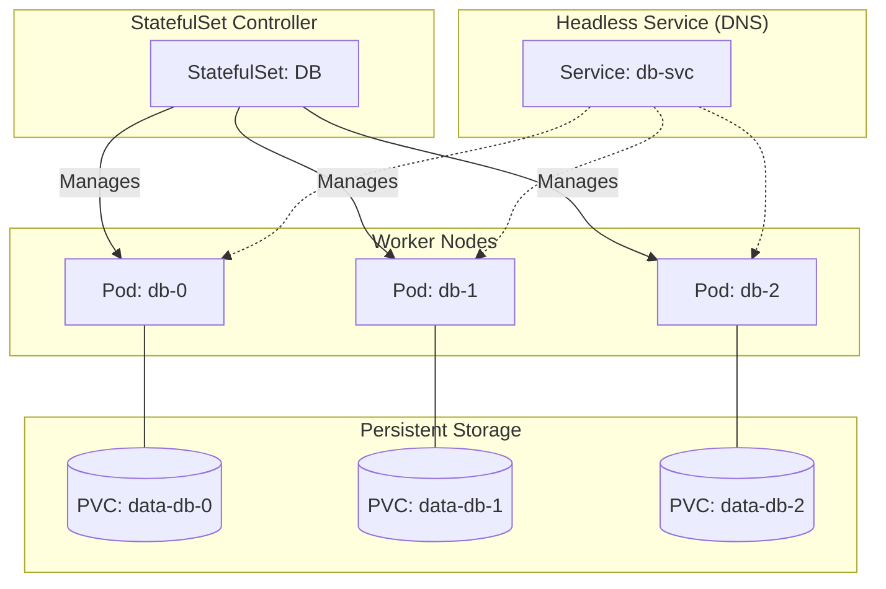

# StatefulSets

## Summary
A StatefulSet is a Kubernetes workload object designed to manage stateful applications by providing stable, unique network identifiers and persistent storage for each Pod. Unlike Deployments, where Pods are interchangeable and treated as cattle, StatefulSet Pods are treated as pets with a fixed identity (e.g., `web-0`, `web-1`) that persists across restarts and rescheduling. This controller is essential for running distributed systems like databases (MySQL, MongoDB), message queues (Kafka), and other applications that require strict ordering and stable persistence.

## Detailed Explanation

### **What is a StatefulSet?**
StatefulSet is the controller used to manage stateful applications. It manages the deployment and scaling of a set of Pods, providing guarantees about the ordering and uniqueness of these Pods.

### **Why use StatefulSets?**
You need a StatefulSet if your application requires one or more of the following:
1.  **Stable, unique network identifiers**: e.g., `pod-name-0`, `pod-name-1`.
2.  **Stable, persistent storage**: Each Pod gets its own PersistentVolumeClaim (PVC) that persists even if the Pod is rescheduled.
3.  **Ordered, graceful deployment and scaling**: Pods are created sequentially (0, then 1, then 2).
4.  **Ordered, automated rolling updates**.

### **How it Works: Sticky Identity**
In a Deployment, Pod names are random (e.g., `myapp-6b47-xyz`). In a StatefulSet, they are deterministic: `myapp-0`, `myapp-1`, `myapp-2`.

*   **Network Identity**: A Headless Service is usually created to control the network domain. Each Pod gets a DNS name like `pod-name.service-name.namespace.svc.cluster.local`.
*   **Storage Identity**: Uses `volumeClaimTemplates` to create a PVC for each Pod. `data-myapp-0` is always mounted to `myapp-0`.



### **Ordered Creation and Deletion**
*   **Scale Up**: 0 -> 1 -> 2. Pod `N` is not started until Pod `N-1` is Running and Ready.
*   **Scale Down**: 2 -> 1 -> 0. Pod `N` is terminated only after Pod `N+1` is fully terminated.

---

## Go Application

StatefulSets are common for Go-based distributed systems (like Etcd, CockroachDB, or custom Raft implementations).

### **1. Creating a StatefulSet with Client-Go**
This example demonstrates how to define a StatefulSet programmatically using Go.

```go
package main

import (
	"context"
	appsv1 "k8s.io/api/apps/v1"
	corev1 "k8s.io/api/core/v1"
	metav1 "k8s.io/apimachinery/pkg/apis/meta/v1"
	"k8s.io/client-go/kubernetes"
	"k8s.io/client-go/tools/clientcmd"
)

func createStatefulSet(clientset *kubernetes.Clientset) {
	replicas := int32(3)
	ss := &appsv1.StatefulSet{
		ObjectMeta: metav1.ObjectMeta{
			Name: "go-kv-store",
		},
		Spec: appsv1.StatefulSetSpec{
			Replicas: &replicas,
			Selector: &metav1.LabelSelector{
				MatchLabels: map[string]string{"app": "kv-store"},
			},
			ServiceName: "kv-service", // Matches Headless Service
			Template: corev1.PodTemplateSpec{
				ObjectMeta: metav1.ObjectMeta{
					Labels: map[string]string{"app": "kv-store"},
				},
				Spec: corev1.PodSpec{
					Containers: []corev1.Container{
						{
							Name:  "kv-node",
							Image: "my-go-kv:v1",
							Ports: []corev1.ContainerPort{
								{ContainerPort: 8080, Name: "web"},
							},
						},
					},
				},
			},
		},
	}

	_, err := clientset.AppsV1().StatefulSets("default").Create(context.TODO(), ss, metav1.CreateOptions{})
	if err != nil {
		panic(err)
	}
}
```

### **2. Go Application Logic: Finding Peers**
Inside a StatefulSet, a Go app can find its peers using DNS SRV records or simply by predicting hostnames (`myapp-0`, `myapp-1`...).

```go
// Simple peer discovery logic
func getPeers(serviceName, namespace string, replicas int) []string {
	var peers []string
	for i := 0; i < replicas; i++ {
		// format: <statefulset-name>-<ordinal>.<service-name>.<namespace>.svc.cluster.local
		peer := fmt.Sprintf("go-kv-store-%d.%s.%s.svc.cluster.local", i, serviceName, namespace)
		peers = append(peers, peer)
	}
	return peers
}
```

---

## Interview Questions

**Q: What happens to the PVC when a Pod in a StatefulSet is deleted or scaled down?**
**A:** The PVC is **retained**. Kubernetes does not automatically delete the PVC (and the underlying data) to prevent accidental data loss. You must manually delete the PVC if you want to reclaim the storage. When the Pod comes back up (e.g., scaling back up), it reattaches to the existing PVC.

**Q: Why do we need a "Headless Service" for a StatefulSet?**
**A:** A Headless Service (ClusterIP: None) is responsible for the network identity of the Pods. It creates DNS A records for each Pod directly (e.g., `web-0.nginx`), allowing them to communicate directly with each other by hostname, which is crucial for clustering protocols (like Raft or Paxos).

**Q: Explain the "OrderedReady" pod management policy.**
**A:** This is the default behavior. It ensures that when scaling up, the previous Pod must be Running and Ready before the next one starts. When scaling down, it terminates Pods in reverse order (highest ordinal first) and waits for complete termination before moving to the next.

**Q: What is the difference between a Deployment and a StatefulSet regarding rolling updates?**
**A:** In a Deployment, Pods are updated in a "surge" (create new, kill old) and hash-based naming makes them interchangeable. In a StatefulSet, updates happen strictly one at a time, usually starting from the highest ordinal (N-1) down to 0 (Partitioned update strategy), ensuring the cluster quorum is maintained during the update.

**Q: Can you use a StatefulSet for a stateless application?**
**A:** Yes, you *can*, but it's usually unnecessary complexity. If your app doesn't need stable storage or unique network IDs, a Deployment is preferred because it allows for faster, parallel scaling and updates without the ordering constraints.
