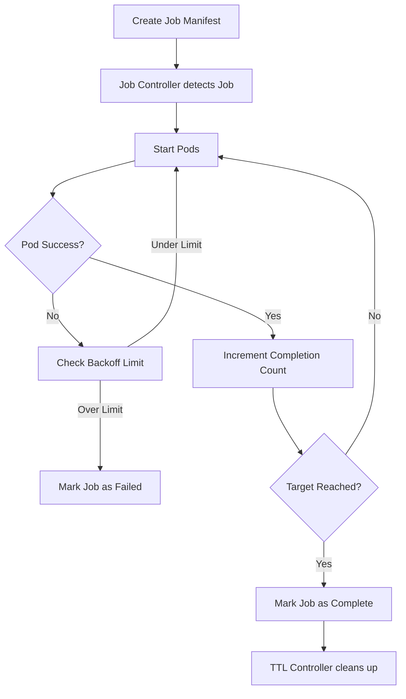

# **Kubernetes Jobs**

## **Summary**
A **Kubernetes Job** is a workload controller designed for tasks that run to completion, rather than maintaining a continuous state like a Deployment. It manages one or more Pods and ensures that a specified number of them successfully terminate. Jobs are ideal for batch processing, data migrations, and CI/CD pipelines where the goal is to perform a unit of work and then exit. The controller handles retries on failure and can manage parallel execution to optimize resource usage and throughput.

## **Detailed Explanation**

### **What is a Kubernetes Job?**
In Kubernetes, a **Job** creates one or more Pods and will continue to retry execution of the Pods (based on the `backoffLimit`) until a specified number of them terminate successfully. As soon as the specified number of successful completions is reached, the Job is complete. Deleting a Job will clean up the Pods it created.

### **Why use Jobs instead of Deployments?**
*   **Deployments**: Intended for long-running, "always-on" services (like web servers). If a Pod exits, the Deployment controller tries to restart it to maintain the desired replica count.
*   **Jobs**: Intended for "one-off" tasks. If a Pod exits with code 0 (success), the Job controller marks it as complete. If it fails (non-zero exit code), the controller restarts it until it succeeds or hits the `backoffLimit`.

### **How Jobs Work (The Workflow)**



### **Key Configuration Parameters**
1.  **`parallelism`**: The maximum number of Pods that should run at any given time.
2.  **`completions`**: The total number of successful Pod completions required for the Job to be considered finished.
3.  **`backoffLimit`**: Specifies the number of retries before marking this Job as failed. (Default is 6).
4.  **`activeDeadlineSeconds`**: A hard timeout for the Job's duration, including all retries.
5.  **`ttlSecondsAfterFinished`**: Automatically deletes the Job (and its Pods) after it finishes (success or failure) to save cluster resources.

---

## **Go Application**

For Go developers, interacting with Jobs often involves using `client-go` to trigger batch processing dynamically from within an application.

### **Creating a Job with client-go**

Below is a snippet showing how to define and create a Job using the Kubernetes Go client.

```go
import (
    "context"
    batchv1 "k8s.io/api/batch/v1"
    corev1 "k8s.io/api/core/v1"
    metav1 "k8s.io/apimachinery/pkg/apis/meta/v1"
    "k8s.io/client-go/kubernetes"
)

func createDataProcessingJob(clientset *kubernetes.Clientset, namespace string) error {
    job := &batchv1.Job{
        ObjectMeta: metav1.ObjectMeta{
            Name: "data-processor",
        },
        Spec: batchv1.JobSpec{
            Completions: ptrInt32(1),
            Parallelism: ptrInt32(1),
            Template: corev1.PodTemplateSpec{
                Spec: corev1.PodSpec{
                    Containers: []corev1.Container{
                        {
                            Name:  "processor",
                            Image: "my-go-processor:latest",
                            Command: []string{"/app/process", "--input", "s3://bucket/data"},
                        },
                    },
                    RestartPolicy: corev1.RestartPolicyNever,
                },
            },
            // Automatic cleanup after 1 hour
            TTLSecondsAfterFinished: ptrInt32(3600),
        },
    }

    _, err := clientset.BatchV1().Jobs(namespace).Create(context.TODO(), job, metav1.CreateOptions{})
    return err
}

func ptrInt32(i int32) *int32 { return &i }
```

### **Go-Specific Considerations**
*   **RestartPolicy**: For Jobs, the `RestartPolicy` in the Pod spec must be either `Never` or `OnFailure`. It cannot be `Always`.
*   **Idempotency**: Since the Job controller might retry your Go application, ensure your logic is idempotent (safe to run multiple times).

---

## **Interview Questions**

### **1. What is the difference between a Job and a CronJob?**
A **Job** runs a task once until completion. A **CronJob** is a wrapper around a Job that runs it on a recurring schedule (defined by a Cron expression), similar to a crontab in Linux.

### **2. How do you handle a Job that hangs indefinitely?**
You should use the `activeDeadlineSeconds` field. This sets a clock on the Job. If the Job exceeds this time limit, Kubernetes will terminate all its Pods and mark the Job status as failed with the reason `DeadlineExceeded`.

### **3. Explain the difference between `completions` and `parallelism`.**
*   **`completions`** is the "Goal": how many total Pods must succeed for the Job to be finished.
*   **`parallelism`** is the "Throttle": how many Pods are allowed to run simultaneously at any point in time.

### **4. What is the purpose of the TTL Controller (`ttlSecondsAfterFinished`)?**
Historically, finished Jobs stayed in the cluster forever as "ghost" objects (Pods in `Completed` state). The TTL controller automatically deletes Jobs and their associated Pods after they finish, preventing resource clutter and reducing pressure on the API server.

### **5. What happens to a Job's Pods if the Job is deleted?**
By default, deleting a Job will also delete all the Pods it created via cascading deletion. If you want to keep the Pods for debugging, you can use the `--cascade=orphan` flag in `kubectl`, though this is generally discouraged in production.
