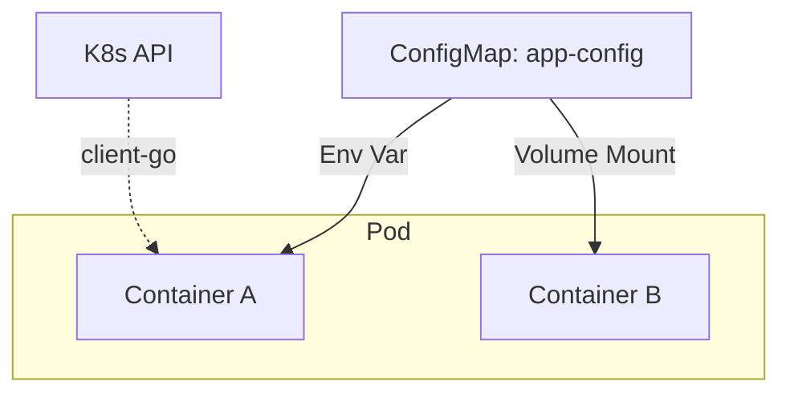

# Injecting Pod Config with ConfigMaps

## Summary
Injecting Pod configuration with **ConfigMaps** is a fundamental Kubernetes pattern used to decouple application code from environment-specific settings. ConfigMaps allow you to store non-sensitive data such as configuration files, environment variables, or command-line arguments as key-value pairs. By separating configuration from the container image, applications become highly portable across different environments (e.g., dev, staging, prod) without needing to be rebuilt.

## Detailed Explanation

### What is a ConfigMap?
A **ConfigMap** is an API object used to store non-confidential data in key-value pairs. It acts as a bridge between the Kubernetes cluster configuration and the application container.

### Why use ConfigMaps?
1.  **12-Factor App Compliance**: ConfigMaps enable the "Store config in the environment" principle.
2.  **Portability**: The same container image can run in different environments by simply binding to a different ConfigMap.
3.  **Dynamic Updates**: ConfigMaps mounted as volumes can be updated at runtime without restarting the Pod (though the app needs to watch for file changes).

### How it Works (Injection Methods)
There are four primary ways to consume a ConfigMap in a Pod:

1.  **Environment Variables**: Inject all or specific keys as env vars.
2.  **Command Line Arguments**: Reference env vars (created from ConfigMap) in the command.
3.  **Volume Mounts**: Mount the ConfigMap as a file or directory inside the container.
4.  **Kubernetes API**: Application reads directly from the API (requires RBAC).



---

## Go Application Integration

Go developers typically use libraries like `viper` or `kelseyhightower/envconfig` to load configurations. Kubernetes ConfigMaps integrate seamlessly with these patterns.

### 1. Loading from Environment Variables
This is the most "cloud-native" approach.

**Kubernetes Manifest:**
```yaml
envFrom:
- configMapRef:
    name: my-go-app-config
```

**Go Code:**
```go
package main

import (
	"fmt"
	"os"
)

type Config struct {
	DatabaseURL string
	Port        string
}

func LoadConfig() Config {
	return Config{
		DatabaseURL: os.Getenv("DATABASE_URL"),
		Port:        getEnv("PORT", "8080"),
	}
}

func getEnv(key, fallback string) string {
	if value, exists := os.LookupEnv(key); exists {
		return value
	}
	return fallback
}
```

### 2. Loading from Mounted Volume (Hot Reload)
If you mount the ConfigMap as a volume, you can watch for changes using `fsnotify` or Viper's built-in watching capabilities.

**Kubernetes Manifest:**
```yaml
volumes:
- name: config-volume
  configMap:
    name: my-go-app-config
```

**Go Code (using Viper):**
```go
package main

import (
	"fmt"
	"github.com/spf13/viper"
)

func main() {
	viper.SetConfigName("config") // name of config file (without extension)
	viper.SetConfigType("yaml")   // REQUIRED if the config file does not have the extension in the name
	viper.AddConfigPath("/etc/config/")   // path to look for the config file in

	if err := viper.ReadInConfig(); err != nil {
		panic(fmt.Errorf("fatal error config file: %w", err))
	}

	viper.WatchConfig()
	viper.OnConfigChange(func(e fsnotify.Event) {
		fmt.Println("Config file changed:", e.Name)
	})
	
	// Keep running...
}
```

---

## Interview Questions

### 1. What happens if a ConfigMap mounted as an environment variable is updated?
**Answer**: The environment variables in the running container will **not** be updated. The Pod must be restarted (usually by rolling out a Deployment restart) to pick up the new values. This is because environment variables are set only when the process starts.

### 2. Can you restrict which keys from a ConfigMap are projected into a volume?
**Answer**: Yes, when defining the `volume` in the Pod spec, you can use the `items` field to specify an array of keys to project and the specific paths (filenames) they should map to. Keys not listed in `items` will be ignored.

### 3. What is the size limit of a ConfigMap?
**Answer**: A ConfigMap (and Secret) is limited to **1MB** in size. This is due to the underlying limits of `etcd`, the key-value store used by Kubernetes. If you need to store larger configuration data, you should use a persistent volume or an external storage service.

### 4. How does `subPath` usage affect ConfigMap updates in volumes?
**Answer**: If you use `subPath` to mount a specific file from a ConfigMap volume (e.g., to avoid overwriting the entire directory), the file will **not** automatically update when the ConfigMap is updated. This is a known limitation of how `subPath` bind mounts work in Kubernetes/Docker.

### 5. What happens if a Pod references a ConfigMap that doesn't exist?
**Answer**: If the ConfigMap is marked as optional (`optional: true`), the Pod will start but the config will be missing. If it is **not** optional (default), the Pod will get stuck in the `CreateContainerConfigError` state and will not start until the ConfigMap is created.
