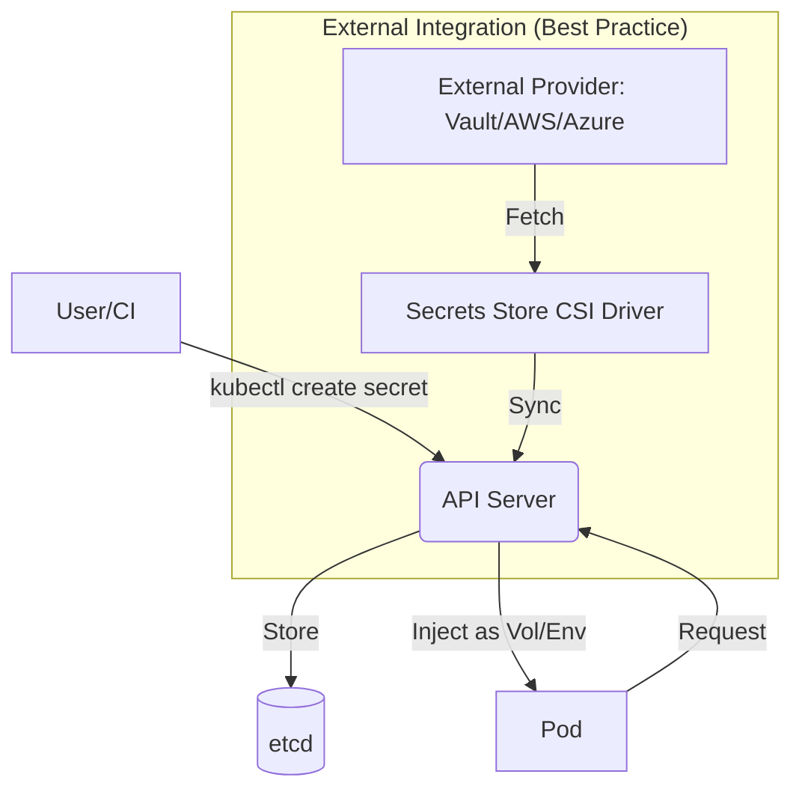

# Using Secrets for Sensitive Data

Kubernetes Secrets are objects designed to store and manage sensitive information such as passwords, OAuth tokens, and ssh keys. Storing confidential data in Secrets is safer and more flexible than putting it verbatim in a Pod definition or in a container image. Secrets decouple sensitive data from the application logic, allowing for better security practices like rotation and least-privilege access.

## Detailed Explanation

### What are Kubernetes Secrets?
A **Secret** is a small object that contains a small amount of sensitive data. It is similar to a ConfigMap but specifically intended for confidential data. By default, Secrets are stored unencrypted in API server's underlying data store (etcd) as base64-encoded strings.

### Why use Secrets?
1.  **Security**: Reduces the risk of exposing sensitive data in manifests, logs, or container images.
2.  **Flexibility**: Allows updating credentials without rebuilding the application image.
3.  **Control**: Enables RBAC policies to restrict who can read or modify specific secrets.

### Types of Secrets
-   **Opaque**: Default type for user-defined arbitrary data.
-   **kubernetes.io/service-account-token**: Used for ServiceAccount credentials.
-   **kubernetes.io/dockercfg** / **kubernetes.io/dockerconfigjson**: For Docker registry credentials.
-   **kubernetes.io/basic-auth**: For basic authentication (username/password).
-   **kubernetes.io/ssh-auth**: For SSH public/private keys.
-   **kubernetes.io/tls**: For TLS certificates.

### How it Works (Architecture)



### Usage Methods
1.  **Environment Variables**: The secret value is injected into a specific env var.
2.  **Volumes**: The secret is mounted as a file in a memory-backed (`tmpfs`) volume.
3.  **Kube-API**: Applications can use `client-go` to fetch secrets directly (requires RBAC).

---

## Go Application Integration

Go developers typically interact with secrets in three ways: as environment variables, as files, or via the Kubernetes API.

### 1. Accessing via Environment Variables
This is the most common and simplest method. Kubernetes injects the value, and the Go app uses standard library functions.

```go
package main

import (
	"fmt"
	"os"
)

func main() {
	dbPassword := os.Getenv("DB_PASSWORD")
	if dbPassword == "" {
		fmt.Println("DB_PASSWORD not set")
		return
	}
	fmt.Printf("Database password loaded successfully (length: %d)\n", len(dbPassword))
}
```

### 2. Accessing via Mounted Volumes (Files)
Recommended for higher security as secrets are not visible in `ps` or `/proc` env outputs. Secrets are mounted as files at a specified path.

```go
package main

import (
	"fmt"
	"os"
)

func readSecret(path string) (string, error) {
	data, err := os.ReadFile(path)
	if err != nil {
		return "", err
	}
	return string(data), nil
}

func main() {
	// Secret mounted at /etc/secrets/api-key
	apiKey, err := readSecret("/etc/secrets/api-key")
	if err != nil {
		fmt.Printf("Error reading secret: %v\n", err)
		return
	}
	fmt.Println("API Key read from volume")
}
```

### 3. Accessing via client-go (API)
Used for controllers or applications that need to manage secrets dynamically.

```go
package main

import (
	"context"
	"fmt"
	metav1 "k8s.io/apimachinery/pkg/apis/meta/v1"
	"k8s.io/client-go/kubernetes"
	"k8s.io/client-go/rest"
)

func main() {
	config, _ := rest.InClusterConfig()
	clientset, _ := kubernetes.NewForConfig(config)

	secret, err := clientset.CoreV1().Secrets("default").Get(context.TODO(), "my-secret", metav1.GetOptions{})
	if err != nil {
		panic(err)
	}

	// Data is a map[string][]byte
	password := string(secret.Data["password"])
	fmt.Printf("Fetched secret via API: %s\n", password)
}
```

---

## Interview Questions

### 1. What is the main difference between a Secret and a ConfigMap?
**Answer**: While both store data, **Secrets** are intended for sensitive information and are stored in `etcd` with the expectation of being encrypted at rest (if configured). **ConfigMaps** are for non-sensitive configuration data. Tools and UIs often mask Secret values, whereas ConfigMap values are usually visible.

### 2. Are Kubernetes Secrets secure by default?
**Answer**: No. By default, Secrets are only **Base64 encoded**, not encrypted. Anyone with access to the API or etcd can decode them. To make them secure, you must enable **Encryption at Rest** in the API server and restrict access using **RBAC**.

### 3. What happens to a Pod when a Secret it uses is updated?
**Answer**: 
-   If used as an **Environment Variable**, the Pod will **not** see the update until it is restarted. 
-   If used as a **Volume**, the kubelet will eventually update the file (usually within a minute, depending on the sync period), provided the secret is not used as a subPath mount.

### 4. What is the "Secrets Store CSI Driver" and why is it used?
**Answer**: It is a project that allows Kubernetes to mount secrets from external secret management systems (like HashiCorp Vault, AWS Secrets Manager, or Azure Key Vault) as volumes. It is used to centralize secrets management outside of Kubernetes, providing better audit trails, rotation, and security.

### 5. How can you prevent a Secret from being accidentally logged?
**Answer**: 
-   Avoid using environment variables (which can leak in logs/dumps).
-   Use specialized Go libraries that implement "Secret" types which redact their string representation (e.g., overriding `String()` method).
-   Use file-based mounts and ensure your logging framework doesn't dump the contents of these files.
