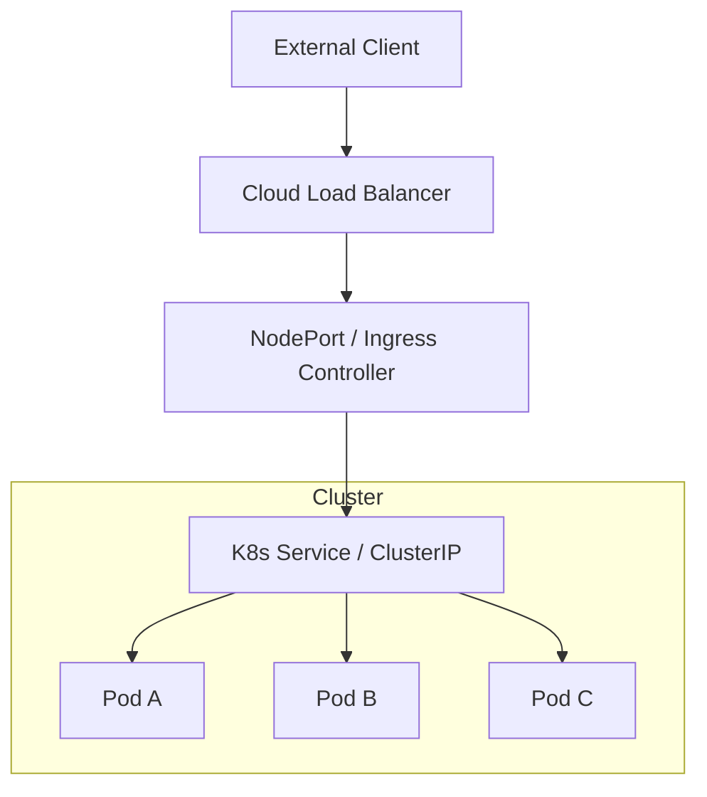

# Load Balancing in Kubernetes

## Summary
Load balancing in Kubernetes is the mechanism of distributing network traffic across multiple pods to ensure high availability and scalability of applications. It operates at various levels, from internal service discovery using `ClusterIP` to external traffic management via `LoadBalancer` services and `Ingress` controllers. Modern Kubernetes environments are transitioning from the traditional `Ingress` API to the more expressive and role-oriented `Gateway API` for advanced L4 and L7 routing. This abstraction allows developers to expose services without worrying about the underlying infrastructure details of the cloud provider.

## Detailed Explanation

### What is Load Balancing in K8s?
In Kubernetes, pods are ephemeral and their IP addresses change frequently. Load balancing provides a stable endpoint (Service) that tracks and routes traffic to a set of pods identified by label selectors.

### Why Load Balancing?
- **High Availability**: Automatically routes traffic away from failing pods to healthy ones.
- **Scalability**: Allows horizontal scaling (adding/removing pods) without updating client configurations.
- **Service Abstraction**: Decouples consumers from the specific IP addresses of the backend instances.

### How it Works

#### 1. Layer 4 (Transport Layer) - Services
The `kube-proxy` component runs on every node and manages the routing rules to handle traffic to `Services`.
- **ClusterIP**: Default internal-only IP for communication within the cluster.
- **NodePort**: Exposes the service on a static port on each Node's IP, allowing external access via `<NodeIP>:<NodePort>`.
- **LoadBalancer**: Provisions an external load balancer (e.g., AWS NLB, GCP LB) via the Cloud Controller Manager.

#### 2. Layer 7 (Application Layer) - Ingress & Gateway API
- **Ingress**: A collection of rules (host, path) that allow inbound connections to reach cluster services. It requires an **Ingress Controller** (e.g., NGINX, HAProxy) to process the rules.
- **Gateway API**: The next-generation evolution of Ingress. It uses resources like `Gateway`, `GatewayClass`, and `HTTPRoute` to provide more granular control, better multi-tenancy support, and built-in support for advanced traffic splitting (Canary, Blue/Green).

### Traffic Flow Diagram



## Go Application

For Go developers, interacting with Kubernetes load balancing typically involves service discovery via `client-go` or implementing client-side load balancing for high-performance RPCs like gRPC.

### gRPC Client-Side Load Balancing with Headless Services
In high-concurrency Go microservices, using a standard `ClusterIP` can lead to uneven load distribution because gRPC keeps connections open (L7). To solve this, Go developers use **Headless Services** (`clusterIP: None`) to allow the gRPC client to perform its own load balancing across all pod IPs.

```go
package main

import (
	"context"
	"log"

	"google.golang.org/grpc"
	"google.golang.org/grpc/credentials/insecure"
)

func main() {
	// "my-grpc-service" is a headless service (clusterIP: None)
	// The "dns:///..." scheme triggers the gRPC DNS resolver
	serviceAddr := "dns:///my-grpc-service.default.svc.cluster.local:50051"

	// Connect using Round Robin client-side load balancing
	conn, err := grpc.DialContext(
		context.Background(),
		serviceAddr,
		grpc.WithTransportCredentials(insecure.NewCredentials()),
		grpc.WithDefaultServiceConfig(`{"loadBalancingConfig": [{"round_robin":{}}]}`),
	)
	if err != nil {
		log.Fatalf("Failed to connect: %v", err)
	}
	defer conn.Close()
	
	log.Println("gRPC connection established with client-side load balancing")
}
```

## Interview Questions

1. **What is the difference between a ClusterIP and a Headless Service?**
   - `ClusterIP` provides a single virtual IP that performs round-robin balancing at the L4 level (via `kube-proxy`). A `Headless Service` (`clusterIP: None`) does not assign a virtual IP; instead, DNS queries return the A records (IPs) of all backing pods, allowing for client-side load balancing (common in gRPC and databases).

2. **How does `kube-proxy` implement load balancing internally?**
   - `kube-proxy` primarily uses `iptables` or `IPVS`. In `iptables` mode, it creates rules that pick a random backend pod for each connection. In `IPVS` mode, it uses more efficient kernel-level load balancing with algorithms like least-connection or weighted round-robin.

3. **Why is the Gateway API replacing the Ingress API?**
   - The Gateway API is more expressive, supports both L4 and L7, and is role-oriented. It separates the concerns of Infrastructure Providers (GatewayClass), Cluster Operators (Gateway), and Application Developers (Routes), avoiding the messy "annotation hell" often found in Ingress.

4. **What happens to traffic if a pod fails its readiness probe?**
   - The pod's IP address is immediately removed from the `Endpoints` or `EndpointSlice` object. Load balancers (kube-proxy, Ingress, or Gateway) will stop sending traffic to that specific pod until it passes the readiness probe again.

5. **How does a `Service` of type `LoadBalancer` work in a local environment (e.g., Minikube) vs. Cloud?**
   - In Cloud (AWS/GCP), it triggers the Cloud Controller Manager to provision a real cloud load balancer. Locally, it usually remains in a `<pending>` state unless a tool like `Metallb` or `minikube tunnel` is used to provide an IP from a local pool.
