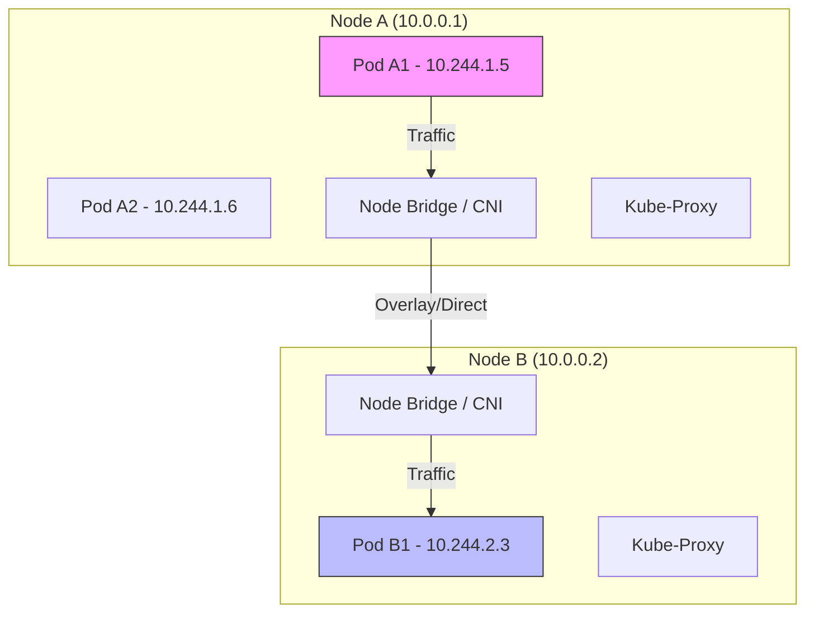

# Networking and Pod-to-Pod Communication

## Summary
Kubernetes networking is designed around a "flat" network model where every Pod receives a unique, cluster-wide IP address, enabling direct communication between any two Pods without the need for Network Address Translation (NAT). This model simplifies the transition from virtual machines to containers, as Pods can be treated like independent hosts on a network. The implementation of this model is offloaded to Container Network Interface (CNI) plugins, which handle the underlying infrastructure—whether it's an overlay network (like VXLAN) or direct routing. For application discovery, Kubernetes utilizes a built-in DNS service (CoreDNS) that maps Service names to their respective ClusterIPs, ensuring reliable and dynamic connectivity within the cluster.

## Detailed Explanation

### The Golden Rules of K8s Networking
Kubernetes imposes three fundamental requirements on any networking implementation:
1.  **Direct Pod-to-Pod**: Any Pod can communicate with any other Pod without NAT.
2.  **Node-to-Pod**: Agents on a node (e.g., Kubelet) can communicate with all Pods on that node.
3.  **IP Consistency**: The IP address a Pod sees for itself is the same IP address that others see for it.

### CNI (Container Network Interface)
Kubernetes doesn't provide the networking layer itself; it delegates this to CNI plugins.
*   **Overlay Networks (e.g., Flannel, Weave Net)**: Create a virtual network on top of the physical node network (using VXLAN or IP-in-IP). Easier to set up but has slight performance overhead.
*   **Direct Routing (e.g., Calico, Cilium)**: Uses BGP or native routing tables to route packets directly. Higher performance but requires more network configuration support.

### Service Discovery & DNS
When a `Service` is created, Kubernetes assigns it a stable virtual IP (ClusterIP). CoreDNS, running as a Deployment in the cluster, watches for new Services and creates DNS records (e.g., `my-app.default.svc.cluster.local`).

### Networking Architecture Diagram


---

## Go Application

For a Go developer, the flat network model means you can use standard networking libraries (`net/http`, `net`) without worrying about complex port mapping or NAT traversal.

### 1. Consuming Internal Services via DNS
This example shows a Go service calling another internal service (`user-service`) using its Kubernetes DNS name.

```go
package main

import (
	"fmt"
	"io"
	"net/http"
	"time"
)

func main() {
	// The DNS name is stable: <service-name>.<namespace>
	serviceURL := "http://user-service.default.svc.cluster.local:8080/users"

	client := &http.Client{
		Timeout: 5 * time.Second,
	}

	resp, err := client.Get(serviceURL)
	if err != nil {
		fmt.Printf("Error calling user-service: %v\n", err)
		return
	}
	defer resp.Body.Close()

	body, _ := io.ReadAll(resp.Body)
	fmt.Printf("Response from user-service: %s\n", string(body))
}
```

### 2. Identifying Pod IP
Sometimes (e.g., for logging or specialized clustering), a Go app needs to know its own Pod IP. This is typically injected via the Downward API.

**Deployment Manifest:**
```yaml
env:
- name: MY_POD_IP
  valueFrom:
    fieldRef:
      fieldPath: status.podIP
```

**Go Code:**
```go
podIP := os.Getenv("MY_POD_IP")
fmt.Printf("My IP address is: %s\n", podIP)
```

---

## Interview Questions

### 1. What is the role of CNI in Kubernetes?
**Answer**: The CNI (Container Network Interface) is a standard API that allows Kubernetes to be agnostic about the underlying network implementation. It is responsible for allocating IP addresses to Pods, configuring network interfaces within the Pod namespace, and ensuring connectivity according to the Kubernetes networking model.

### 2. How does `kube-proxy` enable Service communication?
**Answer**: `kube-proxy` runs on every node and maintains network rules (using `iptables` or `IPVS`). When traffic is sent to a Service's ClusterIP, `kube-proxy` intercepts that traffic and redirects it to one of the backend Pods' actual IPs, effectively acting as a distributed load balancer.

### 3. What is the difference between an Overlay Network and a Flat/Underlay Network?
**Answer**: An **Overlay Network** (like VXLAN) encapsulates packets inside other packets to create a virtual network on top of the physical one, which is flexible but adds overhead. A **Flat/Underlay Network** routes packets natively on the physical network infrastructure, offering better performance but requiring the underlying network to support the routing of Pod IPs.

### 4. Explain how DNS resolution works for a Service named `backend` in the `prod` namespace.
**Answer**: CoreDNS creates an A record for the service in the format `<service>.<namespace>.svc.cluster.local`. So, the FQDN would be `backend.prod.svc.cluster.local`. If a Pod in the same namespace queries just `backend`, the search domain in `/etc/resolv.conf` allows it to resolve successfully.

### 5. Why can't I ping a Service IP (ClusterIP)?
**Answer**: A ClusterIP is a **virtual IP**; it doesn't correspond to a physical network interface. It exists only as a set of `iptables` or `IPVS` rules on the nodes. Therefore, it doesn't respond to ICMP (ping) packets, though it will accept TCP/UDP connections on the configured ports.
