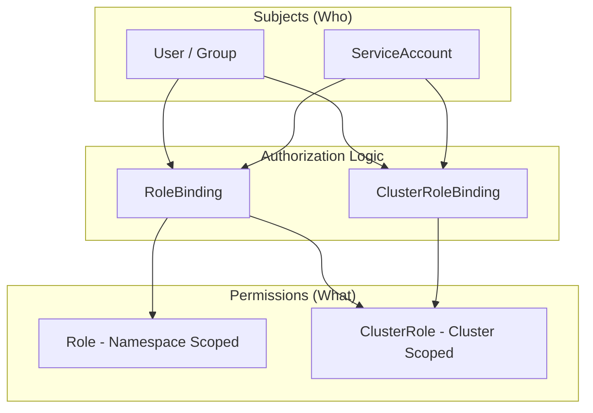

# Role-Based Access Control (RBAC) in Kubernetes

Role-Based Access Control (RBAC) is the standard authorization mechanism in Kubernetes that regulates access to resources based on the roles of individual users or service accounts. It defines "who" (subjects) can perform "what" (verbs) on "which" resources (API objects) and in "what scope" (namespace vs. cluster). By following the principle of least privilege, RBAC ensures that entities only have the minimum permissions necessary to perform their functions, significantly reducing the attack surface of a cluster.

## Detailed Explanation

### **What is RBAC?**

In Kubernetes, RBAC is built around four core API objects that define permissions and bind them to users or processes:

1.  **Role**: A namespaced resource that defines a set of permissions (rules) within a specific namespace.
2.  **ClusterRole**: A cluster-wide resource that can define permissions for namespaced resources across all namespaces or for cluster-scoped resources (like Nodes or PVs).
3.  **RoleBinding**: A namespaced resource that grants the permissions defined in a `Role` (or `ClusterRole`) to a subject (User, Group, or ServiceAccount) within a specific namespace.
4.  **ClusterRoleBinding**: A cluster-wide resource that grants the permissions defined in a `ClusterRole` to a subject across the entire cluster.

### **Why use RBAC?**

*   **Security (Least Privilege)**: Prevents users or compromised pods from performing unauthorized actions.
*   **Multi-tenancy**: Isolates resources between different teams or applications using Namespaces and Roles.
*   **Compliance**: Provides an audit trail and enforceable policies for regulatory requirements (SOC2, HIPAA).
*   **Operational Safety**: Prevents accidental deletion or modification of critical cluster components.

### **How it Works (The Relationship)**

The following diagram illustrates the relationship between Subjects, Bindings, and Roles.



#### **Permission Structure**
Permissions are defined as **Rules**, which consist of:
*   **apiGroups**: The API group (e.g., `""` for core, `"apps"`, `"batch"`).
*   **resources**: The resource types (e.g., `pods`, `deployments`, `secrets`).
*   **verbs**: The allowed actions (e.g., `get`, `list`, `watch`, `create`, `update`, `patch`, `delete`).

## Go Application

For Go developers, RBAC is most relevant when building **Operators**, **Controllers**, or applications that interact with the Kubernetes API using `client-go`.

### **1. ServiceAccounts & In-Cluster Auth**
When a Go application runs inside a Pod, it typically uses a `ServiceAccount` to authenticate with the API server. The `client-go` library makes this seamless using `rest.InClusterConfig()`.

```go
package main

import (
	"context"
	"fmt"
	"k8s.io/client-go/kubernetes"
	"k8s.io/client-go/rest"
	metav1 "k8s.io/apimachinery/pkg/apis/meta/v1"
)

func main() {
	// Create configuration for in-cluster client
	config, err := rest.InClusterConfig()
	if err != nil {
		panic(err.Error())
	}

	// Create the clientset
	clientset, err := kubernetes.NewForConfig(config)
	if err != nil {
		panic(err.Error())
	}

	// Attempt to list pods in the current namespace
	// This will fail if the ServiceAccount lacks 'list' permissions for 'pods'
	pods, err := clientset.CoreV1().Pods("").List(context.TODO(), metav1.ListOptions{})
	if err != nil {
		fmt.Printf("Error listing pods: %v\n", err)
		return
	}
	fmt.Printf("There are %d pods in the cluster\n", len(pods.Items))
}
```

### **2. RBAC Markers for Controllers**
If you are using `kubebuilder` or `operator-sdk` to write a controller, you define your RBAC requirements using **Go markers** (comments). The `controller-gen` tool parses these to generate the actual YAML manifests.

```go
// +kubebuilder:rbac:groups=apps,resources=deployments,verbs=get;list;watch;create;update;patch;delete
// +kubebuilder:rbac:groups=core,resources=pods,verbs=get;list;watch
// +kubebuilder:rbac:groups="",resources=secrets,verbs=get;list;watch

func (r *MyReconciler) Reconcile(ctx context.Context, req ctrl.Request) (ctrl.Result, error) {
    // Controller logic here...
}
```

*   **Group**: `apps` for Deployments, `""` (empty string) for core resources like Pods/Secrets.
*   **Resources**: The plural name of the resource.
*   **Verbs**: Semicolon-separated list of actions.

## Interview Questions

1.  **Q: What is the difference between a Role and a ClusterRole?**
    *   **A**: A `Role` is scoped to a specific namespace and grants access to resources within that namespace. A `ClusterRole` is non-namespaced and can grant access to cluster-scoped resources (like Nodes) or namespaced resources across the entire cluster (when bound with a `ClusterRoleBinding`).

2.  **Q: Can a RoleBinding reference a ClusterRole?**
    *   **A**: Yes. This is a common pattern to reuse a set of permissions. For example, you can create a `ClusterRole` called `secret-reader` and bind it via `RoleBinding` in `namespace-a`. The subject will only have "secret-reader" permissions within `namespace-a`.

3.  **Q: How does a Pod authenticate with the Kubernetes API?**
    *   **A**: By default, Kubernetes mounts a `ServiceAccount` token into the Pod at `/var/run/secrets/kubernetes.io/serviceaccount/token`. The application (e.g., via `client-go`) uses this token as a Bearer token in its HTTP requests to the API server.

4.  **Q: How do you implement "Least Privilege" for a Go-based controller?**
    *   **A**: By using specific RBAC markers that limit the controller's access to only the resources and verbs it actually needs. Instead of using `*` (wildcards), explicitly list the API groups, resources, and verbs (e.g., only `get` and `patch` instead of `*`).

5.  **Q: What happens if a User is bound to two different Roles in the same namespace?**
    *   **A**: RBAC is purely additive. The user's effective permissions will be the union of all permissions granted by both Roles. There is no concept of a "Deny" rule in Kubernetes RBAC.
